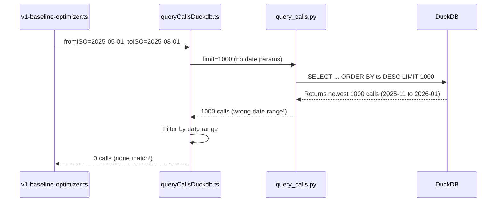

# Fix Date-Range Query Bug in V1 Baseline Optimizer

## Problem

The `queryCallsDuckdb` workflow applies date filtering AFTER the Python query returns results. The Python query fetches the 1000 most recent calls, which may not include older date ranges.

## Root Cause




## Solution

Pass `from_ts_ms` and `to_ts_ms` to the Python query so filtering happens BEFORE the limit.

### Files to Modify

1. **[tools/simulation/duckdb_storage/ops/query_calls.py](tools/simulation/duckdb_storage/ops/query_calls.py)**

- Add `from_ts_ms` and `to_ts_ms` fields to `QueryCallsInput`
- Add WHERE clause for date filtering in SQL query

2. **[packages/simulation/src/duckdb-storage-service.ts](packages/simulation/src/duckdb-storage-service.ts)**

- Update `queryCalls()` method to accept optional `fromTsMs` and `toTsMs` parameters
- Pass these to the Python script via `data` object

3. **[packages/workflows/src/calls/queryCallsDuckdb.ts](packages/workflows/src/calls/queryCallsDuckdb.ts)**

- Convert ISO dates to milliseconds and pass to Python query
- Keep JS-side filtering as a safety net

### Implementation Details

**Python Input Model Change:**

```python
class QueryCallsInput(BaseModel):
    limit: int = Field(default=1000, ge=1, le=10000)
    exclude_unrecoverable: bool = True
    caller_name: Optional[str] = None
    from_ts_ms: Optional[int] = None  # NEW
    to_ts_ms: Optional[int] = None    # NEW
```

**Python SQL Change:**

```sql
SELECT DISTINCT mint, alert_ts_ms, ...
FROM canon.alerts_std
WHERE mint IS NOT NULL
  AND alert_ts_ms >= {from_ts_ms}  -- NEW
  AND alert_ts_ms <= {to_ts_ms}    -- NEW
ORDER BY alert_ts_ms DESC
LIMIT {limit}
```


## Testing

After the fix, verify:

```bash
quantbot backtest v1-baseline \
  --from 2025-05-01 --to 2025-08-01 \
  --mode grouped --interval 1m

```