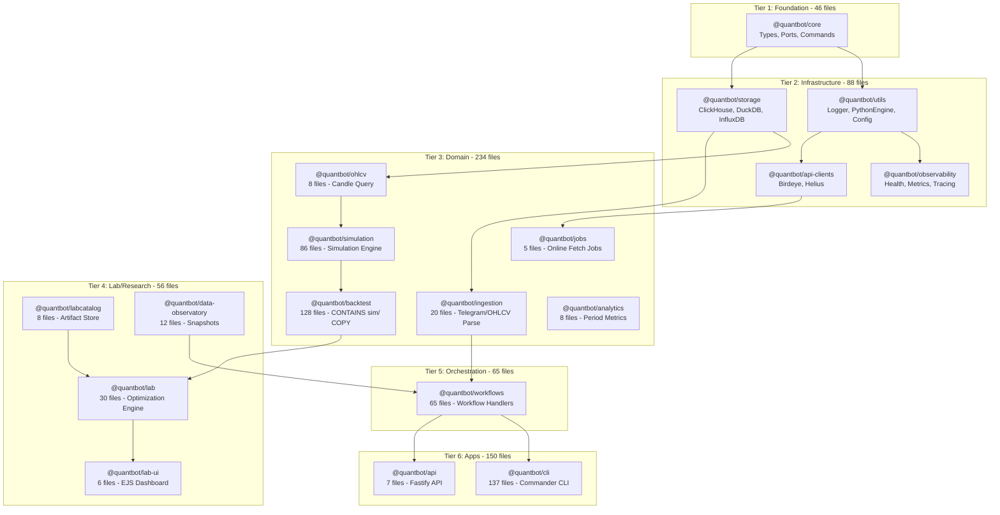
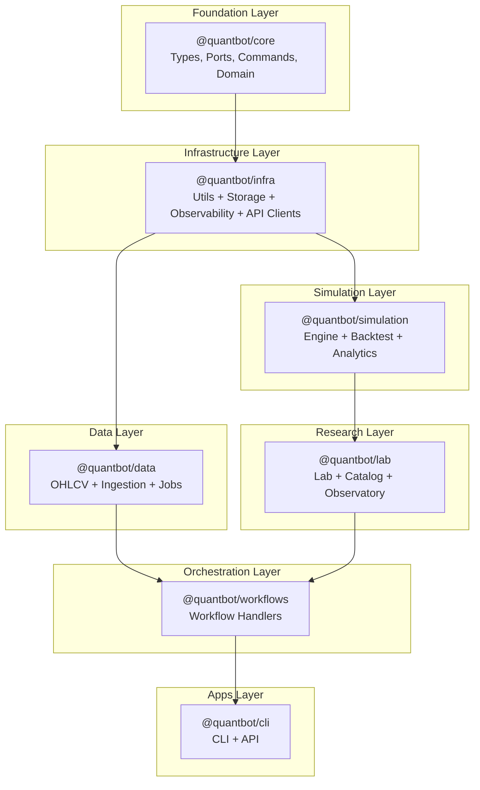

# Package Consolidation Plan: 18 to 7 Packages

## Current State Analysis

### Package Inventory (18 packages)




### Critical Issues Identified

#### Issue 1: Massive Duplication - `@quantbot/backtest/src/sim/` is a COPY of `@quantbot/simulation/src/`

- **backtest/src/sim/**: 86+ files (copy)
- **simulation/src/**: 86 files (original)
- Only 4 files differ: `index.ts`, `logger.ts`, `overlay-simulation.ts`, `sinks.ts`
- **Impact**: ~7,000+ lines of duplicated code

#### Issue 2: Fragmented Lab Ecosystem

| Package | Files | Purpose | Overlap ||---------|-------|---------|---------|| `@quantbot/lab` | 30 | Optimization, features, metrics | Partially duplicates analytics || `@quantbot/labcatalog` | 8 | Artifact storage | Could merge into storage || `@quantbot/data-observatory` | 12 | Snapshots, quality | Could merge into lab || `@quantbot/lab-ui` | 6 | EJS dashboard | Minimal, could be app |

#### Issue 3: Scattered Data Handling

- `@quantbot/ohlcv`: Query candles (8 files)
- `@quantbot/ingestion`: Parse Telegram, OHLCV work planning (20 files)
- `@quantbot/jobs`: Fetch from APIs (5 files)
- **All three** deal with candle/call data but are separated

#### Issue 4: Analytics vs Simulation Period Metrics Overlap

- `@quantbot/analytics`: `calculatePeriodAthAtl`, `enrichCallWithPeriodMetrics`
- `@quantbot/simulation`: `calculatePeriodAthAtlFromCandles`, `period-metrics/`
- Nearly identical functionality

---

## Target Architecture: 7 Packages




### Package Mapping

| Current Packages | Target Package | Action ||-----------------|----------------|--------|| `@quantbot/core` | `@quantbot/core` | **KEEP** - Foundation || `@quantbot/utils` | `@quantbot/infra` | **MERGE** into infra || `@quantbot/storage` | `@quantbot/infra` | **MERGE** into infra || `@quantbot/observability` | `@quantbot/infra` | **MERGE** into infra || `@quantbot/api-clients` | `@quantbot/infra` | **MERGE** into infra || `@quantbot/simulation` | `@quantbot/simulation` | **KEEP** - Primary simulation || `@quantbot/backtest` | `@quantbot/simulation` | **MERGE** - Remove sim/ copy, keep backtest-specific || `@quantbot/analytics` | `@quantbot/simulation` | **MERGE** - Period metrics || `@quantbot/ohlcv` | `@quantbot/data` | **MERGE** into data || `@quantbot/ingestion` | `@quantbot/data` | **MERGE** into data || `@quantbot/jobs` | `@quantbot/data` | **MERGE** into data || `@quantbot/lab` | `@quantbot/lab` | **KEEP** - Research core || `@quantbot/labcatalog` | `@quantbot/lab` | **MERGE** into lab || `@quantbot/data-observatory` | `@quantbot/lab` | **MERGE** into lab || `@quantbot/lab-ui` | `@quantbot/cli` | **MERGE** into CLI as subcommand/mode || `@quantbot/workflows` | `@quantbot/workflows` | **KEEP** - Orchestration || `@quantbot/cli` | `@quantbot/cli` | **KEEP** - App layer || `@quantbot/api` | `@quantbot/cli` | **MERGE** into CLI as server mode |---

## Migration Phases

### Phase 0: Critical Path - Eliminate backtest/sim Duplication (HIGH PRIORITY)

**Goal**: Remove the ~7,000 lines of duplicated simulation code.**Files to analyze**:

- [`packages/backtest/src/sim/index.ts`](packages/backtest/src/sim/index.ts) - Differs from simulation
- [`packages/backtest/src/sim/logger.ts`](packages/backtest/src/sim/logger.ts) - Differs from simulation
- [`packages/backtest/src/sim/overlay-simulation.ts`](packages/backtest/src/sim/overlay-simulation.ts) - Differs from simulation
- [`packages/backtest/src/sim/sinks.ts`](packages/backtest/src/sim/sinks.ts) - Differs from simulation

**Steps**:

1. **Audit differences** between `backtest/src/sim/` and `simulation/src/`

- Identify backtest-specific modifications in the 4 differing files
- Document any backtest-specific logic that must be preserved

2. **Extract backtest-specific code** from differing files

- Move to `backtest/src/backtest-specifics/` or similar
- Keep only what cannot be in `@quantbot/simulation`

3. **Delete `backtest/src/sim/` directory**

- Update all imports to use `@quantbot/simulation` directly
- Keep selective re-exports in [`packages/backtest/src/index.ts`](packages/backtest/src/index.ts) for API stability

4. **Update exports** in backtest index

- Re-export needed simulation types/functions
- Keep backward compatibility for CLI/workflow imports

5. **Run full test suite** to verify no regressions

**Estimated savings**: ~7,000 lines removed, faster builds, single source of truth.---

### Phase 1: Create `@quantbot/infra` Package

**Goal**: Consolidate infrastructure utilities into one package.**Source packages**:

- [`packages/utils/`](packages/utils/) - 32 files
- [`packages/storage/`](packages/storage/) - 43 files
- [`packages/observability/`](packages/observability/) - 13 files
- [`packages/api-clients/`](packages/api-clients/) - 7 files

**Steps**:

1. **Create `packages/infra/` structure**:
   ```javascript
                                          packages/infra/
                                          ├── src/
                                          │   ├── utils/          # From @quantbot/utils
                                          │   ├── storage/        # From @quantbot/storage
                                          │   ├── observability/  # From @quantbot/observability
                                          │   └── clients/        # From @quantbot/api-clients
                                          ├── package.json
                                          └── tsconfig.json
   ```


2. **Move files** from source packages to infra
3. **Create subpath exports** for backward compatibility:
   ```json
                                          {
                                            "exports": {
                                              ".": { "import": "./dist/index.js" },
                                              "./utils": { "import": "./dist/utils/index.js" },
                                              "./storage": { "import": "./dist/storage/index.js" },
                                              "./observability": { "import": "./dist/observability/index.js" },
                                              "./clients": { "import": "./dist/clients/index.js" }
                                            }
                                          }
   ```


4. **Create compatibility shims** in old package locations (temporary):
   ```typescript
                                          // packages/utils/src/index.ts
                                          export * from '@quantbot/infra/utils';
   ```


5. **Update all imports** across codebase
6. **Delete old packages** after migration complete

---

### Phase 2: Create `@quantbot/data` Package

**Goal**: Consolidate all data ingestion and access into one package.**Source packages**:

- [`packages/ohlcv/`](packages/ohlcv/) - 8 files (candle queries)
- [`packages/ingestion/`](packages/ingestion/) - 20 files (Telegram parsing, work planning)
- [`packages/jobs/`](packages/jobs/) - 5 files (online fetch jobs)

**Steps**:

1. **Create `packages/data/` structure**:
   ```javascript
                                          packages/data/
                                          ├── src/
                                          │   ├── ohlcv/       # Candle queries
                                          │   ├── ingestion/   # Telegram parsing, alerts
                                          │   ├── jobs/        # Online fetch orchestration
                                          │   └── index.ts
   ```


2. **Move files** preserving internal organization
3. **Create subpath exports**:
   ```json
                                          {
                                            "exports": {
                                              ".": { "import": "./dist/index.js" },
                                              "./ohlcv": { "import": "./dist/ohlcv/index.js" },
                                              "./ingestion": { "import": "./dist/ingestion/index.js" },
                                              "./jobs": { "import": "./dist/jobs/index.js" }
                                            }
                                          }
   ```


4. **Maintain offline/online boundary** internally:

- `ohlcv/` and `ingestion/` remain offline-only
- `jobs/` remains the only online orchestration point

---

### Phase 3: Consolidate Simulation + Backtest + Analytics

**Goal**: Merge backtest-specific and analytics code into simulation.**Source packages**:

- [`packages/backtest/`](packages/backtest/) - After Phase 0, only backtest-specific remains (~40 files)
- [`packages/analytics/`](packages/analytics/) - 8 files

**Steps**:

1. **Move analytics into simulation**:

- `analytics/src/` → `simulation/src/analytics/`
- Period metrics already partially exist, consolidate

2. **Move backtest-specific into simulation**:

- Policy system (`policies/`)
- Optimization (`optimization/`)
- Reporting (`reporting/`)
- Exit plans (`exits/`)
- Path metrics (`metrics/`)

3. **Create subpath exports**:
   ```json
                                          {
                                            "exports": {
                                              ".": { "import": "./dist/index.js" },
                                              "./backtest": { "import": "./dist/backtest/index.js" },
                                              "./analytics": { "import": "./dist/analytics/index.js" },
                                              "./policies": { "import": "./dist/policies/index.js" }
                                            }
                                          }
   ```


4. **Deprecate old packages** with re-export shims

---

### Phase 4: Consolidate Lab Ecosystem

**Goal**: Merge lab-related packages.**Source packages**:

- [`packages/labcatalog/`](packages/labcatalog/) - 8 files
- [`packages/data-observatory/`](packages/data-observatory/) - 12 files

**Target**: [`packages/lab/`](packages/lab/)**Steps**:

1. **Move labcatalog into lab**:

- `labcatalog/src/` → `lab/src/catalog/`

2. **Move data-observatory into lab**:

- `data-observatory/src/` → `lab/src/observatory/`

3. **Create subpath exports**:
   ```json
                                          {
                                            "exports": {
                                              ".": { "import": "./dist/index.js" },
                                              "./catalog": { "import": "./dist/catalog/index.js" },
                                              "./observatory": { "import": "./dist/observatory/index.js" }
                                            }
                                          }
   ```


---

### Phase 5: Consolidate Apps into CLI

**Goal**: Merge API and lab-ui into CLI as modes.**Source packages**:

- [`packages/api/`](packages/api/) - 7 files
- [`packages/lab-ui/`](packages/lab-ui/) - 6 files

**Target**: [`packages/cli/`](packages/cli/)**Steps**:

1. **Move API into CLI**:

- `api/src/` → `cli/src/server/`
- Add `quantbot serve` command

2. **Move lab-ui into CLI**:

- `lab-ui/src/` → `cli/src/lab-ui/`
- Add `quantbot lab-ui` command

3. **Single entry point** for all app concerns

---

## Comprehensive TODO

### Critical Path (Must Complete First)

- [ ] **P0-1**: Audit 4 differing files in backtest/sim vs simulation
- [ ] **P0-2**: Document backtest-specific modifications needed
- [ ] **P0-3**: Extract backtest-specific code to separate location
- [ ] **P0-4**: Delete backtest/src/sim/ directory
- [ ] **P0-5**: Update all imports to use @quantbot/simulation
- [ ] **P0-6**: Run full test suite, fix any failures
- [ ] **P0-7**: Update CHANGELOG and documentation

### Phase 1: Create @quantbot/infra

- [ ] **P1-1**: Create packages/infra directory structure
- [ ] **P1-2**: Create package.json with subpath exports
- [ ] **P1-3**: Move @quantbot/utils files to infra/utils/
- [ ] **P1-4**: Move @quantbot/storage files to infra/storage/
- [ ] **P1-5**: Move @quantbot/observability files to infra/observability/
- [ ] **P1-6**: Move @quantbot/api-clients files to infra/clients/
- [ ] **P1-7**: Create re-export shims in old packages
- [ ] **P1-8**: Update all codebase imports
- [ ] **P1-9**: Run full test suite
- [ ] **P1-10**: Delete old packages (utils, storage, observability, api-clients)

### Phase 2: Create @quantbot/data

- [ ] **P2-1**: Create packages/data directory structure
- [ ] **P2-2**: Create package.json with subpath exports
- [ ] **P2-3**: Move @quantbot/ohlcv files to data/ohlcv/
- [ ] **P2-4**: Move @quantbot/ingestion files to data/ingestion/
- [ ] **P2-5**: Move @quantbot/jobs files to data/jobs/
- [ ] **P2-6**: Verify offline/online boundary maintained
- [ ] **P2-7**: Update all codebase imports
- [ ] **P2-8**: Run full test suite
- [ ] **P2-9**: Delete old packages (ohlcv, ingestion, jobs)

### Phase 3: Consolidate Simulation

- [ ] **P3-1**: Move analytics/src/ to simulation/src/analytics/
- [ ] **P3-2**: Deduplicate period metrics (analytics vs simulation)
- [ ] **P3-3**: Move backtest-specific code to simulation/src/backtest/
- [ ] **P3-4**: Update simulation package.json exports
- [ ] **P3-5**: Create re-export shims for backward compatibility
- [ ] **P3-6**: Update all codebase imports
- [ ] **P3-7**: Run full test suite
- [ ] **P3-8**: Delete @quantbot/backtest and @quantbot/analytics

### Phase 4: Consolidate Lab

- [ ] **P4-1**: Move labcatalog/src/ to lab/src/catalog/
- [ ] **P4-2**: Move data-observatory/src/ to lab/src/observatory/
- [ ] **P4-3**: Update lab package.json exports
- [ ] **P4-4**: Update all codebase imports
- [ ] **P4-5**: Run full test suite
- [ ] **P4-6**: Delete @quantbot/labcatalog and @quantbot/data-observatory

### Phase 5: Consolidate Apps

- [ ] **P5-1**: Move api/src/ to cli/src/server/
- [ ] **P5-2**: Add `quantbot serve` command
- [ ] **P5-3**: Move lab-ui/src/ to cli/src/lab-ui/
- [ ] **P5-4**: Add `quantbot lab-ui` command
- [ ] **P5-5**: Update all references
- [ ] **P5-6**: Run full test suite
- [ ] **P5-7**: Delete @quantbot/api and @quantbot/lab-ui

### Cleanup

- [ ] **CL-1**: Remove all temporary re-export shims
- [ ] **CL-2**: Update all documentation
- [ ] **CL-3**: Update build scripts in root package.json
- [ ] **CL-4**: Update CI/CD pipelines
- [ ] **CL-5**: Final test suite run
- [ ] **CL-6**: Update ARCHITECTURE.md with new structure

---

## Risk Mitigation

### Backward Compatibility Strategy

Each phase will:

1. Create the new package first
2. Add re-export shims in old packages pointing to new locations
3. Update imports incrementally
4. Only delete old packages after full verification

### Testing Strategy