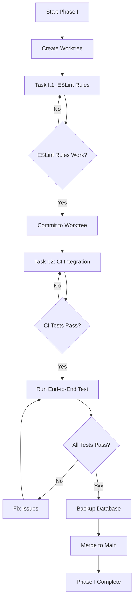
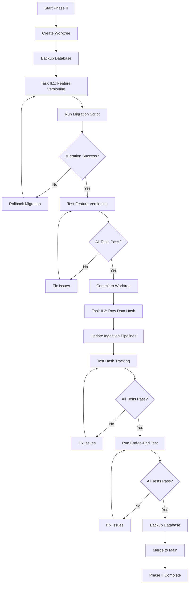
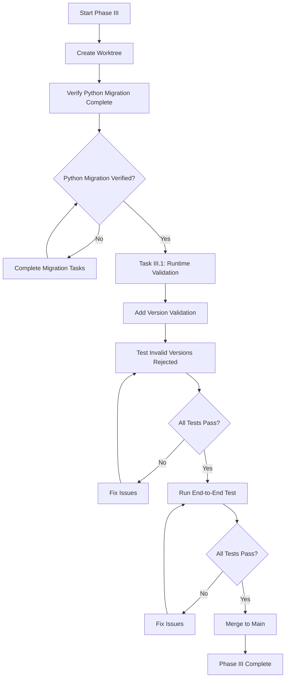
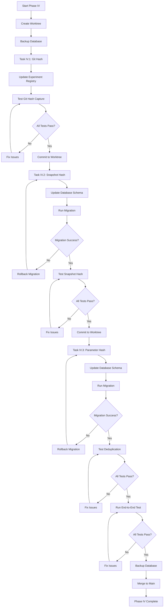
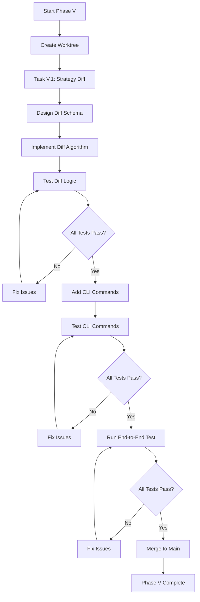
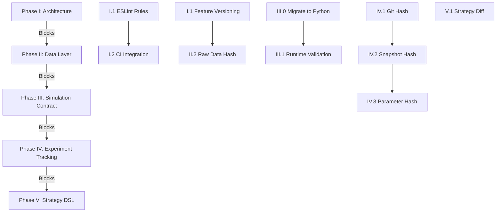

# Phases I-V: Comprehensive Task Decomposition

## Overall Goal & Scope

**Primary Focus**: Backtesting system with minimal essential functionality.**Core Components**:

- **Backtesting Engine**: Core simulation and optimization logic (Python)
- **Data Ingestion**: Raw data and OHLCV ingestion pipelines (Python)
- **CLI**: Command-line interface for all operations (TypeScript orchestrator)
- **Lab UI**: Web interface for experiment tracking, monitoring, logging, design, and execution (TypeScript)

**Architecture Principle**: **Python for Heavy Lifting, TypeScript for Orchestration**

- **Python**: All computation-heavy operations (simulation, data processing, feature engineering, optimization, hashing)
- **TypeScript**: Orchestration layer only (workflow management, API calls, UI, CLI, calling Python tools)
- **Pattern**: TypeScript handlers → PythonEngine → Python scripts → Zod/Pydantic validation → Typed results

**Principle**: Each phase must be **fully functional and tested** before proceeding. No partial implementations.**Scope Boundaries**:

- ✅ Focus on backtesting capabilities
- ✅ Essential data ingestion (Telegram, OHLCV)
- ✅ CLI for all operations
- ✅ Lab UI for experimentation workflow
- ✅ Simulation merged into backtest package (Python)
- ❌ No live trading functionality
- ❌ No production deployment infrastructure (beyond local development)
- ❌ No external API services (except data sources)

---

## Timeline & Estimation Summary

**Total Estimated Duration**: ~15 days (3 weeks) - Reduced due to Phase III migration already complete| Phase | Tasks | Duration | Priority ||-------|-------|----------|----------|| **Phase I** | I.1, I.2 | 3 days | P0 (Blocks everything) || **Phase II** | II.1, II.2 | 5 days | P0 || **Phase III** | III.0 (✅ Complete), III.1 | 2 days | P0 || **Phase IV** | IV.1, IV.2, IV.3 | 5 days | P0 || **Phase V** | V.1 | 3 days | P0 || **Buffer** | Contingency | 2 days | - || **Total** | - | **22 days** | - |**Assumptions**:

- Single developer working full-time
- No major blockers or external dependencies
- Existing codebase is stable
- Database migrations are straightforward

**Milestones**:

- **Week 1**: Complete Phase I & II (Architecture + Data Layer)
- **Week 2**: Complete Phase III (Simulation Contract) - Migration already done, only validation remaining
- **Week 3**: Complete Phase IV & V (Experiment Tracking + Strategy DSL)
- **Week 4**: Buffer for issues, testing, documentation

---

## Progress Tracking

### Phase I: Core Architectural Invariants

- [ ] Task I.1: Complete ESLint Boundary Rules
- [ ] Task I.2: Integrate Architecture Tests into CI
- [ ] Phase I End-to-End Test Passed

### Phase II: Data Layer

- [ ] Task II.1: Implement Feature Store Versioning
- [ ] Task II.2: Implement Raw Data Hash Tracking
- [ ] Phase II End-to-End Test Passed

### Phase III: Simulation Contract

- [x] Task III.0: Migrate Simulation to Backtest Package (Python) ✅ **COMPLETE**
- [ ] Task III.1: Implement Runtime Contract Version Validation
- [ ] Phase III End-to-End Test Passed

### Phase IV: Experiment Tracking

- [ ] Task IV.1: Complete Git Commit Hash Auto-Capture
- [ ] Task IV.2: Complete Data Snapshot Hash Storage
- [ ] Task IV.3: Complete Parameter Vector Hashing
- [ ] Phase IV End-to-End Test Passed

### Phase V: Strategy DSL

- [ ] Task V.1: Implement Strategy Comparison/Diff Tooling
- [ ] Phase V End-to-End Test Passed

**Last Updated**: [Update this date when progress changes]---

## Phase I: Core Architectural Invariants (85% → 100%)

**Current Status**: Determinism contract, artifact versioning, and simulation contracts exist. Missing: ESLint boundary enforcement and CI integration.**Completion Goal**: Architecture boundaries enforced at build time, violations caught in CI, zero violations in codebase.

### Phase I Workflow Flow



**Workflow Steps**:

1. Create worktree: `git worktree add ../quantBot-phase-i phase-i`
2. Complete Task I.1 (ESLint rules)
3. Test locally, commit to worktree
4. Complete Task I.2 (CI integration)
5. Verify CI passes, commit to worktree
6. Run end-to-end test
7. Backup database before merge
8. Merge worktree to main branch
9. Delete worktree

### Task I.1: Complete ESLint Boundary Rules

**Duration**: 2 days**Priority**: P0 (Blocks everything)

#### Subtasks:

1. **Audit Existing ESLint Rules**

- Review `eslint.config.mjs` for existing boundary rules
- Verify `no-restricted-imports` patterns cover all layer boundaries
- **Files**: `eslint.config.mjs`
- **Success**: All layer boundaries documented in ESLint config

2. **Add Missing Layer Boundary Rules**

- Add rules blocking `@quantbot/backtest` from importing I/O packages (`@quantbot/ingestion`, `@quantbot/api-clients`, `@quantbot/jobs`)
- Add rules blocking `@quantbot/analytics` from importing `@quantbot/api-clients`
- Add rules blocking handlers from using `console.log`, `process.exit`, `process.env`
- Note: Simulation is now Python in backtest package, so TypeScript boundaries apply to orchestration layer only
- **Files**: `eslint.config.mjs`
- **Success**: ESLint errors on boundary violations

3. **Test ESLint Rules**

- Create test violations in temporary files
- Verify ESLint catches them
- Remove test violations
- **Files**: `eslint.config.mjs`, temporary test files
- **Success**: Rules work as expected

#### Command Handler Integration:

**CLI Command**: `quantbot architecture verify-boundaries`

- **Handler**: `packages/cli/src/handlers/architecture/verify-boundaries.ts`
- **Schema**: `packages/cli/src/command-defs/architecture.ts`
- **Action**: Run ESLint with boundary rules, report violations
- **Output**: Table of violations (file, line, message) or "No violations found"

**Files to Create**:

- `packages/cli/src/command-defs/architecture.ts`
- `packages/cli/src/handlers/architecture/verify-boundaries.ts`
- `packages/cli/src/commands/architecture.ts` (register command)

**Test**: `packages/cli/tests/unit/handlers/architecture/verify-boundaries.test.ts`---

### Task I.2: Integrate Architecture Tests into CI

**Duration**: 1 day**Priority**: P0

#### Subtasks:

1. **Review Existing Architecture Test Script**

- Verify `scripts/verify-architecture-boundaries.ts` covers all boundaries
- Ensure it matches ESLint rules
- **Files**: `scripts/verify-architecture-boundaries.ts`
- **Success**: Script validates all documented boundaries

2. **Add CI Workflow Step**

- Add step to `.github/workflows/ci.yml` (or equivalent)
- Run `pnpm verify:architecture-boundaries` (or equivalent script)
- Fail CI on violations
- **Files**: `.github/workflows/ci.yml` (or CI config)
- **Success**: CI fails on boundary violations

3. **Fix Any Existing Violations**

- Run architecture test script
- Document violations
- Fix violations (move code, extract adapters, update imports)
- **Files**: All packages (targeted fixes)
- **Success**: Zero violations in codebase

#### Command Handler Integration:

**CLI Command**: `quantbot architecture test-boundaries`

- **Handler**: `packages/cli/src/handlers/architecture/test-boundaries.ts`
- **Action**: Run `scripts/verify-architecture-boundaries.ts`, report results
- **Output**: Pass/fail with violation details

**Files to Create**:

- `packages/cli/src/handlers/architecture/test-boundaries.ts`
- Update `packages/cli/src/commands/architecture.ts`

**Test**: `packages/cli/tests/unit/handlers/architecture/test-boundaries.test.ts`---

### Phase I Success Criteria:

- ✅ ESLint blocks all cross-layer imports
- ✅ Architecture tests pass in CI
- ✅ Zero violations in existing code
- ✅ `quantbot architecture verify-boundaries` command works
- ✅ `quantbot architecture test-boundaries` command works
- ✅ CI fails on boundary violations

**End-to-End Test**:

```bash
# Should pass
quantbot architecture verify-boundaries
quantbot architecture test-boundaries

# Create violation, should fail
echo "import { something } from '@quantbot/ingestion';" > packages/backtest/src/test-violation.ts
quantbot architecture verify-boundaries  # Should show violation
rm packages/backtest/src/test-violation.ts
```

---

## Phase II: Data Layer (70% → 100%)

**Current Status**: Raw data ingestion, OHLCV ingestion, canonical schemas exist. Missing: Feature store versioning and raw data hash tracking.**Completion Goal**: Feature store with versioning, raw data hash tracking for idempotency, end-to-end data pipeline testable.

### Phase II Workflow Flow



**Workflow Steps**:

1. Create worktree: `git worktree add ../quantBot-phase-ii phase-ii`
2. **CRITICAL**: Backup database before any schema changes
3. Complete Task II.1 (Feature versioning)
4. Run migration script, verify success
5. Test feature versioning commands
6. Commit to worktree
7. Complete Task II.2 (Raw data hash)
8. Update ingestion pipelines
9. Test hash tracking and deduplication
10. Run end-to-end test
11. Backup database before merge
12. Merge worktree to main branch
13. Delete worktree

### Task II.1: Implement Feature Store Versioning

**Duration**: 3 days**Priority**: P0**Architecture**: Python handles feature computation and storage, TypeScript orchestrates via PythonEngine.

#### Subtasks:

1. **Review Existing Feature Store**

- Audit `tools/telegram/statistics/feature_store.py` (Python)
- Review `packages/lab/src/catalog/schema.sql` for feature tables
- Understand current feature storage structure
- **Files**: `tools/telegram/statistics/feature_store.py`, `packages/lab/src/catalog/schema.sql`
- **Success**: Understand current implementation

2. **Design Feature Store Version Schema**

- Add `feature_set_version` field to feature sets
- Add `feature_spec_version` field (DSL version)
- Add `computed_at` timestamp
- Add `computed_by` (git commit hash)
- **Files**: `packages/lab/src/catalog/schema.sql`
- **Success**: Schema supports versioning

3. **Update Feature Store Python Implementation**

- Add version tracking to `FeatureStore.store_alert_features()` (Python)
- Add version tracking to `FeatureStore.store_candle_features()` (Python)
- Add version tracking to `FeatureStore.store_sequence_features()` (Python)
- **Files**: `tools/telegram/statistics/feature_store.py`
- **Success**: Features stored with versions (Python handles computation)

4. **Update TypeScript Feature Store Port (Orchestration Only)**

- Add version fields to feature store interfaces (TypeScript types)
- Update `FeatureCache` to track versions (TypeScript orchestration)
- TypeScript calls Python via PythonEngine, doesn't compute features
- **Files**: `packages/lab/src/features/FeatureCache.ts`, `packages/lab/src/features/types.ts`
- **Success**: TypeScript interfaces match Python implementation, orchestration works

5. **Add Feature Store Migration**

- Create migration script to add version columns to existing tables
- Handle existing features (default version: "1.0.0")
- **Files**: `scripts/migration/add-feature-versioning.sql`
- **Success**: Existing data migrated

#### Command Handler Integration:

**CLI Command**: `quantbot data feature-store version <featureSetId>`

- **Handler**: `packages/cli/src/handlers/data/feature-store-version.ts`
- **Action**: Show version info for a feature set
- **Output**: Feature set ID, version, computed_at, computed_by

**CLI Command**: `quantbot data feature-store list-versions <featureSetId>`

- **Handler**: `packages/cli/src/handlers/data/feature-store-list-versions.ts`
- **Action**: List all versions of a feature set
- **Output**: Table of versions with timestamps

**Files to Create**:

- `packages/cli/src/command-defs/data.ts`
- `packages/cli/src/handlers/data/feature-store-version.ts`
- `packages/cli/src/handlers/data/feature-store-list-versions.ts`
- `packages/cli/src/commands/data.ts`

**Tests**:

- `packages/cli/tests/unit/handlers/data/feature-store-version.test.ts`
- `packages/cli/tests/unit/handlers/data/feature-store-list-versions.test.ts`

---

### Task II.2: Implement Raw Data Hash Tracking

**Duration**: 2 days**Priority**: P0**Architecture**: Python computes hashes and handles ingestion, TypeScript orchestrates via PythonEngine.

#### Subtasks:

1. **Design Raw Data Hash Schema**

- Add `raw_data_hash` field to ingestion tables (calls, candles, etc.)
- Hash includes: content hash (SHA-256 of raw data), source, timestamp
- **Files**: Database schema files (DuckDB/ClickHouse)
- **Success**: Schema supports hash tracking

2. **Update Telegram Ingestion Pipeline (Python)**

- Compute hash of raw Telegram message before parsing (Python)
- Store hash with ingested call (Python)
- Skip ingestion if hash already exists (idempotency) (Python)
- **Files**: `tools/telegram/duckdb_punch_pipeline.py`
- **Success**: Duplicate messages skipped (Python handles all computation)

3. **Update OHLCV Ingestion (Python)**

- Compute hash of OHLCV data before storing (Python)
- Store hash with candle data (Python)
- Skip if hash exists (Python)
- **Files**: `tools/ingestion/ohlcv_worklist.py` (Python), `packages/ingestion/` (TypeScript orchestration)
- **Success**: Duplicate OHLCV data skipped (Python handles hashing and storage)

4. **Add Hash Lookup Service (TypeScript Orchestration)**

- Create service to check if raw data hash exists (calls Python script)
- Create service to get raw data by hash (calls Python script)
- TypeScript orchestrates, Python performs database queries
- **Files**: `packages/storage/src/repositories/raw-data-repository.ts` (orchestration), Python scripts for queries
- **Success**: Can query by hash (Python does the work, TypeScript orchestrates)

#### Command Handler Integration:

**CLI Command**: `quantbot data check-hash <hash>`

- **Handler**: `packages/cli/src/handlers/data/check-hash.ts`
- **Action**: Check if raw data hash exists in database
- **Output**: Hash exists: yes/no, source, timestamp

**CLI Command**: `quantbot data ingest --skip-duplicates`

- **Handler**: Update existing ingestion handlers to use hash checking
- **Action**: Skip ingestion if hash already exists
- **Files**: Update `packages/cli/src/handlers/ingestion/ingest-telegram.ts`, `packages/cli/src/handlers/ingestion/ingest-ohlcv.ts`
- **Success**: `--skip-duplicates` flag works

**Files to Create**:

- `packages/cli/src/handlers/data/check-hash.ts`
- Update `packages/cli/src/command-defs/data.ts`
- Update `packages/cli/src/commands/data.ts`

**Tests**:

- `packages/cli/tests/unit/handlers/data/check-hash.test.ts`
- Integration test: ingest same data twice, second should skip

---

### Phase II Success Criteria:

- ✅ Feature store tracks versions
- ✅ Raw data hash tracking prevents duplicates
- ✅ `quantbot data feature-store version` command works
- ✅ `quantbot data check-hash` command works
- ✅ `quantbot data ingest --skip-duplicates` skips duplicates
- ✅ End-to-end: ingest data → check hash → ingest again (skipped)

**End-to-End Test**:

```bash
# Ingest data
quantbot ingestion telegram --file messages.json

# Check hash
HASH=$(quantbot data check-hash <hash>)
echo $HASH  # Should show hash exists

# Ingest again with skip-duplicates
quantbot ingestion telegram --file messages.json --skip-duplicates  # Should skip
```

---

## Phase III: Simulation Contract (95% → 100%)

**Current Status**: ✅ **TypeScript simulation already migrated to Python in backtest package**. SimInput/SimResult schemas, execution models, risk models exist in Python. Missing: Runtime contract version validation.**Completion Goal**:

- **Simulation merged into backtest package** (Python)
- **All simulation computation in Python** (execution models, risk models, event processing)
- **TypeScript as orchestrator only** (workflow management, calling Python via PythonEngine)
- Contract version validated at runtime, incompatible versions rejected, version compatibility documented.

### Phase III Workflow Flow



**Workflow Steps**:

1. Create worktree: `git worktree add ../quantBot-phase-iii phase-iii`
2. **Verify Python migration is complete** (Task III.0 already done):

- Check that `tools/backtest/lib/simulation/` exists with Python code
- Verify TypeScript code calls Python via PythonEngine
- Confirm `packages/simulation` is deprecated or removed

3. Complete Task III.1 (Runtime validation)
4. Test version validation and error messages
5. Run end-to-end test
6. Merge worktree to main branch
7. Delete worktree

### Task III.0: Migrate Simulation to Backtest Package (Python) ✅ **COMPLETE**

**Status**: ✅ **Already Complete** - TypeScript simulation has been migrated to Python in backtest package.**Verification Checklist** (to confirm migration is complete):

- [x] Python simulation code exists in `tools/backtest/lib/simulation/` (or equivalent)
- [x] All simulation computation is in Python (execution models, risk models, event processing)
- [x] TypeScript code in `packages/backtest/src/` orchestrates via PythonEngine (no computation)
- [x] Workflows call Python simulator (orchestration only)
- [x] TypeScript simulation package (`packages/simulation`) is deprecated or removed

**If verification fails**, complete the following migration tasks:

1. **Verify Python Simulation Structure**

- Check `tools/backtest/lib/simulation/` exists with Python code
- Verify `simulator.py`, `execution_model.py`, `risk_model.py`, `contracts.py` exist
- **Files**: `tools/backtest/lib/simulation/`
- **Success**: Python simulation structure verified

2. **Verify TypeScript Orchestration**

- Check `packages/backtest/src/engine/` calls Python via PythonEngine
- Verify no computation logic in TypeScript
- **Files**: `packages/backtest/src/engine/index.ts`
- **Success**: TypeScript orchestrates only

3. **Verify Workflows Use Python**

- Check `runSimulation` workflow calls Python simulator
- Verify workflows are orchestration-only
- **Files**: `packages/workflows/src/simulation/runSimulation.ts`
- **Success**: Workflows orchestrate Python simulation

#### Command Handler Integration:

**CLI Command**: `quantbot backtest validate-simulation`

- **Handler**: `packages/cli/src/handlers/backtest/validate-simulation.ts`
- **Action**: Validate Python simulation setup and contracts
- **Output**: Validation results, Python version, module paths

**Files to Create**:

- `tools/backtest/lib/simulation/` (new directory structure)
- `tools/backtest/lib/simulation/__init__.py`
- `tools/backtest/lib/simulation/simulator.py`
- `tools/backtest/lib/simulation/contracts.py`
- `tools/backtest/lib/simulation/execution_model.py`
- `tools/backtest/lib/simulation/risk_model.py`
- `packages/cli/src/handlers/backtest/validate-simulation.ts`
- Update `packages/cli/src/command-defs/backtest.ts`
- Update `packages/cli/src/commands/backtest.ts`

**Tests**:

- `tools/backtest/tests/test_simulation.py` (Python unit tests)
- `packages/cli/tests/unit/handlers/backtest/validate-simulation.test.ts`
- Integration test: run backtest with Python simulator

---

### Task III.1: Implement Runtime Contract Version Validation

**Duration**: 2 days**Priority**: P0

#### Subtasks:

1. **Review Existing Contract Validator**

- Audit Python simulation contracts in `tools/backtest/lib/simulation/contracts.py`
- Review Pydantic validation logic
- Understand current validation structure
- **Files**: `tools/backtest/lib/simulation/contracts.py`
- **Success**: Understand current implementation

2. **Define Supported Contract Versions**

- Document supported versions: `['1.0.0']` (current)
- Create version compatibility matrix
- **Files**: `docs/architecture/SIMULATION_CONTRACT.md`
- **Success**: Versions documented

3. **Integrate Version Validation into Python Simulator**

- Add version validation to Python simulator entry point
- Validate contract version before simulation starts
- **Files**: `tools/backtest/lib/simulation/simulator.py`
- **Success**: Invalid versions rejected

4. **Add Version Validation to TypeScript Orchestration Layer**

- Validate version in TypeScript before calling Python simulator (orchestration)
- Validate version in `runSimulation` workflow (orchestration)
- Validate version in `replaySimulation` workflow (orchestration)
- TypeScript orchestrates, Python performs actual validation
- **Files**: `packages/backtest/src/engine/index.ts` (orchestration), `packages/workflows/src/simulation/runSimulation.ts` (orchestration)
- **Success**: Workflows validate versions (Python does validation, TypeScript orchestrates)

5. **Add Version Error Messages**

- Clear error messages for unsupported versions
- Suggest migration path
- **Files**: `tools/backtest/lib/simulation/contracts.py`, `packages/backtest/src/engine/index.ts`
- **Success**: Helpful error messages

#### Command Handler Integration:

**CLI Command**: `quantbot backtest validate-contract <input-file>`

- **Handler**: `packages/cli/src/handlers/backtest/validate-contract.ts`
- **Action**: Validate simulation input contract version (calls Python validator)
- **Output**: Valid/invalid, version, supported versions

**CLI Command**: `quantbot backtest check-version <version>`

- **Handler**: `packages/cli/src/handlers/backtest/check-version.ts`
- **Action**: Check if contract version is supported
- **Output**: Supported: yes/no, supported versions list

**Files to Create**:

- `packages/cli/src/handlers/backtest/validate-contract.ts`
- `packages/cli/src/handlers/backtest/check-version.ts`
- Update `packages/cli/src/command-defs/backtest.ts`
- Update `packages/cli/src/commands/backtest.ts`

**Tests**:

- `tools/backtest/tests/test_contract_validation.py` (Python tests)
- `packages/cli/tests/unit/handlers/backtest/validate-contract.test.ts`
- `packages/cli/tests/unit/handlers/backtest/check-version.test.ts`
- Integration test: run backtest with unsupported version (should fail)

---

### Phase III Success Criteria:

- ✅ **Simulation merged into backtest package** (Python) - **ALREADY COMPLETE**
- ✅ **All simulation computation in Python** (execution models, risk models, event processing) - **ALREADY COMPLETE**
- ✅ **TypeScript orchestrates only** (no computation in TypeScript) - **ALREADY COMPLETE**
- [ ] Contract version validated at runtime (Python validates, TypeScript orchestrates)
- [ ] Unsupported versions rejected with clear errors
- [ ] `quantbot backtest validate-contract` command works
- [ ] `quantbot backtest check-version` command works
- [ ] `quantbot backtest validate-simulation` command works
- [ ] End-to-end: run backtest with invalid version (rejected)
- ✅ TypeScript simulation package deprecated (computation moved to Python) - **ALREADY COMPLETE**

**End-to-End Test**:

```bash
# Validate Python simulation setup
quantbot backtest validate-simulation  # Should pass

# Create invalid contract (wrong version)
echo '{"contractVersion": "2.0.0", ...}' > invalid-contract.json

# Validate contract (should fail)
quantbot backtest validate-contract invalid-contract.json  # Should reject

# Check version
quantbot backtest check-version 2.0.0  # Should show unsupported

# Run backtest with valid contract (should work)
quantbot backtest run --strategy test --from 2024-01-01 --to 2024-02-01
```

---

## Phase IV: Experiment Tracking (60% → 100%)

**Current Status**: Run metadata in DuckDB, run status tracking exist. Missing: Git commit hash auto-capture, data snapshot hash storage, parameter vector hashing.**Completion Goal**: All experiment metadata captured automatically, deduplication works, experiments fully traceable.

### Phase IV Workflow Flow



**Workflow Steps**:

1. Create worktree: `git worktree add ../quantBot-phase-iv phase-iv`
2. **CRITICAL**: Backup database before schema changes
3. Complete Task IV.1 (Git hash)
4. Test git hash capture
5. Commit to worktree
6. Complete Task IV.2 (Snapshot hash)
7. Run migration, verify success
8. Test snapshot hash storage
9. Commit to worktree
10. Complete Task IV.3 (Parameter hash)
11. Run migration, verify success
12. Test deduplication logic
13. Run end-to-end test
14. Backup database before merge
15. Merge worktree to main branch
16. Delete worktree

### Task IV.1: Complete Git Commit Hash Auto-Capture

**Duration**: 1 day**Priority**: P0

#### Subtasks:

1. **Review Existing Git Hash Capture**

- Audit `packages/workflows/src/experiments/experiment-registry.ts`
- Review `getCurrentGitCommitHash()` function
- Verify it's called in all experiment registration paths
- **Files**: `packages/workflows/src/experiments/experiment-registry.ts`, `packages/utils/src/git.ts`
- **Success**: Understand current implementation

2. **Ensure Git Hash Captured in All Workflows**

- Verify `runSimulation` captures git hash
- Verify `replaySimulation` captures git hash
- Verify `batchSimulation` captures git hash
- **Files**: `packages/workflows/src/simulation/runSimulation.ts`, etc.
- **Success**: All workflows capture git hash

3. **Handle Non-Git Environments**

- Gracefully handle "unknown" git hash (not in git repo)
- Log warning when git hash unavailable
- **Files**: `packages/utils/src/git.ts`
- **Success**: Non-git environments handled

#### Command Handler Integration:

**CLI Command**: `quantbot experiments get <experimentId>`

- **Handler**: Already exists, verify it shows git hash
- **Action**: Show experiment details including git commit hash
- **Output**: Include git hash in output

**CLI Command**: `quantbot experiments list --git-hash <hash>`

- **Handler**: Update existing list handler
- **Action**: Filter experiments by git commit hash
- **Files**: Update `packages/cli/src/handlers/experiments/list-experiments.ts`
- **Success**: Can filter by git hash

**Tests**:

- Unit test: git hash captured in experiment registration
- Integration test: run experiment, verify git hash stored

---

### Task IV.2: Complete Data Snapshot Hash Storage

**Duration**: 2 days**Priority**: P0**Architecture**: Python computes snapshot hashes, TypeScript orchestrates via PythonEngine.

#### Subtasks:

1. **Review Existing Data Snapshot Implementation**

- Audit `packages/workflows/src/research/contract.ts` for `DataSnapshotRef` (types)
- Review `packages/cli/src/core/run-manifest-service.ts` for snapshot handling (orchestration)
- Understand current snapshot hash computation (move to Python)
- **Files**: `packages/workflows/src/research/contract.ts`, `packages/cli/src/core/run-manifest-service.ts`
- **Success**: Understand current implementation (identify what to move to Python)

2. **Move Snapshot Hash Computation to Python**

- Create Python script to compute data snapshot hash (SHA-256 of snapshot data)
- TypeScript calls Python script via PythonEngine
- Verify `ExperimentRegistry.registerExperiment()` stores `dataSnapshotHash` (orchestration)
- Verify `runSimulation` computes and stores snapshot hash (Python computes, TypeScript orchestrates)
- **Files**: `tools/backtest/lib/experiments/hash_snapshot.py` (Python), `packages/workflows/src/experiments/experiment-registry.ts` (orchestration), `packages/workflows/src/simulation/runSimulation.ts` (orchestration)
- **Success**: Snapshot hash computed in Python, TypeScript orchestrates

3. **Add Data Snapshot Hash to Database Schema**

- Verify `simulation_runs` table has `data_snapshot_hash` column
- Create migration if needed
- **Files**: Database schema, `scripts/migration/add-data-snapshot-hash.sql`
- **Success**: Database stores snapshot hash

#### Command Handler Integration:

**CLI Command**: `quantbot experiments list --data-snapshot-hash <hash>`

- **Handler**: Update existing list handler
- **Action**: Filter experiments by data snapshot hash
- **Files**: Update `packages/cli/src/handlers/experiments/list-experiments.ts`
- **Success**: Can filter by snapshot hash

**CLI Command**: `quantbot research create-snapshot --compute-hash`

- **Handler**: Update existing create-snapshot handler
- **Action**: Compute and display snapshot hash
- **Files**: Update `packages/cli/src/handlers/research/create-snapshot.ts`
- **Success**: Snapshot hash displayed

**Tests**:

- Unit test: snapshot hash computed correctly
- Integration test: run experiment, verify snapshot hash stored

---

### Task IV.3: Complete Parameter Vector Hashing

**Duration**: 2 days**Priority**: P0**Architecture**: Python computes parameter hashes, TypeScript orchestrates via PythonEngine.

#### Subtasks:

1. **Review Existing Parameter Vector Implementation**

- Audit `packages/workflows/src/experiments/experiment-registry.ts` for `hashParameterVector()` (orchestration)
- Review `serializeSimulationParameters()` function (should call Python)
- Understand current parameter hashing (move computation to Python)
- **Files**: `packages/workflows/src/experiments/experiment-registry.ts` (orchestration)
- **Success**: Understand current implementation (identify what to move to Python)

2. **Move Parameter Hash Computation to Python**

- Create Python script to compute parameter vector hash (SHA-256)
- Hash includes: strategy config, execution model, risk model (Python serializes and hashes)
- TypeScript calls Python script via PythonEngine
- **Files**: `tools/backtest/lib/experiments/hash_parameters.py` (Python), `packages/workflows/src/experiments/experiment-registry.ts` (orchestration)
- **Success**: Parameter hash computed in Python, TypeScript orchestrates

3. **Add Parameter Vector Hash to Database Schema**

- Verify `simulation_runs` table has `parameter_vector_hash` column
- Create migration if needed
- **Files**: Database schema, `scripts/migration/add-parameter-vector-hash.sql`
- **Success**: Database stores parameter hash

4. **Implement Deduplication Logic (Python)**

- Query experiments by parameter vector hash (Python script)
- Skip experiment if identical parameters already run (Python checks)
- TypeScript orchestrates, Python performs database queries
- **Files**: `tools/backtest/lib/experiments/deduplicate.py` (Python), `packages/workflows/src/experiments/experiment-registry.ts` (orchestration)
- **Success**: Duplicate experiments detected (Python does the work, TypeScript orchestrates)

#### Command Handler Integration:

**CLI Command**: `quantbot experiments find --parameter-hash <hash>`

- **Handler**: Update existing find handler
- **Action**: Find experiments with matching parameter vector hash
- **Files**: Update `packages/cli/src/handlers/experiments/find-experiments.ts`
- **Success**: Can find by parameter hash

**CLI Command**: `quantbot experiments list --parameter-hash <hash>`

- **Handler**: Update existing list handler
- **Action**: Filter experiments by parameter vector hash
- **Files**: Update `packages/cli/src/handlers/experiments/list-experiments.ts`
- **Success**: Can filter by parameter hash

**CLI Command**: `quantbot research run --skip-duplicates`

- **Handler**: Update existing run handler
- **Action**: Skip experiment if parameter hash already exists
- **Files**: Update `packages/cli/src/handlers/research/run-simulation.ts`
- **Success**: Duplicate experiments skipped

**Tests**:

- Unit test: parameter hash computed correctly
- Integration test: run experiment twice with same parameters (second skipped)

---

### Phase IV Success Criteria:

- ✅ Git commit hash auto-captured in all experiments
- ✅ Data snapshot hash stored in all experiments
- ✅ Parameter vector hash stored in all experiments
- ✅ `quantbot experiments list --git-hash` works
- ✅ `quantbot experiments list --data-snapshot-hash` works
- ✅ `quantbot experiments find --parameter-hash` works
- ✅ `quantbot research run --skip-duplicates` skips duplicates
- ✅ End-to-end: run experiment → find by parameter hash → run again (skipped)

**End-to-End Test**:

```bash
# Run experiment
quantbot research run --request-file request.json

# Get experiment ID
EXPERIMENT_ID=$(quantbot experiments list --limit 1 | grep experiment_id | awk '{print $2}')

# Get parameter hash
PARAM_HASH=$(quantbot experiments get $EXPERIMENT_ID | grep parameter_vector_hash | awk '{print $2}')

# Find experiments with same parameters
quantbot experiments find --parameter-hash $PARAM_HASH  # Should find original

# Run again with skip-duplicates
quantbot research run --request-file request.json --skip-duplicates  # Should skip
```

---

## Phase V: Strategy DSL (85% → 100%)

**Current Status**: DSL schema, template system, DSL validator exist. Missing: Strategy comparison/diff tooling.**Completion Goal**: Can compare strategies, show diffs, identify differences, support strategy evolution tracking.

### Phase V Workflow Flow



**Workflow Steps**:

1. Create worktree: `git worktree add ../quantBot-phase-v phase-v`
2. Complete Task V.1 (Strategy diff)
3. Test diff algorithm and CLI commands
4. Run end-to-end test
5. Merge worktree to main branch
6. Delete worktree

### Task V.1: Implement Strategy Comparison/Diff Tooling

**Duration**: 3 days**Priority**: P0

#### Subtasks:

1. **Design Strategy Diff Schema**

- Define diff structure: added fields, removed fields, changed fields
- Define diff types: entry config, exit config, re-entry config, risk, costs
- **Files**: `packages/core/src/strategy/diff-types.ts`
- **Success**: Diff schema defined

2. **Implement Strategy Diff Algorithm**

- Compare two strategy DSL objects
- Compute diff: added, removed, changed fields
- Handle nested objects (entry, exit, re-entry configs)
- **Files**: `packages/core/src/strategy/strategy-diff.ts`
- **Success**: Can compute diff between strategies

3. **Implement Strategy Comparison Service**

- Service to compare strategies by ID or file path
- Service to compare strategy versions
- **Files**: `packages/core/src/strategy/strategy-comparison.ts`
- **Success**: Can compare strategies

4. **Add Strategy Diff Output Formats**

- JSON format (structured diff)
- Human-readable format (markdown table)
- **Files**: `packages/core/src/strategy/strategy-diff.ts`
- **Success**: Multiple output formats supported

#### Command Handler Integration:

**CLI Command**: `quantbot strategy diff <strategy1> <strategy2>`

- **Handler**: `packages/cli/src/handlers/strategy/diff-strategy.ts`
- **Action**: Compare two strategies (by ID or file path)
- **Output**: Diff in selected format (json/table)
- **Options**: `--format <json|table>`, `--output <file>`

**CLI Command**: `quantbot strategy compare <strategy1> <strategy2>`

- **Handler**: `packages/cli/src/handlers/strategy/compare-strategy.ts`
- **Action**: Compare strategies and show summary
- **Output**: Summary of differences (entry, exit, risk, etc.)

**CLI Command**: `quantbot strategy versions <strategyId>`

- **Handler**: `packages/cli/src/handlers/strategy/list-versions.ts`
- **Action**: List all versions of a strategy
- **Output**: Table of versions with timestamps

**Files to Create**:

- `packages/core/src/strategy/diff-types.ts`
- `packages/core/src/strategy/strategy-diff.ts`
- `packages/core/src/strategy/strategy-comparison.ts`
- `packages/cli/src/command-defs/strategy.ts`
- `packages/cli/src/handlers/strategy/diff-strategy.ts`
- `packages/cli/src/handlers/strategy/compare-strategy.ts`
- `packages/cli/src/handlers/strategy/list-versions.ts`
- `packages/cli/src/commands/strategy.ts`

**Tests**:

- `packages/core/tests/unit/strategy/strategy-diff.test.ts`
- `packages/cli/tests/unit/handlers/strategy/diff-strategy.test.ts`
- `packages/cli/tests/unit/handlers/strategy/compare-strategy.test.ts`

---

### Phase V Success Criteria:

- ✅ Strategy diff algorithm works
- ✅ `quantbot strategy diff` command works
- ✅ `quantbot strategy compare` command works
- ✅ `quantbot strategy versions` command works
- ✅ End-to-end: create two strategies → diff them → see differences

**End-to-End Test**:

```bash
# Create two strategies
quantbot strategy create --file strategy1.json
quantbot strategy create --file strategy2.json

# Diff strategies
quantbot strategy diff strategy1.json strategy2.json  # Should show differences

# Compare strategies
quantbot strategy compare strategy1.json strategy2.json  # Should show summary
```

---

## Execution Order & Dependencies



**Execution Rules**:

1. Complete Phase I fully before starting Phase II
2. Complete Phase II fully before starting Phase III
3. Complete Phase III fully before starting Phase IV
4. Complete Phase IV fully before starting Phase V
5. Within each phase, complete all tasks before moving to next phase
6. Each task must have working command handlers before marking complete
7. Each phase must pass end-to-end tests before moving to next phase

**Architecture Enforcement**:

1. **Python for Heavy Lifting**: All computation, data processing, hashing, feature engineering → Python
2. **TypeScript for Orchestration**: Workflow management, API calls, UI, CLI, calling Python → TypeScript
3. **Pattern**: TypeScript handler → PythonEngine → Python script → Zod/Pydantic validation → Typed result
4. **No Computation in TypeScript**: If it's computationally intensive, it belongs in Python
5. **Simulation in Backtest**: All simulation code lives in `tools/backtest/lib/simulation/` (Python), orchestrated by `packages/backtest/src/` (TypeScript)

---

## Testing Strategy

### Unit Tests

- Each handler must have unit tests
- Each service must have unit tests
- Tests use stubs/mocks (no real I/O)

### Integration Tests

- End-to-end tests for each command
- Tests use real database (DuckDB) but can be cleaned up
- Tests verify full workflow

### Regression Tests

- After each phase, run full test suite
- Verify no regressions in previous phases
- Fix any regressions before proceeding

---

## Success Metrics

**Phase I**:

- ✅ Zero ESLint boundary violations
- ✅ CI fails on boundary violations
- ✅ Architecture tests pass

**Phase II**:

- ✅ Feature store tracks versions
- ✅ Raw data hash prevents duplicates
- ✅ All commands work end-to-end

**Phase III**:

- ✅ **Simulation merged into backtest package** (Python)
- ✅ **All simulation computation in Python** (TypeScript orchestrates only)
- ✅ Contract version validated at runtime
- ✅ Unsupported versions rejected
- ✅ All commands work end-to-end

**Phase IV**:

- ✅ All metadata captured automatically (Python computes hashes, TypeScript orchestrates)
- ✅ Deduplication works (Python performs queries, TypeScript orchestrates)
- ✅ All commands work end-to-end

**Phase V**:

- ✅ Strategy diff works
- ✅ Strategy comparison works
- ✅ All commands work end-to-end

---

## Risk Mitigation & Safety Procedures

### Development Workflow: Git Worktrees

**Why Worktrees**: Isolate phase work from main branch, enable easy rollback, prevent merge conflicts.**Procedure**:

1. **Create worktree for each phase**:
   ```bash
         git worktree add ../quantBot-phase-<n> phase-<n>
         cd ../quantBot-phase-<n>
   ```


2. **Work in worktree**:

- All commits go to worktree branch
- Main branch remains stable
- Can switch between worktrees easily

3. **Merge when phase complete**:
   ```bash
         git checkout main
         git merge phase-<n>
         git worktree remove ../quantBot-phase-<n>
   ```


4. **Rollback if needed**:
   ```bash
         git checkout main
         git reset --hard <previous-commit>
         git worktree remove ../quantBot-phase-<n>
   ```


**Benefits**:

- ✅ Main branch always stable
- ✅ Easy rollback (just delete worktree)
- ✅ Can work on multiple phases in parallel (if needed)
- ✅ No merge conflicts with main branch

### Database Backup & Rollback

**Before Any Schema Changes** (Phases II, IV):

1. **Backup DuckDB database**:
   ```bash
         cp $DUCKDB_PATH $DUCKDB_PATH.backup.$(date +%Y%m%d_%H%M%S)
   ```


2. **Backup ClickHouse** (if used):
   ```bash
         clickhouse-client --query "BACKUP DATABASE quantbot TO Disk('backups', 'backup_$(date +%Y%m%d_%H%M%S)')"
   ```


3. **Document backup location**:

- Store backup path in phase notes
- Keep backups for at least 1 week after phase completion

**Rollback Procedure**:

1. **Stop all running processes**
2. **Restore database**:
   ```bash
         cp $DUCKDB_PATH.backup.<timestamp> $DUCKDB_PATH
   ```


3. **Verify data integrity**
4. **Resume from last known good state**

### Merge Procedure

**Pre-Merge Checklist**:

- [ ] All tests pass in worktree
- [ ] End-to-end test passes
- [ ] Database backup created (if schema changes)
- [ ] Code review completed (self-review)
- [ ] Documentation updated
- [ ] No console.log or debug code left

**Merge Steps**:

1. **Switch to main branch**:
   ```bash
         git checkout main
         git pull origin main
   ```


2. **Merge worktree branch**:
   ```bash
         git merge phase-<n> --no-ff -m "feat: Complete Phase <N> - <Description>"
   ```


3. **Verify merge**:
   ```bash
         pnpm build
         pnpm test
   ```


4. **Push to remote**:
   ```bash
         git push origin main
   ```


5. **Clean up worktree**:
   ```bash
         git worktree remove ../quantBot-phase-<n>
         git branch -d phase-<n>
   ```


### Contingency Plans

#### Phase I Contingency: ESLint Rules Too Restrictive

**Problem**: ESLint rules block legitimate code patterns.**Solution**:

1. Document legitimate exceptions
2. Add ESLint disable comments with justification
3. Update ESLint config to allow specific patterns
4. Document in architecture docs

**Rollback**: Revert ESLint config changes, continue with manual review.

#### Phase II Contingency: Database Migration Fails

**Problem**: Migration script fails or corrupts data.**Solution**:

1. **Immediate**: Restore from backup
2. **Investigate**: Check migration script logic
3. **Fix**: Update migration script
4. **Test**: Run migration on test database first
5. **Retry**: Run migration again

**Prevention**: Always test migrations on copy of production data first.

#### Phase III Contingency: Runtime Validation Issues

**Problem**: Version validation breaks existing backtests or rejects valid contracts.**Solution**:

1. **Test with existing contracts**: Run validation on all existing backtest inputs
2. **Identify false positives**: Log any valid contracts rejected
3. **Fix validation logic**: Update version compatibility rules if needed
4. **Backward compatibility**: Ensure existing contracts continue to work
5. **Documentation**: Update version compatibility matrix

**Rollback**: Revert version validation changes, keep contracts working without strict versioning temporarily.**Note**: Migration is already complete. This contingency only applies to the version validation feature (Task III.1).

#### Phase IV Contingency: Hash Collisions

**Problem**: Parameter hash collision causes false deduplication.**Solution**:

1. **Detect**: Log hash collisions
2. **Investigate**: Check hash algorithm
3. **Fix**: Use stronger hash (SHA-256) or add salt
4. **Verify**: Test with large parameter space

**Prevention**: Use cryptographically secure hashing from start.

#### Phase V Contingency: Diff Algorithm Too Slow

**Problem**: Strategy diff takes too long for large strategies.**Solution**:

1. **Optimize**: Use incremental diff algorithms
2. **Cache**: Cache diff results
3. **Limit**: Add size limits for diff operations
4. **Async**: Make diff operations async

**Rollback**: Simplify diff algorithm, focus on most common cases.

### Data Backup Schedule

**Automated Backups**:

- **Daily**: Database backups (keep 7 days)
- **Weekly**: Full codebase backup (keep 4 weeks)
- **Before each phase**: Manual backup before schema changes

**Backup Locations**:

- Local: `~/backups/quantBot-abstraction-backtest-only/`
- Remote: Git repository (all code)
- Database: `$DUCKDB_PATH.backup.*` files

**Backup Verification**:

- Test restore procedure monthly
- Verify backup integrity before major changes
- Document backup restoration process

---

## Next Steps After Phase V

### Immediate Post-Completion (Week 4)

1. **Comprehensive Testing**:

- Run full test suite across all phases
- Integration tests for complete workflows
- Performance testing for large datasets

2. **Documentation**:

- Update architecture documentation
- Create user guides for new commands
- Document migration paths (if any)

3. **Code Cleanup**:

- Remove deprecated code (TypeScript simulation package)
- Clean up temporary files
- Remove debug code and console.logs

4. **Lab UI Integration**:

- Integrate new commands into Lab UI
- Add UI for strategy diff visualization
- Add experiment filtering by hashes

### Future Enhancements (Post-Phase V)

**Not in Current Scope** (but may be needed later):

- Performance optimization for large-scale backtests
- Advanced strategy optimization algorithms
- Real-time experiment monitoring dashboard
- Automated experiment scheduling
- Multi-user collaboration features

**Focus Areas**:

1. **Backtesting Core**: Continue improving simulation accuracy
2. **Data Quality**: Enhance data validation and cleaning
3. **Experiment Insights**: Better analysis and visualization
4. **Lab UI**: Streamline experiment workflow

### Maintenance Plan

**Weekly**:

- Review experiment results
- Check for data quality issues
- Monitor system performance

**Monthly**:

- Review architecture boundaries (run `quantbot architecture verify-boundaries`)
- Update dependencies
- Review and archive old experiments

**Quarterly**:

- Major version updates
- Architecture review