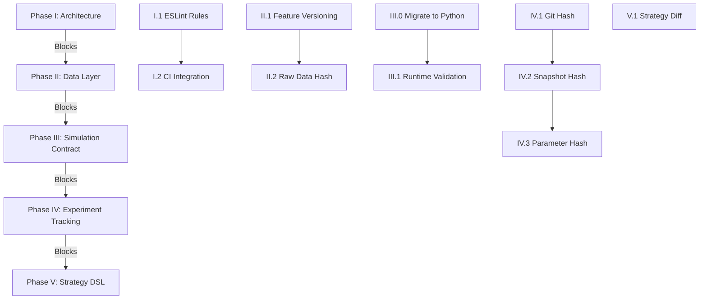

# Phases I-V: Comprehensive Task Decomposition

**Goal**: Complete each phase end-to-end with working command handlers before moving to the next phase.**Principle**: Each phase must be **fully functional and tested** before proceeding. No partial implementations.---

## Phase I: Core Architectural Invariants (85% → 100%)

**Current Status**: Determinism contract, artifact versioning, and simulation contracts exist. Missing: ESLint boundary enforcement and CI integration.**Completion Goal**: Architecture boundaries enforced at build time, violations caught in CI, zero violations in codebase.

### Task I.1: Complete ESLint Boundary Rules

**Duration**: 2 days**Priority**: P0 (Blocks everything)

#### Subtasks:

1. **Audit Existing ESLint Rules**

- Review `eslint.config.mjs` for existing boundary rules
- Verify `no-restricted-imports` patterns cover all layer boundaries
- **Files**: `eslint.config.mjs`
- **Success**: All layer boundaries documented in ESLint config

2. **Add Missing Layer Boundary Rules**

- Add rules blocking `@quantbot/backtest` from importing I/O packages (`@quantbot/ingestion`, `@quantbot/api-clients`, `@quantbot/jobs`)
- Add rules blocking `@quantbot/analytics` from importing `@quantbot/api-clients`
- Add rules blocking handlers from using `console.log`, `process.exit`, `process.env`
- Note: Simulation is now Python in backtest package, so TypeScript boundaries apply to orchestration layer only
- **Files**: `eslint.config.mjs`
- **Success**: ESLint errors on boundary violations

3. **Test ESLint Rules**

- Create test violations in temporary files
- Verify ESLint catches them
- Remove test violations
- **Files**: `eslint.config.mjs`, temporary test files
- **Success**: Rules work as expected

#### Command Handler Integration:

**CLI Command**: `quantbot architecture verify-boundaries`

- **Handler**: `packages/cli/src/handlers/architecture/verify-boundaries.ts`
- **Schema**: `packages/cli/src/command-defs/architecture.ts`
- **Action**: Run ESLint with boundary rules, report violations
- **Output**: Table of violations (file, line, message) or "No violations found"

**Files to Create**:

- `packages/cli/src/command-defs/architecture.ts`
- `packages/cli/src/handlers/architecture/verify-boundaries.ts`
- `packages/cli/src/commands/architecture.ts` (register command)

**Test**: `packages/cli/tests/unit/handlers/architecture/verify-boundaries.test.ts`---

### Task I.2: Integrate Architecture Tests into CI

**Duration**: 1 day**Priority**: P0

#### Subtasks:

1. **Review Existing Architecture Test Script**

- Verify `scripts/verify-architecture-boundaries.ts` covers all boundaries
- Ensure it matches ESLint rules
- **Files**: `scripts/verify-architecture-boundaries.ts`
- **Success**: Script validates all documented boundaries

2. **Add CI Workflow Step**

- Add step to `.github/workflows/ci.yml` (or equivalent)
- Run `pnpm verify:architecture-boundaries` (or equivalent script)
- Fail CI on violations
- **Files**: `.github/workflows/ci.yml` (or CI config)
- **Success**: CI fails on boundary violations

3. **Fix Any Existing Violations**

- Run architecture test script
- Document violations
- Fix violations (move code, extract adapters, update imports)
- **Files**: All packages (targeted fixes)
- **Success**: Zero violations in codebase

#### Command Handler Integration:

**CLI Command**: `quantbot architecture test-boundaries`

- **Handler**: `packages/cli/src/handlers/architecture/test-boundaries.ts`
- **Action**: Run `scripts/verify-architecture-boundaries.ts`, report results
- **Output**: Pass/fail with violation details

**Files to Create**:

- `packages/cli/src/handlers/architecture/test-boundaries.ts`
- Update `packages/cli/src/commands/architecture.ts`

**Test**: `packages/cli/tests/unit/handlers/architecture/test-boundaries.test.ts`---

### Phase I Success Criteria:

- ✅ ESLint blocks all cross-layer imports
- ✅ Architecture tests pass in CI
- ✅ Zero violations in existing code
- ✅ `quantbot architecture verify-boundaries` command works
- ✅ `quantbot architecture test-boundaries` command works
- ✅ CI fails on boundary violations

**End-to-End Test**:

```bash
# Should pass
quantbot architecture verify-boundaries
quantbot architecture test-boundaries

# Create violation, should fail
echo "import { something } from '@quantbot/ingestion';" > packages/backtest/src/test-violation.ts
quantbot architecture verify-boundaries  # Should show violation
rm packages/backtest/src/test-violation.ts
```

---

## Phase II: Data Layer (70% → 100%)

**Current Status**: Raw data ingestion, OHLCV ingestion, canonical schemas exist. Missing: Feature store versioning and raw data hash tracking.**Completion Goal**: Feature store with versioning, raw data hash tracking for idempotency, end-to-end data pipeline testable.

### Task II.1: Implement Feature Store Versioning

**Duration**: 3 days**Priority**: P0

#### Subtasks:

1. **Review Existing Feature Store**

- Audit `tools/telegram/statistics/feature_store.py`
- Review `packages/lab/src/catalog/schema.sql` for feature tables
- Understand current feature storage structure
- **Files**: `tools/telegram/statistics/feature_store.py`, `packages/lab/src/catalog/schema.sql`
- **Success**: Understand current implementation

2. **Design Feature Store Version Schema**

- Add `feature_set_version` field to feature sets
- Add `feature_spec_version` field (DSL version)
- Add `computed_at` timestamp
- Add `computed_by` (git commit hash)
- **Files**: `packages/lab/src/catalog/schema.sql`
- **Success**: Schema supports versioning

3. **Update Feature Store Python Implementation**

- Add version tracking to `FeatureStore.store_alert_features()`
- Add version tracking to `FeatureStore.store_candle_features()`
- Add version tracking to `FeatureStore.store_sequence_features()`
- **Files**: `tools/telegram/statistics/feature_store.py`
- **Success**: Features stored with versions

4. **Update TypeScript Feature Store Port**

- Add version fields to feature store interfaces
- Update `FeatureCache` to track versions
- **Files**: `packages/lab/src/features/FeatureCache.ts`, `packages/lab/src/features/types.ts`
- **Success**: TypeScript interfaces match Python implementation

5. **Add Feature Store Migration**

- Create migration script to add version columns to existing tables
- Handle existing features (default version: "1.0.0")
- **Files**: `scripts/migration/add-feature-versioning.sql`
- **Success**: Existing data migrated

#### Command Handler Integration:

**CLI Command**: `quantbot data feature-store version <featureSetId>`

- **Handler**: `packages/cli/src/handlers/data/feature-store-version.ts`
- **Action**: Show version info for a feature set
- **Output**: Feature set ID, version, computed_at, computed_by

**CLI Command**: `quantbot data feature-store list-versions <featureSetId>`

- **Handler**: `packages/cli/src/handlers/data/feature-store-list-versions.ts`
- **Action**: List all versions of a feature set
- **Output**: Table of versions with timestamps

**Files to Create**:

- `packages/cli/src/command-defs/data.ts`
- `packages/cli/src/handlers/data/feature-store-version.ts`
- `packages/cli/src/handlers/data/feature-store-list-versions.ts`
- `packages/cli/src/commands/data.ts`

**Tests**:

- `packages/cli/tests/unit/handlers/data/feature-store-version.test.ts`
- `packages/cli/tests/unit/handlers/data/feature-store-list-versions.test.ts`

---

### Task II.2: Implement Raw Data Hash Tracking

**Duration**: 2 days**Priority**: P0

#### Subtasks:

1. **Design Raw Data Hash Schema**

- Add `raw_data_hash` field to ingestion tables (calls, candles, etc.)
- Hash includes: content hash (SHA-256 of raw data), source, timestamp
- **Files**: Database schema files (DuckDB/ClickHouse)
- **Success**: Schema supports hash tracking

2. **Update Telegram Ingestion Pipeline**

- Compute hash of raw Telegram message before parsing
- Store hash with ingested call
- Skip ingestion if hash already exists (idempotency)
- **Files**: `tools/telegram/duckdb_punch_pipeline.py`
- **Success**: Duplicate messages skipped

3. **Update OHLCV Ingestion**

- Compute hash of OHLCV data before storing
- Store hash with candle data
- Skip if hash exists
- **Files**: `tools/ingestion/ohlcv_worklist.py`, `packages/ingestion/`
- **Success**: Duplicate OHLCV data skipped

4. **Add Hash Lookup Service**

- Create service to check if raw data hash exists
- Create service to get raw data by hash
- **Files**: `packages/storage/src/repositories/raw-data-repository.ts`
- **Success**: Can query by hash

#### Command Handler Integration:

**CLI Command**: `quantbot data check-hash <hash>`

- **Handler**: `packages/cli/src/handlers/data/check-hash.ts`
- **Action**: Check if raw data hash exists in database
- **Output**: Hash exists: yes/no, source, timestamp

**CLI Command**: `quantbot data ingest --skip-duplicates`

- **Handler**: Update existing ingestion handlers to use hash checking
- **Action**: Skip ingestion if hash already exists
- **Files**: Update `packages/cli/src/handlers/ingestion/ingest-telegram.ts`, `packages/cli/src/handlers/ingestion/ingest-ohlcv.ts`
- **Success**: `--skip-duplicates` flag works

**Files to Create**:

- `packages/cli/src/handlers/data/check-hash.ts`
- Update `packages/cli/src/command-defs/data.ts`
- Update `packages/cli/src/commands/data.ts`

**Tests**:

- `packages/cli/tests/unit/handlers/data/check-hash.test.ts`
- Integration test: ingest same data twice, second should skip

---

### Phase II Success Criteria:

- ✅ Feature store tracks versions
- ✅ Raw data hash tracking prevents duplicates
- ✅ `quantbot data feature-store version` command works
- ✅ `quantbot data check-hash` command works
- ✅ `quantbot data ingest --skip-duplicates` skips duplicates
- ✅ End-to-end: ingest data → check hash → ingest again (skipped)

**End-to-End Test**:

```bash
# Ingest data
quantbot ingestion telegram --file messages.json

# Check hash
HASH=$(quantbot data check-hash <hash>)
echo $HASH  # Should show hash exists

# Ingest again with skip-duplicates
quantbot ingestion telegram --file messages.json --skip-duplicates  # Should skip
```

---

## Phase III: Simulation Contract (90% → 100%)

**Current Status**: SimInput/SimResult schemas, execution models, risk models exist. Missing: Runtime contract version validation, TypeScript simulation code migration to Python, simulation consolidation into backtest package.**Completion Goal**: Simulation code migrated to Python in backtest package, contract version validated at runtime, incompatible versions rejected, version compatibility documented.

### Task III.0: Migrate Simulation to Backtest Package (Python)

**Duration**: 5 days**Priority**: P0 (Must complete before III.1)

#### Subtasks:

1. **Audit Existing Simulation Code**

- Review TypeScript simulation code in `packages/simulation/src/`
- Review Python simulation code in `tools/telegram/simulation/` and `tools/simulation/`
- Review backtest package structure in `packages/backtest/src/`
- Identify what needs to be migrated
- **Files**: `packages/simulation/src/`, `tools/telegram/simulation/`, `tools/simulation/`, `packages/backtest/src/`
- **Success**: Understand what needs migration

2. **Design Python Simulation Architecture in Backtest Package**

- Design Python simulation module structure: `tools/backtest/lib/simulation/`
- Define interfaces matching TypeScript contracts (SimInput, SimResult)
- Plan migration of execution models, risk models, clock abstraction
- **Files**: `tools/backtest/lib/simulation/` (new structure)
- **Success**: Architecture designed

3. **Migrate Core Simulation Logic to Python**

- Migrate simulation engine logic from TypeScript to Python
- Migrate execution models (latency, slippage, partial fills, fees)
- Migrate risk models (position limits, drawdown limits, exposure limits)
- Migrate clock abstraction
- **Files**: `tools/backtest/lib/simulation/simulator.py`, `tools/backtest/lib/simulation/execution_model.py`, `tools/backtest/lib/simulation/risk_model.py`
- **Success**: Core simulation logic in Python

4. **Migrate Contract Types and Schemas**

- Create Python Zod-equivalent schemas for SimInput/SimResult
- Use Pydantic for validation (matches Zod patterns)
- Ensure schemas match TypeScript contracts exactly
- **Files**: `tools/backtest/lib/simulation/contracts.py`
- **Success**: Python schemas match TypeScript contracts

5. **Update Backtest Package to Use Python Simulation**

- Update `packages/backtest/src/engine/` to call Python simulator via PythonEngine
- Remove TypeScript simulation code from backtest package
- Update imports and dependencies
- **Files**: `packages/backtest/src/engine/index.ts`, `packages/backtest/package.json`
- **Success**: Backtest package uses Python simulation

6. **Update Workflows to Use Python Simulation**

- Update `runSimulation` workflow to call Python simulator
- Update `replaySimulation` workflow to call Python simulator
- Update batch/sweep workflows
- **Files**: `packages/workflows/src/simulation/runSimulation.ts`
- **Success**: Workflows use Python simulation

7. **Deprecate TypeScript Simulation Package**

- Mark `packages/simulation` as deprecated
- Update documentation to point to backtest package
- Create migration guide
- **Files**: `packages/simulation/README.md`, `docs/migrations/simulation-to-backtest.md`
- **Success**: TypeScript simulation package deprecated

#### Command Handler Integration:

**CLI Command**: `quantbot backtest validate-simulation`

- **Handler**: `packages/cli/src/handlers/backtest/validate-simulation.ts`
- **Action**: Validate Python simulation setup and contracts
- **Output**: Validation results, Python version, module paths

**Files to Create**:

- `tools/backtest/lib/simulation/` (new directory structure)
- `tools/backtest/lib/simulation/__init__.py`
- `tools/backtest/lib/simulation/simulator.py`
- `tools/backtest/lib/simulation/contracts.py`
- `tools/backtest/lib/simulation/execution_model.py`
- `tools/backtest/lib/simulation/risk_model.py`
- `packages/cli/src/handlers/backtest/validate-simulation.ts`
- Update `packages/cli/src/command-defs/backtest.ts`
- Update `packages/cli/src/commands/backtest.ts`

**Tests**:

- `tools/backtest/tests/test_simulation.py` (Python unit tests)
- `packages/cli/tests/unit/handlers/backtest/validate-simulation.test.ts`
- Integration test: run backtest with Python simulator

---

### Task III.1: Implement Runtime Contract Version Validation

**Duration**: 2 days**Priority**: P0

#### Subtasks:

1. **Review Existing Contract Validator**

- Audit Python simulation contracts in `tools/backtest/lib/simulation/contracts.py`
- Review Pydantic validation logic
- Understand current validation structure
- **Files**: `tools/backtest/lib/simulation/contracts.py`
- **Success**: Understand current implementation

2. **Define Supported Contract Versions**

- Document supported versions: `['1.0.0']` (current)
- Create version compatibility matrix
- **Files**: `docs/architecture/SIMULATION_CONTRACT.md`
- **Success**: Versions documented

3. **Integrate Version Validation into Python Simulator**

- Add version validation to Python simulator entry point
- Validate contract version before simulation starts
- **Files**: `tools/backtest/lib/simulation/simulator.py`
- **Success**: Invalid versions rejected

4. **Add Version Validation to TypeScript Orchestration Layer**

- Validate version in TypeScript before calling Python simulator
- Validate version in `runSimulation` workflow
- Validate version in `replaySimulation` workflow
- **Files**: `packages/backtest/src/engine/index.ts`, `packages/workflows/src/simulation/runSimulation.ts`
- **Success**: Workflows validate versions

5. **Add Version Error Messages**

- Clear error messages for unsupported versions
- Suggest migration path
- **Files**: `tools/backtest/lib/simulation/contracts.py`, `packages/backtest/src/engine/index.ts`
- **Success**: Helpful error messages

#### Command Handler Integration:

**CLI Command**: `quantbot backtest validate-contract <input-file>`

- **Handler**: `packages/cli/src/handlers/backtest/validate-contract.ts`
- **Action**: Validate simulation input contract version (calls Python validator)
- **Output**: Valid/invalid, version, supported versions

**CLI Command**: `quantbot backtest check-version <version>`

- **Handler**: `packages/cli/src/handlers/backtest/check-version.ts`
- **Action**: Check if contract version is supported
- **Output**: Supported: yes/no, supported versions list

**Files to Create**:

- `packages/cli/src/handlers/backtest/validate-contract.ts`
- `packages/cli/src/handlers/backtest/check-version.ts`
- Update `packages/cli/src/command-defs/backtest.ts`
- Update `packages/cli/src/commands/backtest.ts`

**Tests**:

- `tools/backtest/tests/test_contract_validation.py` (Python tests)
- `packages/cli/tests/unit/handlers/backtest/validate-contract.test.ts`
- `packages/cli/tests/unit/handlers/backtest/check-version.test.ts`
- Integration test: run backtest with unsupported version (should fail)

---

### Phase III Success Criteria:

- ✅ TypeScript simulation code migrated to Python in backtest package
- ✅ Python simulation integrated with backtest package
- ✅ Contract version validated at runtime
- ✅ Unsupported versions rejected with clear errors
- ✅ `quantbot backtest validate-contract` command works
- ✅ `quantbot backtest check-version` command works
- ✅ `quantbot backtest validate-simulation` command works
- ✅ End-to-end: run backtest with invalid version (rejected)
- ✅ TypeScript simulation package deprecated

**End-to-End Test**:

```bash
# Validate Python simulation setup
quantbot backtest validate-simulation  # Should pass

# Create invalid contract (wrong version)
echo '{"contractVersion": "2.0.0", ...}' > invalid-contract.json

# Validate contract (should fail)
quantbot backtest validate-contract invalid-contract.json  # Should reject

# Check version
quantbot backtest check-version 2.0.0  # Should show unsupported

# Run backtest with valid contract (should work)
quantbot backtest run --strategy test --from 2024-01-01 --to 2024-02-01
```

---

## Phase IV: Experiment Tracking (60% → 100%)

**Current Status**: Run metadata in DuckDB, run status tracking exist. Missing: Git commit hash auto-capture, data snapshot hash storage, parameter vector hashing.**Completion Goal**: All experiment metadata captured automatically, deduplication works, experiments fully traceable.

### Task IV.1: Complete Git Commit Hash Auto-Capture

**Duration**: 1 day**Priority**: P0

#### Subtasks:

1. **Review Existing Git Hash Capture**

- Audit `packages/workflows/src/experiments/experiment-registry.ts`
- Review `getCurrentGitCommitHash()` function
- Verify it's called in all experiment registration paths
- **Files**: `packages/workflows/src/experiments/experiment-registry.ts`, `packages/utils/src/git.ts`
- **Success**: Understand current implementation

2. **Ensure Git Hash Captured in All Workflows**

- Verify `runSimulation` captures git hash
- Verify `replaySimulation` captures git hash
- Verify `batchSimulation` captures git hash
- **Files**: `packages/workflows/src/simulation/runSimulation.ts`, etc.
- **Success**: All workflows capture git hash

3. **Handle Non-Git Environments**

- Gracefully handle "unknown" git hash (not in git repo)
- Log warning when git hash unavailable
- **Files**: `packages/utils/src/git.ts`
- **Success**: Non-git environments handled

#### Command Handler Integration:

**CLI Command**: `quantbot experiments get <experimentId>`

- **Handler**: Already exists, verify it shows git hash
- **Action**: Show experiment details including git commit hash
- **Output**: Include git hash in output

**CLI Command**: `quantbot experiments list --git-hash <hash>`

- **Handler**: Update existing list handler
- **Action**: Filter experiments by git commit hash
- **Files**: Update `packages/cli/src/handlers/experiments/list-experiments.ts`
- **Success**: Can filter by git hash

**Tests**:

- Unit test: git hash captured in experiment registration
- Integration test: run experiment, verify git hash stored

---

### Task IV.2: Complete Data Snapshot Hash Storage

**Duration**: 2 days**Priority**: P0

#### Subtasks:

1. **Review Existing Data Snapshot Implementation**

- Audit `packages/workflows/src/research/contract.ts` for `DataSnapshotRef`
- Review `packages/cli/src/core/run-manifest-service.ts` for snapshot handling
- Understand current snapshot hash computation
- **Files**: `packages/workflows/src/research/contract.ts`, `packages/cli/src/core/run-manifest-service.ts`
- **Success**: Understand current implementation

2. **Ensure Data Snapshot Hash Stored in All Experiments**

- Verify `ExperimentRegistry.registerExperiment()` stores `dataSnapshotHash`
- Verify `runSimulation` computes and stores snapshot hash
- **Files**: `packages/workflows/src/experiments/experiment-registry.ts`, `packages/workflows/src/simulation/runSimulation.ts`
- **Success**: Snapshot hash always stored

3. **Add Data Snapshot Hash to Database Schema**

- Verify `simulation_runs` table has `data_snapshot_hash` column
- Create migration if needed
- **Files**: Database schema, `scripts/migration/add-data-snapshot-hash.sql`
- **Success**: Database stores snapshot hash

#### Command Handler Integration:

**CLI Command**: `quantbot experiments list --data-snapshot-hash <hash>`

- **Handler**: Update existing list handler
- **Action**: Filter experiments by data snapshot hash
- **Files**: Update `packages/cli/src/handlers/experiments/list-experiments.ts`
- **Success**: Can filter by snapshot hash

**CLI Command**: `quantbot research create-snapshot --compute-hash`

- **Handler**: Update existing create-snapshot handler
- **Action**: Compute and display snapshot hash
- **Files**: Update `packages/cli/src/handlers/research/create-snapshot.ts`
- **Success**: Snapshot hash displayed

**Tests**:

- Unit test: snapshot hash computed correctly
- Integration test: run experiment, verify snapshot hash stored

---

### Task IV.3: Complete Parameter Vector Hashing

**Duration**: 2 days**Priority**: P0

#### Subtasks:

1. **Review Existing Parameter Vector Implementation**

- Audit `packages/workflows/src/experiments/experiment-registry.ts` for `hashParameterVector()`
- Review `serializeSimulationParameters()` function
- Understand current parameter hashing
- **Files**: `packages/workflows/src/experiments/experiment-registry.ts`
- **Success**: Understand current implementation

2. **Ensure Parameter Vector Hash Stored**

- Verify `ExperimentRegistry.registerExperiment()` stores `parameterVectorHash`
- Verify hash includes: strategy config, execution model, risk model
- **Files**: `packages/workflows/src/experiments/experiment-registry.ts`
- **Success**: Parameter hash always stored

3. **Add Parameter Vector Hash to Database Schema**

- Verify `simulation_runs` table has `parameter_vector_hash` column
- Create migration if needed
- **Files**: Database schema, `scripts/migration/add-parameter-vector-hash.sql`
- **Success**: Database stores parameter hash

4. **Implement Deduplication Logic**

- Query experiments by parameter vector hash
- Skip experiment if identical parameters already run
- **Files**: `packages/workflows/src/experiments/experiment-registry.ts`
- **Success**: Duplicate experiments detected

#### Command Handler Integration:

**CLI Command**: `quantbot experiments find --parameter-hash <hash>`

- **Handler**: Update existing find handler
- **Action**: Find experiments with matching parameter vector hash
- **Files**: Update `packages/cli/src/handlers/experiments/find-experiments.ts`
- **Success**: Can find by parameter hash

**CLI Command**: `quantbot experiments list --parameter-hash <hash>`

- **Handler**: Update existing list handler
- **Action**: Filter experiments by parameter vector hash
- **Files**: Update `packages/cli/src/handlers/experiments/list-experiments.ts`
- **Success**: Can filter by parameter hash

**CLI Command**: `quantbot research run --skip-duplicates`

- **Handler**: Update existing run handler
- **Action**: Skip experiment if parameter hash already exists
- **Files**: Update `packages/cli/src/handlers/research/run-simulation.ts`
- **Success**: Duplicate experiments skipped

**Tests**:

- Unit test: parameter hash computed correctly
- Integration test: run experiment twice with same parameters (second skipped)

---

### Phase IV Success Criteria:

- ✅ Git commit hash auto-captured in all experiments
- ✅ Data snapshot hash stored in all experiments
- ✅ Parameter vector hash stored in all experiments
- ✅ `quantbot experiments list --git-hash` works
- ✅ `quantbot experiments list --data-snapshot-hash` works
- ✅ `quantbot experiments find --parameter-hash` works
- ✅ `quantbot research run --skip-duplicates` skips duplicates
- ✅ End-to-end: run experiment → find by parameter hash → run again (skipped)

**End-to-End Test**:

```bash
# Run experiment
quantbot research run --request-file request.json

# Get experiment ID
EXPERIMENT_ID=$(quantbot experiments list --limit 1 | grep experiment_id | awk '{print $2}')

# Get parameter hash
PARAM_HASH=$(quantbot experiments get $EXPERIMENT_ID | grep parameter_vector_hash | awk '{print $2}')

# Find experiments with same parameters
quantbot experiments find --parameter-hash $PARAM_HASH  # Should find original

# Run again with skip-duplicates
quantbot research run --request-file request.json --skip-duplicates  # Should skip
```

---

## Phase V: Strategy DSL (85% → 100%)

**Current Status**: DSL schema, template system, DSL validator exist. Missing: Strategy comparison/diff tooling.**Completion Goal**: Can compare strategies, show diffs, identify differences, support strategy evolution tracking.

### Task V.1: Implement Strategy Comparison/Diff Tooling

**Duration**: 3 days**Priority**: P0

#### Subtasks:

1. **Design Strategy Diff Schema**

- Define diff structure: added fields, removed fields, changed fields
- Define diff types: entry config, exit config, re-entry config, risk, costs
- **Files**: `packages/core/src/strategy/diff-types.ts`
- **Success**: Diff schema defined

2. **Implement Strategy Diff Algorithm**

- Compare two strategy DSL objects
- Compute diff: added, removed, changed fields
- Handle nested objects (entry, exit, re-entry configs)
- **Files**: `packages/core/src/strategy/strategy-diff.ts`
- **Success**: Can compute diff between strategies

3. **Implement Strategy Comparison Service**

- Service to compare strategies by ID or file path
- Service to compare strategy versions
- **Files**: `packages/core/src/strategy/strategy-comparison.ts`
- **Success**: Can compare strategies

4. **Add Strategy Diff Output Formats**

- JSON format (structured diff)
- Human-readable format (markdown table)
- **Files**: `packages/core/src/strategy/strategy-diff.ts`
- **Success**: Multiple output formats supported

#### Command Handler Integration:

**CLI Command**: `quantbot strategy diff <strategy1> <strategy2>`

- **Handler**: `packages/cli/src/handlers/strategy/diff-strategy.ts`
- **Action**: Compare two strategies (by ID or file path)
- **Output**: Diff in selected format (json/table)
- **Options**: `--format <json|table>`, `--output <file>`

**CLI Command**: `quantbot strategy compare <strategy1> <strategy2>`

- **Handler**: `packages/cli/src/handlers/strategy/compare-strategy.ts`
- **Action**: Compare strategies and show summary
- **Output**: Summary of differences (entry, exit, risk, etc.)

**CLI Command**: `quantbot strategy versions <strategyId>`

- **Handler**: `packages/cli/src/handlers/strategy/list-versions.ts`
- **Action**: List all versions of a strategy
- **Output**: Table of versions with timestamps

**Files to Create**:

- `packages/core/src/strategy/diff-types.ts`
- `packages/core/src/strategy/strategy-diff.ts`
- `packages/core/src/strategy/strategy-comparison.ts`
- `packages/cli/src/command-defs/strategy.ts`
- `packages/cli/src/handlers/strategy/diff-strategy.ts`
- `packages/cli/src/handlers/strategy/compare-strategy.ts`
- `packages/cli/src/handlers/strategy/list-versions.ts`
- `packages/cli/src/commands/strategy.ts`

**Tests**:

- `packages/core/tests/unit/strategy/strategy-diff.test.ts`
- `packages/cli/tests/unit/handlers/strategy/diff-strategy.test.ts`
- `packages/cli/tests/unit/handlers/strategy/compare-strategy.test.ts`

---

### Phase V Success Criteria:

- ✅ Strategy diff algorithm works
- ✅ `quantbot strategy diff` command works
- ✅ `quantbot strategy compare` command works
- ✅ `quantbot strategy versions` command works
- ✅ End-to-end: create two strategies → diff them → see differences

**End-to-End Test**:

```bash
# Create two strategies
quantbot strategy create --file strategy1.json
quantbot strategy create --file strategy2.json

# Diff strategies
quantbot strategy diff strategy1.json strategy2.json  # Should show differences

# Compare strategies
quantbot strategy compare strategy1.json strategy2.json  # Should show summary
```

---

## Execution Order & Dependencies



**Execution Rules**:

1. Complete Phase I fully before starting Phase II
2. Complete Phase II fully before starting Phase III
3. Complete Phase III fully before starting Phase IV
4. Complete Phase IV fully before starting Phase V
5. Within each phase, complete all tasks before moving to next phase
6. Each task must have working command handlers before marking complete
7. Each phase must pass end-to-end tests before moving to next phase

---

## Testing Strategy

### Unit Tests

- Each handler must have unit tests
- Each service must have unit tests
- Tests use stubs/mocks (no real I/O)

### Integration Tests

- End-to-end tests for each command
- Tests use real database (DuckDB) but can be cleaned up
- Tests verify full workflow

### Regression Tests

- After each phase, run full test suite
- Verify no regressions in previous phases
- Fix any regressions before proceeding

---

## Success Metrics

**Phase I**:

- ✅ Zero ESLint boundary violations
- ✅ CI fails on boundary violations
- ✅ Architecture tests pass

**Phase II**:

- ✅ Feature store tracks versions
- ✅ Raw data hash prevents duplicates
- ✅ All commands work end-to-end

**Phase III**:

- ✅ Simulation migrated to Python in backtest package
- ✅ Contract version validated at runtime
- ✅ Unsupported versions rejected
- ✅ All commands work end-to-end

**Phase IV**:

- ✅ All metadata captured automatically
- ✅ Deduplication works
- ✅ All commands work end-to-end

**Phase V**:

- ✅ Strategy diff works
- ✅ Strategy comparison works
- ✅ All commands work end-to-end

---

## Notes

- **No Partial Implementations**: Each phase must be 100% complete before moving to next
- **Command Handlers First**: Implement command handlers early to verify functionality