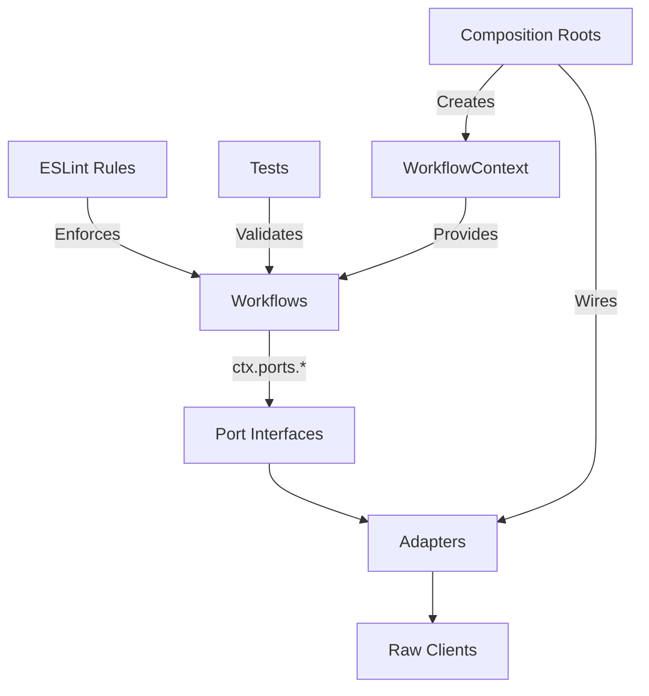

# Ports Migration Roadmap

## Current State

**Completed:**

- MarketDataPort adapter (wired to BirdeyeClient)
- TelemetryPort adapter (console-backed)
- ClockPort adapter (system clock)
- `ingestOhlcvPorted.ts` demonstrates ports pattern
- ProductionPorts infrastructure in place

**Remaining Work:**

- 2 workflows still use raw clients: `resolveEvmChains.ts`, `ingestTelegramJson.ts`
- ✅ StatePort: in-memory adapter exists (dev/test/idempotency only)
- ❌ StatePort: durable adapter (DuckDB/Redis/Postgres) not created
- ExecutionPort adapter not created
- ✅ Import gates exist (ESLint no-restricted-imports)
- ❌ Ports-only is not fully enforced (still holes / exceptions too broad / doesn't cover all patterns)
- Main `ingestOhlcv.ts` still uses raw clients via OhlcvFetchJob

## Architecture Flow

## Phase 1: Lock In Pattern (Critical Path - Highest ROI)

**Goal:** Prevent regression and validate the ports pattern works end-to-end.

**Why First:**

- ESLint rules are low effort, high impact (prevents future mistakes)
- Testing validates the pattern before expanding
- No dependencies - can be done immediately

**Tasks:**

1. **Wire Smoke Tests into pnpm Scripts**

   - Create `pnpm smoke:ports` script that runs all port smoke tests
   - Run: `smokeMarketDataPort()`, `smokeStatePort()` (when created), telemetry events
   - **File:** `package.json` (root)
   - **Script:** `"smoke:ports": "tsx packages/workflows/src/dev/smokeMarketDataPort.ts"`
   - **Success Criteria:** Smoke tests runnable via pnpm script

2. **Test Ported Workflow**

   - Run `pnpm smoke:ports` to verify MarketDataPort adapter
   - Test `ingestOhlcvPorted` with real mint (SOL or test token)
   - Verify telemetry events are emitted correctly
   - **File:** `packages/workflows/src/dev/smokeMarketDataPort.ts`
   - **Success Criteria:** All smoke tests pass, candles fetched successfully

3. **Add Performance Sanity Metrics**

   - Track `ohlcv_fetch_latency_ms` (p50/p95) in ported workflow
   - Compare ported vs non-ported workflow runtime
   - Verify candle count sanity (no regressions)
   - **File:** `packages/workflows/src/ohlcv/ingestOhlcvPorted.ts`
   - **Success Criteria:** Performance metrics logged, no regressions detected

4. **Add ESLint Rules for Workflows**

   - Block raw client imports in `packages/workflows/src/**/*.ts`
   - Block: `@quantbot/api-clients/src/**`, `@quantbot/storage/src/**`
   - Allow: Adapter files in `packages/workflows/src/adapters/**`
   - Allow: Context files in `packages/workflows/src/context/**`
   - **File:** `eslint.config.mjs`
   - **Pattern:** Add new block for `packages/workflows/src/**/*.ts` (excluding adapters and context)
   - **Success Criteria:** ESLint errors on raw client imports in workflows

5. **Prove ESLint Gate Works (Intentional Failure Test)**

   - Create a one-line intentionally-bad import in a workflow file (not adapters)
   - Example: `import { BirdeyeClient } from '@quantbot/api-clients/src/birdeye-client.js';` in `ingestOhlcv.ts`
   - Confirm ESLint fails in CI/local
   - Delete the intentional failure line
   - **File:** Any workflow file (temporary)
   - **Success Criteria:** ESLint catches the violation, gate is proven active

6. **Update Architecture Documentation**

   - Document ESLint enforcement in `docs/ARCHITECTURE.md`
   - Add section on "Workflow Ports Enforcement"
   - Add section: "How to verify ports migration locally"
   - Document: `pnpm verify:architecture-boundaries`, `pnpm lint`, `pnpm smoke:ports`
   - **File:** `docs/ARCHITECTURE.md`
   - **Success Criteria:** Documentation reflects enforcement mechanism and verification steps

**Dependencies:** None

**Timeline:** Same-day

**ROI:** Very High (prevents regression, validates pattern, makes repo self-teaching)

---

## Phase 2: Migrate Remaining Workflows (Quick Wins)

**Goal:** Remove all raw client usage from workflows, completing the ports migration for MarketDataPort.

**Why Second:**

- Quick wins (2 workflows, straightforward migrations)
- Removes technical debt
- Validates pattern works for different use cases
- Must complete before Phase 3 (StatePort) to avoid mixing concerns

**Tasks:**

1. **Migrate `resolveEvmChains.ts`**

   - Replace `BirdeyeClient` parameter with `ctx: WorkflowContextWithPorts`
   - Use `ctx.ports.marketData.fetchMetadata()` instead of `birdeyeClient.getTokenMetadata()`
   - Update function signature and all call sites
   - **File:** `packages/workflows/src/metadata/resolveEvmChains.ts`
   - **Changes:**
     - Remove `birdeyeClient: BirdeyeClient` from context interface
     - Update `resolveTokenChain()` to use `ctx.ports.marketData.fetchMetadata()`
     - Update `resolveEvmChains()` to accept `WorkflowContextWithPorts`
   - **Success Criteria:** No raw BirdeyeClient imports, all tests pass

2. **Migrate `ingestTelegramJson.ts`**

   - Replace `fetchMultiChainMetadata()` with `ctx.ports.marketData.fetchMetadata()`
   - Update to use `WorkflowContextWithPorts`
   - Handle multi-chain logic in workflow (try chains, keep logic in workflow not handlers)
   - Options: extend `MarketDataMetadataRequest` to accept `chain?: Chain` and loop, or add helper in workflows using port calls
   - **File:** `packages/workflows/src/telegram/ingestTelegramJson.ts`
   - **Changes:**
     - Remove `import { fetchMultiChainMetadata } from '@quantbot/api-clients'`
     - Replace `fetchMultiChainMetadata()` calls with `ctx.ports.marketData.fetchMetadata()`
     - Update context type to `WorkflowContextWithPorts`
     - Keep "try chains" logic in workflow, not in handlers
   - **Success Criteria:** No raw API client imports, workflow works end-to-end

3. **Update Context Creation**

   - Ensure `createProductionContextWithPorts()` is used for migrated workflows
   - Update CLI commands that call these workflows
   - **Files:** 
     - `packages/workflows/src/context/createProductionContext.ts`
     - CLI command files that invoke these workflows
   - **Success Criteria:** All workflows use ports, no raw clients

**Dependencies:** Phase 1 (ESLint rules will catch violations)

**Timeline:** Next-day

**ROI:** High (removes technical debt, validates pattern)

---

## Phase 3: Create Durable StatePort Adapter (Enables More Workflows)

**Goal:** Create durable StatePort adapter (DuckDB) to abstract storage operations, enabling workflows to use ports for state management.

**Why Third:**

- Enables migration of workflows that use storage (main `ingestOhlcv.ts`)
- StatePort is simpler than ExecutionPort (lower risk)
- Needed before Phase 4 (main workflow migration)
- Split into two steps to avoid scope creep

**Tasks (Step 1 - Core Operations):**

1. **Review StatePort Interface**

   - Review `StatePort` interface in `packages/core/src/ports/statePort.ts`
   - Interface already defined with: `get()`, `set()`, `delete()`, `query()`, `transaction()`, `isAvailable()`
   - **File:** `packages/core/src/ports/statePort.ts` (already defined)
   - **Success Criteria:** Interface is clear and complete

2. **Create DuckDB StatePort Adapter (Core Operations)**

   - Implement `StatePort` interface wrapping DuckDB operations
   - **Step 1:** Implement `get()`, `set()`, `delete()`, `isAvailable()` first
   - Handle namespace scoping and TTL
   - **File:** `packages/workflows/src/adapters/stateDuckdbAdapter.ts`
   - **Implementation:**
     - Use `DuckDBStorageService` from `packages/simulation/src/duckdb-storage-service.ts` or `DuckDBClient` from `packages/storage/src/duckdb/duckdb-client.ts`
     - Map port requests to DuckDB operations
     - Handle errors and return port-compatible responses
     - Match request/result types exactly from `StatePort` interface
   - **Success Criteria:** Core operations (get/set/delete/isAvailable) work, adapter tests pass

3. **Wire StatePort into ProductionPorts (Core)**

   - Add `state` port to `createProductionPorts()`
   - Wire DuckDB adapter
   - **File:** `packages/workflows/src/context/createProductionPorts.ts`
   - **Success Criteria:** `ctx.ports.state` is available with core operations

4. **Create StatePort Smoke Test (Core)**

   - Test get/set/delete/isAvailable operations
   - **File:** `packages/workflows/src/dev/smokeStatePort.ts`
   - **Success Criteria:** Core state operations work correctly

**Tasks (Step 2 - Advanced Operations):**

5. **Implement Query and Transaction**

   - Add `query()` method for SQL-like queries
   - Add `transaction()` method for atomic operations
   - **File:** `packages/workflows/src/adapters/stateDuckdbAdapter.ts`
   - **Success Criteria:** Query and transaction operations work, tests pass

6. **Update Smoke Test (Advanced)**

   - Add query and transaction tests
   - **File:** `packages/workflows/src/dev/smokeStatePort.ts`
   - **Success Criteria:** All state operations work correctly

**Dependencies:** Phase 2 (workflows migrated, pattern validated)

**Timeline:** Multi-PR (Step 1: same-day, Step 2: when needed)

**ROI:** Medium-High (enables Phase 4, abstracts storage)

---

## Phase 4: Migrate Main OHLCV Ingestion Workflow

**Goal:** Migrate the main `ingestOhlcv.ts` workflow to use ports instead of raw clients and OhlcvFetchJob.

**Why Fourth:**

- Largest workflow, most complex migration
- Depends on StatePort (Phase 3)
- High impact (core ingestion pipeline)
- Validates pattern works for complex workflows

**Tasks:**

1. **Analyze Current Dependencies**

   - Map all raw client usage in `ingestOhlcv.ts`
   - Identify what needs to be ported:
     - MarketDataPort (already available)
     - StatePort (from Phase 3)
     - OhlcvFetchJob (may need to be wrapped or replaced)
   - **File:** `packages/workflows/src/ohlcv/ingestOhlcv.ts`
   - **Success Criteria:** Complete dependency map

2. **Refactor OhlcvFetchJob Integration (Default: Option B)**

   - **Decision Rule:**
     - If OhlcvFetchJob is "just orchestration of market data fetch + store" → **Option B: Replace with direct port calls**
     - If it's "job runner with retries, batching, backpressure" → Option A: Wrap as port adapter
   - **Default:** Option B (simpler, cleaner in ports world)
   - Replace OhlcvFetchJob with direct `ctx.ports.marketData.fetchOhlcv()` and `ctx.ports.state.set()` calls
   - Fold any valuable behavior (retries, batching) into workflow orchestration
   - Reintroduce "job semantics" later if needed
   - **Files:**
     - `packages/workflows/src/ohlcv/ingestOhlcv.ts`
   - **Success Criteria:** Workflow uses ports directly, OhlcvFetchJob removed or wrapped only if proven valuable

3. **Migrate to MarketDataPort**

   - Replace any remaining BirdeyeClient usage with `ctx.ports.marketData`
   - Update candle fetching to use port
   - **File:** `packages/workflows/src/ohlcv/ingestOhlcv.ts`
   - **Success Criteria:** No raw BirdeyeClient imports

4. **Migrate to StatePort**

   - Replace DuckDB metadata updates with `ctx.ports.state.set()`
   - Use `ctx.ports.state.query()` for worklist queries if needed
   - **File:** `packages/workflows/src/ohlcv/ingestOhlcv.ts`
   - **Success Criteria:** No direct DuckDB storage calls

5. **Update Context Creation**

   - Ensure `createOhlcvIngestionContext()` uses ports
   - Update to `createProductionContextWithPorts()`
   - **File:** `packages/workflows/src/context/createOhlcvIngestionContext.ts`
   - **Success Criteria:** Context provides ports, not raw clients

6. **Comprehensive Testing**

   - Test with real DuckDB and ClickHouse
   - Verify worklist generation still works
   - Verify metadata updates work
   - Verify error handling
   - **Files:** Existing test files + new integration tests
   - **Success Criteria:** All tests pass, workflow works end-to-end

**Dependencies:** Phase 3 (StatePort must be available)

**Timeline:** Multi-PR

**ROI:** High (core workflow migrated, validates pattern at scale)

---

## Phase 5: Create ExecutionPort Adapter (Future-Proofing)

**Goal:** Create ExecutionPort adapter for trade execution, completing the ports architecture.

**Why Last:**

- Touches "real money" - highest risk
- Not currently used by workflows (future-proofing)
- Can be done after pattern is proven
- Lowest immediate ROI (not blocking other work)

**Tasks:**

1. **Design ExecutionPort Adapter**

   - Review `ExecutionPort` interface in `packages/core/src/ports/executionPort.ts`
   - Identify execution clients (Jito, Helius, etc.)
   - Design adapter interface
   - **File:** `packages/core/src/ports/executionPort.ts` (already defined)
   - **Success Criteria:** Interface is clear and complete

2. **Create Jito ExecutionPort Adapter (Safety-First)**

   - Implement `ExecutionPort` wrapping Jito client
   - Support: `execute()`, `isAvailable()`
   - Handle slippage, priority fees, retries
   - **Safety Features:**
     - Dry-run mode / simulation adapter (must support)
     - Circuit breaker behavior defined
     - Idempotency key design (prevent double-execution)
   - **File:** `packages/workflows/src/adapters/executionJitoAdapter.ts`
   - **Success Criteria:** Adapter implements ExecutionPort with all safety features, handles all execution scenarios

3. **Wire ExecutionPort into ProductionPorts**

   - Add `execution` port to `createProductionPorts()`
   - Use Jito adapter (or stub if not available)
   - **File:** `packages/workflows/src/context/createProductionPorts.ts`
   - **Success Criteria:** `ctx.ports.execution` is available (may be stub)

4. **Create ExecutionPort Smoke Test (Safety-First)**

   - Test `isAvailable()` (safe to call)
   - Test `execute()` with dry-run mode (required)
   - Verify circuit breaker behavior
   - Verify idempotency key handling
   - **File:** `packages/workflows/src/dev/smokeExecutionPort.ts`
   - **Success Criteria:** Port interface works, all safety features validated (actual execution optional)

5. **Document ExecutionPort Usage (Safety-First)**

   - Add examples of how workflows would use ExecutionPort
   - Document safety considerations: dry-run mode, circuit breakers, idempotency keys
   - Document "real money" warnings and best practices
   - **File:** `docs/ARCHITECTURE.md` or new execution guide
   - **Success Criteria:** Documentation is clear and complete, safety features prominently documented

**Dependencies:** Phases 1-4 (pattern proven, infrastructure ready)

**Timeline:** When execution is needed

**ROI:** Low-Medium (future-proofing, not immediately needed)

---

## Success Metrics

**Phase 1:**

- ESLint blocks raw client imports in workflows
- Smoke tests pass
- Documentation updated

**Phase 2:**

- Zero raw client imports in workflows (except adapters)
- All migrated workflows pass tests
- No regressions

**Phase 3:**

- StatePort adapter implements all methods
- Smoke tests pass
- Port wired into ProductionPorts

**Phase 4:**

- Main ingestOhlcv workflow uses only ports
- All tests pass
- No performance regressions

**Phase 5:**

- ExecutionPort adapter created
- Port wired into ProductionPorts
- Documentation complete

## Risk Mitigation

- **Breaking Changes:** Each phase is incremental, backward compatibility maintained
- **Performance:** Ports add minimal overhead (thin adapters)
- **Testing:** Smoke tests validate each port before migration
- **Rollback:** Each phase is independent, can rollback if needed

## Timeline Estimate

- **Phase 1:** Same-day
- **Phase 2:** Next-day
- **Phase 3:** Multi-PR (Step 1: same-day, Step 2: when needed)
- **Phase 4:** Multi-PR
- **Phase 5:** When execution is needed

**Total:** Incremental, resilient to change