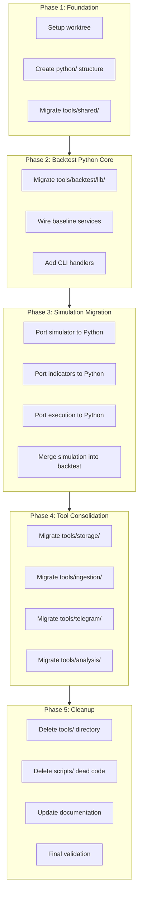

# Python-TypeScript Architecture Refactor v2

## Executive Summary

Refactor the codebase to enforce a clear separation:

- **TypeScript**: Orchestration, validation, CLI, API, formatting
- **Python**: All data science, simulation, backtesting, heavy computation

Using a **worktree-based approach** at `/home/memez/backups/quantBot2/` with frequent commits.---

## Guiding Principles

1. **Python bears the brunt** of data science workload
2. **TypeScript orchestrates** via PythonEngine boundary
3. **Colocated Python** lives in `packages/{package}/python/`
4. **Simulation merges into backtest** (one unified package for backtesting)
5. **Aggressive cleanup** - delete dead code, don't archive
6. **Frequent commits** - commit at each task completion

---

## Phase Overview



---

## Phase 1: Foundation Setup

**Milestone**: Worktree created, base Python structure established, shared utilities migrated.

### 1.1 Worktree Setup

- [ ] Create git worktree at `/home/memez/backups/quantBot2/`
- [ ] Create feature branch `refactor/python-ts-architecture`
- [ ] Verify worktree builds and tests pass
- [ ] **Commit**: "chore: create worktree for python-ts refactor"

### 1.2 Create Python Directory Structure

- [ ] Create `packages/backtest/python/` directory
- [ ] Create `packages/backtest/python/lib/` for shared modules
- [ ] Create `packages/backtest/python/scripts/` for CLI entry points
- [ ] Create `packages/storage/python/` directory
- [ ] Create `packages/ingestion/python/` directory
- [ ] Add `__init__.py` files for Python package structure
- [ ] Add `requirements.txt` to each Python directory
- [ ] **Commit**: "feat(backtest): add python/ directory structure"

### 1.3 Migrate Shared Python Utilities

- [ ] Move `tools/shared/` → `packages/backtest/python/shared/`
- [ ] Update imports in dependent Python files
- [ ] Update PYTHONPATH in PythonEngine calls
- [ ] Verify shared utilities still work
- [ ] **Commit**: "refactor: migrate tools/shared to packages/backtest/python/shared"

---

## Phase 2: Backtest Python Core

**Milestone**: All backtest Python tools migrated and wired through TypeScript services.

### 2.1 Migrate Backtest Library

- [ ] Move `tools/backtest/lib/` → `packages/backtest/python/lib/`
- [ ] Move `tools/backtest/tests/` → `packages/backtest/python/tests/`
- [ ] Update all relative imports in Python files
- [ ] Update V1BaselinePythonService script paths
- [ ] Run Python tests to verify migration
- [ ] **Commit**: "refactor(backtest): migrate tools/backtest/lib to packages/backtest/python/lib"

### 2.2 Migrate Backtest Entry Scripts

- [ ] Move `tools/backtest/run_baseline.py` → `packages/backtest/python/scripts/run_baseline.py`
- [ ] Move `tools/backtest/run_fast_backtest.py` → `packages/backtest/python/scripts/run_fast_backtest.py`
- [ ] Move `tools/backtest/run_optimizer.py` → `packages/backtest/python/scripts/run_optimizer.py`
- [ ] Move `tools/backtest/run_caller_analysis.py` → `packages/backtest/python/scripts/run_caller_analysis.py`
- [ ] Move `tools/backtest/token_slicer.py` → `packages/backtest/python/scripts/token_slicer.py`
- [ ] Update script imports to use new lib location
- [ ] **Commit**: "refactor(backtest): migrate tools/backtest scripts to packages/backtest/python/scripts"

### 2.3 Create BaselineBacktestService

- [ ] Create `packages/backtest/src/services/baseline-backtest-service.ts`
- [ ] Define Zod schemas for baseline backtest input/output
- [ ] Implement `runFullBaseline()` method calling `run_baseline.py`
- [ ] Implement `runFastBacktest()` method calling `run_fast_backtest.py`
- [ ] Add error handling and logging
- [ ] **Commit**: "feat(backtest): add BaselineBacktestService for Python integration"

### 2.4 Create TokenSlicerService

- [ ] Create `packages/backtest/src/services/token-slicer-service.ts`
- [ ] Define Zod schemas for slice input/output
- [ ] Implement `exportSlice()` method
- [ ] Implement `exportSlicesForAlerts()` method
- [ ] **Commit**: "feat(backtest): add TokenSlicerService for Python slice export"

### 2.5 Create CallerAnalysisService

- [ ] Create `packages/backtest/src/services/caller-analysis-service.ts`
- [ ] Define Zod schemas for caller analysis
- [ ] Implement `analyzeCallers()` method
- [ ] Implement `scoreCallers()` method
- [ ] **Commit**: "feat(backtest): add CallerAnalysisService for Python caller analysis"

### 2.6 Wire CLI Handlers

- [ ] Create `packages/cli/src/handlers/backtest/run-baseline.ts`
- [ ] Create `packages/cli/src/handlers/backtest/run-fast.ts`
- [ ] Create `packages/cli/src/handlers/backtest/analyze-callers.ts`
- [ ] Update `packages/cli/src/commands/backtest.ts` with new commands
- [ ] Update CommandContext to provide new services
- [ ] **Commit**: "feat(cli): add handlers for baseline backtest commands"

### 2.7 Add Integration Tests

- [ ] Create `packages/backtest/src/services/__tests__/baseline-backtest-service.integration.test.ts`
- [ ] Create `packages/backtest/src/services/__tests__/token-slicer-service.integration.test.ts`
- [ ] Create `packages/backtest/src/services/__tests__/caller-analysis-service.integration.test.ts`
- [ ] Verify all services work through PythonEngine
- [ ] **Commit**: "test(backtest): add integration tests for Python services"

---

## Phase 3: Simulation Migration to Python

**Milestone**: TypeScript simulation code ported to Python, simulation package merged into backtest.

### 3.1 Create Python Simulation Core

- [ ] Create `packages/backtest/python/lib/simulation/` directory
- [ ] Create `packages/backtest/python/lib/simulation/__init__.py`
- [ ] Create `packages/backtest/python/lib/simulation/simulator.py` (port from TS)
- [ ] Create `packages/backtest/python/lib/simulation/types.py` (candle, position, etc.)
- [ ] Port main simulation loop from `packages/simulation/src/core/simulator.ts`
- [ ] Use numpy for vectorized operations
- [ ] Add unit tests for Python simulator
- [ ] **Commit**: "feat(backtest): add Python simulation core"

### 3.2 Port Indicators to Python

- [ ] Create `packages/backtest/python/lib/simulation/indicators/` directory
- [ ] Port `packages/simulation/src/indicators/moving-averages.ts` → Python
- [ ] Port `packages/simulation/src/indicators/rsi.ts` → Python
- [ ] Port `packages/simulation/src/indicators/macd.ts` → Python
- [ ] Port `packages/simulation/src/indicators/ichimoku.ts` → Python
- [ ] Add incremental indicator updates (from `incremental.ts`)
- [ ] Add unit tests for Python indicators
- [ ] **Commit**: "feat(backtest): port indicators to Python"

### 3.3 Port Execution Models to Python

- [ ] Create `packages/backtest/python/lib/simulation/execution/` directory
- [ ] Port entry detection logic from `packages/simulation/src/execution/entry.ts`
- [ ] Port exit detection logic from `packages/simulation/src/execution/exit.ts`
- [ ] Port stop-loss logic (fixed, trailing, time)
- [ ] Port cost/slippage models
- [ ] Add unit tests for Python execution
- [ ] **Commit**: "feat(backtest): port execution models to Python"

### 3.4 Port Signal Evaluation to Python

- [ ] Create `packages/backtest/python/lib/simulation/signals/` directory
- [ ] Port signal evaluator from `packages/simulation/src/signals/evaluator.ts`
- [ ] Port signal presets from `packages/simulation/src/signals/presets.ts`
- [ ] Port ladder logic from `packages/simulation/src/signals/ladder.ts`
- [ ] Add unit tests for Python signals
- [ ] **Commit**: "feat(backtest): port signal evaluation to Python"

### 3.5 Create Python Simulation Entry Point

- [ ] Create `packages/backtest/python/scripts/run_simulation.py`
- [ ] Accept JSON input (candles, strategy config, cost config)
- [ ] Return JSON output (results, events, metrics)
- [ ] Add CLI argument parsing
- [ ] Test end-to-end simulation
- [ ] **Commit**: "feat(backtest): add Python simulation entry point"

### 3.6 Create SimulationPythonService

- [ ] Create `packages/backtest/src/services/simulation-python-service.ts`
- [ ] Define Zod schemas for simulation input/output
- [ ] Implement `simulateStrategy()` method calling Python
- [ ] Implement `simulateOverlay()` method
- [ ] Implement `batchSimulate()` method for multiple targets
- [ ] **Commit**: "feat(backtest): add SimulationPythonService"

### 3.7 Migrate Simulation Types and Contracts

- [ ] Copy essential types from `packages/simulation/src/types/` to `packages/backtest/src/types/`
- [ ] Keep only orchestration types in TypeScript
- [ ] Ensure Zod schemas match Python output shapes
- [ ] **Commit**: "refactor(backtest): migrate simulation types"

### 3.8 Update Workflow Adapters

- [ ] Update `packages/workflows/src/simulation/runSimulation.ts` to use SimulationPythonService
- [ ] Update `packages/workflows/src/calls/backtest.ts` to use new service
- [ ] Update any handlers calling simulation directly
- [ ] **Commit**: "refactor(workflows): use SimulationPythonService"

### 3.9 Deprecate TypeScript Simulation Package

- [ ] Add deprecation notices to `packages/simulation/src/core/simulator.ts`
- [ ] Add deprecation notices to `packages/simulation/src/indicators/`
- [ ] Update package.json to mark as deprecated
- [ ] Keep package temporarily for comparison testing
- [ ] **Commit**: "chore(simulation): mark TypeScript simulation as deprecated"

### 3.10 Validation and Parity Testing

- [ ] Create parity tests comparing TS and Python simulation output
- [ ] Run on sample candle data
- [ ] Verify results match within tolerance
- [ ] Document any intentional differences
- [ ] **Commit**: "test(backtest): add parity tests for Python vs TS simulation"

---

## Phase 4: Tool Consolidation

**Milestone**: All Python tools from tools/ migrated to packages/, tools/ directory deleted.

### 4.1 Migrate Storage Python Tools

- [ ] Move `tools/storage/duckdb_simulation_runs.py` → `packages/storage/python/duckdb_simulation_runs.py`
- [ ] Move `tools/storage/analyze_candle_quality.py` → `packages/storage/python/analyze_candle_quality.py`
- [ ] Move `tools/storage/duckdb_*.py` → `packages/storage/python/`
- [ ] Update imports and PYTHONPATH references
- [ ] Update existing services to use new paths
- [ ] **Commit**: "refactor(storage): migrate Python tools to packages/storage/python"

### 4.2 Migrate Ingestion Python Tools

- [ ] Move `tools/ingestion/ohlcv_worklist.py` → `packages/ingestion/python/ohlcv_worklist.py`
- [ ] Update PythonEngine.runOhlcvWorklist() script path
- [ ] Verify worklist functionality
- [ ] **Commit**: "refactor(ingestion): migrate Python tools to packages/ingestion/python"

### 4.3 Migrate Telegram Python Tools

- [ ] Move `tools/telegram/` → `packages/ingestion/python/telegram/`
- [ ] Update TelegramPipelineService script paths
- [ ] Update PYTHONPATH for telegram imports
- [ ] Verify telegram parsing still works
- [ ] **Commit**: "refactor(ingestion): migrate telegram tools to packages/ingestion/python"

### 4.4 Migrate Analysis Python Tools

- [ ] Move `tools/analysis/` → `packages/backtest/python/analysis/`
- [ ] Update workflow adapters for coverage analysis
- [ ] Verify analysis scripts work
- [ ] **Commit**: "refactor(backtest): migrate analysis tools to packages/backtest/python"

### 4.5 Migrate Simulation Python Tools

- [ ] Move `tools/simulation/duckdb_storage/` → `packages/storage/python/duckdb_storage/`
- [ ] Move `tools/simulation/clickhouse_engine.py` → `packages/storage/python/clickhouse_engine.py`
- [ ] Update DuckDBStorageService script paths
- [ ] Update ClickHouseService script paths
- [ ] Verify all storage operations work
- [ ] **Commit**: "refactor(storage): migrate simulation storage tools"

### 4.6 Update All PythonEngine Script Paths

- [ ] Audit all PythonEngine calls in codebase
- [ ] Update all script paths to new locations
- [ ] Verify all Python integrations work
- [ ] **Commit**: "refactor: update all PythonEngine script paths"

---

## Phase 5: Cleanup and Finalization

**Milestone**: Dead code removed, documentation updated, refactor complete.

### 5.1 Delete tools/ Directory

- [ ] Verify no remaining references to `tools/`
- [ ] Delete `tools/` directory entirely
- [ ] **Commit**: "chore: remove legacy tools/ directory"

### 5.2 Audit and Delete scripts/ Dead Code

- [ ] Delete `scripts/run_baseline_all.py` (duplicate)
- [ ] Delete `scripts/generate-trades-from-db.py` (unused)
- [ ] Delete `scripts/generate-remaining-trades.py` (unused)
- [ ] Delete `scripts/generate-performance-summary.py` (unused)
- [ ] Delete `scripts/prepare-existing-trades.py` (unused)
- [ ] Review `scripts/bus_*.py` - keep if used, delete if not
- [ ] Review `scripts/data-processing/` - migrate useful ones, delete rest
- [ ] **Commit**: "chore: remove dead scripts"

### 5.3 Delete TypeScript Simulation Package

- [ ] Verify all simulation functionality works via Python
- [ ] Remove `packages/simulation/` directory
- [ ] Update workspace dependencies
- [ ] Update any remaining imports
- [ ] **Commit**: "chore: remove deprecated packages/simulation"

### 5.4 Update Documentation

- [ ] Update README.md with new architecture
- [ ] Create `docs/architecture/python-ts-boundary.md`
- [ ] Update package READMEs
- [ ] Update .cursor/rules with new patterns
- [ ] **Commit**: "docs: update architecture documentation"

### 5.5 Update Tests and CI

- [ ] Ensure all tests pass
- [ ] Update CI to install Python dependencies
- [ ] Add Python test runs to CI
- [ ] **Commit**: "ci: update for Python integration"

### 5.6 Final Validation

- [ ] Run full test suite
- [ ] Run sample backtest end-to-end
- [ ] Verify CLI commands work
- [ ] Performance comparison (Python vs old TS)
- [ ] **Commit**: "chore: final validation complete"

### 5.7 Merge and Cleanup

- [ ] Squash/merge feature branch to main
- [ ] Delete worktree
- [ ] Tag release

---

## File Structure After Refactor

```javascript
packages/
  backtest/
    src/                           # TypeScript orchestration
      services/
        baseline-backtest-service.ts
        token-slicer-service.ts
        caller-analysis-service.ts
        simulation-python-service.ts
        v1-baseline-python-service.ts
      types/
        simulation.ts              # Orchestration types only
    python/                        # Python data science
      lib/
        __init__.py
        alerts.py
        baseline_query.py
        helpers.py
        metrics_contract.py
        optimizer.py
        scoring.py
        storage.py
        v1_baseline_optimizer.py
        v1_baseline_simulator.py
        simulation/
          __init__.py
          simulator.py
          types.py
          indicators/
            __init__.py
            moving_averages.py
            rsi.py
            macd.py
            ichimoku.py
          execution/
            __init__.py
            entry.py
            exit.py
            costs.py
          signals/
            __init__.py
            evaluator.py
            presets.py
      scripts/
        run_baseline.py
        run_fast_backtest.py
        run_optimizer.py
        run_simulation.py
        token_slicer.py
      analysis/
        ohlcv_coverage_map.py
        ohlcv_detailed_coverage.py
      shared/
        __init__.py
        progress_bar.py
        duckdb_adapter.py
        datetime_controller.py
      tests/
        test_simulator.py
        test_indicators.py
        test_baseline.py
      requirements.txt
    tests/
  
  storage/
    src/
    python/
      duckdb_storage/
        __init__.py
        main.py
        ops/
      clickhouse_engine.py
      duckdb_simulation_runs.py
      analyze_candle_quality.py
      requirements.txt
  
  ingestion/
    src/
    python/
      ohlcv_worklist.py
      telegram/
        duckdb_punch_pipeline.py
        link_callers.py
        parse_bot_cards.py
        validation_pipeline.py
        ml/
        statistics/
      requirements.txt
  
  cli/
    src/
      handlers/
        backtest/
          run-baseline.ts
          run-fast.ts
          analyze-callers.ts
          run-simulation.ts
  
  utils/
    src/
      python/
        python-engine.ts           # Boundary layer (unchanged)
```

---

## Commit Strategy

- **Prefix commits** with conventional commit types: `feat`, `refactor`, `chore`, `test`, `docs`
- **Scope commits** to package: `feat(backtest):`, `refactor(storage):`
- **Commit frequently** - at least once per task
- **Never commit broken state** - ensure tests pass before commit

---

## Risk Mitigation

1. **Parity testing**: Run TS and Python simulations in parallel during migration
2. **Incremental migration**: Don't delete TS code until Python is validated
3. **Worktree isolation**: All changes in quantBot2/, main repo untouched
4. **Frequent commits**: Easy to bisect and rollback if issues arise

---

## Success Criteria

- [ ] All Python tools live in `packages/*/python/`
- [ ] `tools/` directory deleted
- [ ] `packages/simulation/` deleted (merged into backtest)
- [ ] All data-heavy operations run in Python