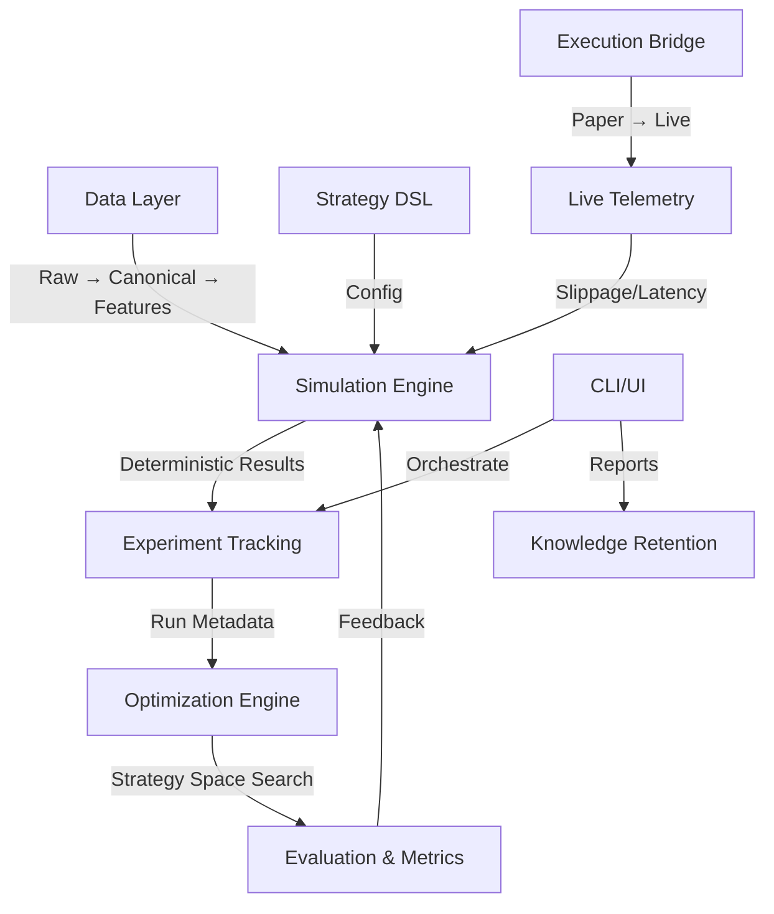
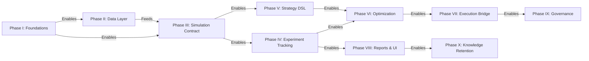

# Quant Research Lab Roadmap - Implementation Plan

## Executive Summary

This plan transforms the existing QuantBot codebase into a research lab system through incremental refactoring. The roadmap is organized into 10 phases, with Phase I (Foundations) as the critical path that unlocks all subsequent work. Each phase includes detailed tasks with subtasks, dependencies, and parallel execution strategies.

## Architecture Overview

## Phase Breakdown & Critical Path

### Critical Path Dependencies

**Critical Path:** Phase I → Phase III → Phase IV → Phase VI (these must complete in order)

**Parallelizable:** Phase II (with Phase I), Phase V (with Phase IV), Phase VII-IX (after Phase VI)

---

## PHASE I: CORE ARCHITECTURAL INVARIANTS (Critical Path - Week 1-2)

**Goal:** Lock in separation of concerns and determinism requirements. Establishes the foundation for all subsequent work.

**Why First:** All other phases depend on these invariants. Without them, technical debt accumulates.

**Dependencies:** None

**Parallel Execution:** Tasks can be split across 2-3 agents (Separation, Determinism, Artifacts)

### Task 1.1: Formalize Separation of Concerns (Hard Walls)

**Owner:** Architecture Agent

**Duration:** 3 days

**Priority:** P0 (Blocks everything)

#### Subtasks:

1. **Document Layer Boundaries**

   - Create `docs/ARCHITECTURE_BOUNDARIES.md` mapping roadmap layers to existing packages
   - Map existing code to layers: ingestion → feature engineering → strategy → execution → evaluation
   - Document violations (code that crosses boundaries)
   - **Files:** `docs/ARCHITECTURE_BOUNDARIES.md`

2. **Add ESLint Rules for Layer Boundaries**

   - Create ESLint config that blocks cross-layer imports
   - Example: `@quantbot/simulation` cannot import from `@quantbot/ingestion`
   - Add exceptions for adapters/composition roots
   - **Files:** `eslint.config.mjs`

3. **Refactor Existing Violations**

   - Identify and fix boundary violations in existing code
   - Move cross-cutting concerns to appropriate layers
   - Add adapter layer where needed
   - **Files:** All packages (targeted refactoring)

4. **Add Architecture Tests**

   - Create `scripts/verify-architecture-boundaries.ts` that validates imports
   - Run in CI to prevent regressions
   - **Files:** `scripts/verify-architecture-boundaries.ts`, `.github/workflows/ci.yml`

**Success Criteria:**

- ESLint blocks cross-layer imports
- Architecture tests pass in CI
- Documentation maps all boundaries
- Zero violations in existing code

### Task 1.2: Enforce Determinism Contract

**Owner:** Simulation Agent

**Duration:** 4 days

**Priority:** P0 (Blocks Phase III)

#### Subtasks:

1. **Define Determinism Requirements**

   - Document deterministic contract: seeded random, versioned inputs, replayable outputs
   - Create `packages/core/src/determinism.ts` with types/interfaces
   - **Files:** `packages/core/src/determinism.ts`, `docs/DETERMINISM.md`

2. **Add Seed Management**

   - Create `SeedManager` class that generates deterministic seeds from run IDs
   - Integrate into simulation engine
   - **Files:** `packages/core/src/seed-manager.ts`, `packages/simulation/src/core/simulator.ts`

3. **Version Input Contracts**

   - Ensure all simulation inputs include version fields
   - Add version validation to `SimInputSchema`
   - **Files:** `packages/simulation/src/types/contracts.ts`

4. **Add Determinism Tests**

   - Create tests that verify: same inputs + same seed → same outputs
   - Test with different seeds → different but deterministic outputs
   - **Files:** `packages/simulation/tests/unit/determinism.test.ts`

5. **Refactor Non-Deterministic Code**

   - Identify and fix non-deterministic patterns (Date.now(), Math.random(), etc.)
   - Replace with seeded alternatives
   - **Files:** All simulation code

**Success Criteria:**

- All simulations accept seed parameter
- Same inputs + seed → byte-identical outputs
- Determinism tests pass
- Documentation complete

### Task 1.3: Artifact Versioning System

**Owner:** Storage Agent

**Duration:** 5 days

**Priority:** P1 (Enables Phase IV)

#### Subtasks:

1. **Define Artifact Schema**

   - Create Zod schemas for versioned artifacts (strategies, feature sets, sim runs, configs)
   - Add version, hash, timestamp fields
   - **Files:** `packages/core/src/artifacts.ts`

2. **Create Artifact Repository Interface**

   - Define `ArtifactRepository` port for storing/retrieving artifacts
   - Support versioning, tagging, querying
   - **Files:** `packages/core/src/ports/artifact-repository-port.ts`

3. **Implement DuckDB Artifact Adapter**

   - Create `artifactDuckdbAdapter.ts` implementing repository
   - Store artifacts with versioning metadata
   - **Files:** `packages/storage/src/adapters/artifact-duckdb-adapter.ts`, `tools/storage/artifact_schema.sql`

4. **Migrate Existing Storage to Artifacts**

   - Refactor strategy storage to use artifact system
   - Migrate simulation runs to artifact format
   - **Files:** `packages/storage/src/repositories/strategies-repo.ts`, `packages/workflows/src/simulation/runSimulation.ts`

5. **Add Artifact CLI Commands**

   - `quantbot artifacts list` - List all artifacts
   - `quantbot artifacts get <id> --version <v>` - Get specific version
   - `quantbot artifacts tag <id> <tag>` - Tag artifact
   - **Files:** `packages/cli/src/commands/artifacts/`, `packages/cli/src/handlers/artifacts/`

**Success Criteria:**

- Artifact schema defined and validated
- Repository interface implemented
- Existing storage migrated
- CLI commands work end-to-end

---

## PHASE II: DATA LAYER - RAW → CANONICAL → FEATURES (Parallel to Phase I, Week 2-3)

**Goal:** Establish clean data pipeline with immutable raw data, opinionated canonical format, and disposable feature stores.

**Why Second:** Feeds simulation engine. Can start in parallel with Phase I after Task 1.1 completes.

**Dependencies:** Phase I Task 1.1 (boundaries)

**Parallel Execution:** Tasks can be split across 2 agents (Raw/Canonical, Features)

### Task 2.1: Raw Data Immutability

**Owner:** Ingestion Agent

**Duration:** 4 days

#### Subtasks:

1. **Audit Current Raw Data Storage**

   - Document current raw data storage (Telegram exports, API responses)
   - Identify mutable operations (updates, deletes)
   - **Files:** `packages/ingestion/`, `packages/storage/src/repositories/`

2. **Implement Append-Only Pattern**

   - Refactor storage to append-only (no updates/deletes on raw data)
   - Add run_id/timestamp to all raw data tables
   - **Files:** `tools/telegram/duckdb_punch_pipeline.py`, `packages/ingestion/src/telegram/`

3. **Add Raw Data Hash Tracking**

   - Store SHA256 hash of raw inputs (files, API responses)
   - Use hash to detect duplicates (idempotency)
   - **Files:** `packages/ingestion/src/telegram/ingestTelegramJson.ts`

4. **Create Raw Data Access Interface**

   - Define `RawDataRepository` port for accessing raw data
   - Support querying by time range, source, hash
   - **Files:** `packages/core/src/ports/raw-data-repository-port.ts`

5. **Add Raw Data CLI**

   - `quantbot data raw list` - List raw data sources
   - `quantbot data raw query --from <date> --to <date>` - Query raw data
   - **Files:** `packages/cli/src/commands/data/raw.ts`

**Success Criteria:**

- Raw data is append-only (no updates/deletes)
- Hash tracking prevents duplicates
- Repository interface implemented
- CLI commands work

### Task 2.2: Canonical Data Schema

**Owner:** Core Agent

**Duration:** 5 days

#### Subtasks:

1. **Define Canonical Event Schema**

   - Create unified schema: `(asset, venue, timestamp, event_type, value, confidence)`
   - Map existing data types (calls, candles, trades) to canonical format
   - **Files:** `packages/core/src/canonical/event-schema.ts`

2. **Create Canonical Transformers**

   - Implement transformers: Calls → Canonical, Candles → Canonical, Trades → Canonical
   - Handle missing fields, normalization, timestamp conversion
   - **Files:** `packages/core/src/canonical/transformers.ts`

3. **Implement Canonical Storage**

   - Create `CanonicalRepository` port and DuckDB adapter
   - Store canonical events with unified schema
   - **Files:** `packages/core/src/ports/canonical-repository-port.ts`, `packages/storage/src/adapters/canonical-duckdb-adapter.ts`

4. **Migrate Existing Data to Canonical**

   - Create migration script: raw data → canonical format
   - Validate transformations preserve all information
   - **Files:** `scripts/migration/raw-to-canonical.ts`

5. **Add Canonical Query Interface**

   - Support querying canonical events by asset, time range, event type
   - Chain-agnostic queries (normalize addresses)
   - **Files:** `packages/core/src/ports/canonical-repository-port.ts`

**Success Criteria:**

- Canonical schema defined and validated
- Transformers implemented and tested
- Migration script works
- Query interface supports all use cases

### Task 2.3: Feature Store (Disposable)

**Owner:** Analytics Agent

**Duration:** 3 days

#### Subtasks:

1. **Define Feature Store Interface**

   - Create `FeatureStore` port with: `compute(featureSet, data)`, `get(featureSet, asset, timestamp)`
   - Features are versioned, tagged with source assumptions
   - **Files:** `packages/core/src/ports/feature-store-port.ts`

2. **Implement In-Memory Feature Store**

   - Simple LRU cache for features
   - TTL-based expiration (10 minutes default)
   - **Files:** `packages/analytics/src/feature-store/in-memory-feature-store.ts`

3. **Add Feature Computation Registry**

   - Registry of feature functions: `registerFeature(name, computeFn, version)`
   - Features can depend on other features
   - **Files:** `packages/analytics/src/feature-store/feature-registry.ts`

4. **Create Feature CLI**

   - `quantbot features list` - List registered features
   - `quantbot features compute <featureSet> --from <date> --to <date>` - Compute features
   - **Files:** `packages/cli/src/commands/features/`

**Success Criteria:**

- Feature store interface defined
- In-memory implementation works
- Registry supports feature dependencies
- CLI commands work

---

## PHASE III: SIMULATION CONTRACT (Critical Path - Week 3-4)

**Goal:** Formalize the immutable simulation contract as the single source of truth. This is the heart of the lab.

**Why Third:** Everything depends on this contract. Phase IV (experiment tracking) needs it. Phase VI (optimization) needs it.

**Dependencies:** Phase I (determinism), Phase II (canonical data)

**Parallel Execution:** Limited (contract design must be unified)

### Task 3.1: Formalize Simulation Contract Interface

**Owner:** Simulation Agent (lead), Architecture Agent (review)

**Duration:** 5 days

**Priority:** P0 (Blocks Phase IV)

#### Subtasks:

1. **Review Existing Contract**

   - Audit `packages/simulation/src/types/contracts.ts` (SimInput, SimResult)
   - Document gaps: missing fields, unclear semantics
   - **Files:** `packages/simulation/src/types/contracts.ts`

2. **Extend Contract Schema**

   - Add missing fields: execution model, risk model, random seed, data snapshot hash
   - Ensure all fields are JSON-serializable
   - **Files:** `packages/simulation/src/types/contracts.ts`

3. **Define Execution Model Schema**

   - Latency distributions, slippage models, partial fills, failed transactions, fee regimes
   - Create `ExecutionModelSchema` Zod schema
   - **Files:** `packages/simulation/src/types/execution-model.ts`

4. **Define Risk Model Schema**

   - Position limits, drawdown limits, exposure limits
   - Create `RiskModelSchema` Zod schema
   - **Files:** `packages/simulation/src/types/risk-model.ts`

5. **Create Contract Validator**

   - Validator that ensures contract compliance (all required fields, valid ranges)
   - Use in simulation engine entry point
   - **Files:** `packages/simulation/src/core/contract-validator.ts`

6. **Add Contract Documentation**

   - Document every field, semantics, constraints
   - Add examples of valid contracts
   - **Files:** `docs/SIMULATION_CONTRACT.md`

**Success Criteria:**

- Contract schema is complete and validated
- All simulation code uses contract
- Documentation is comprehensive
- Validator catches invalid inputs

### Task 3.2: Implement Execution Models (No Perfect Fills)

**Owner:** Simulation Agent

**Duration:** 6 days

#### Subtasks:

1. **Create Execution Model Interface**

   - Interface: `ExecutionModel.execute(trade, marketState) -> ExecutionResult`
   - Result includes: executed price, slippage, fees, latency, partial fill flag
   - **Files:** `packages/simulation/src/execution/execution-model.ts`

2. **Implement Basic Execution Models**

   - `PerfectFillModel` (for comparison)
   - `FixedSlippageModel` (constant slippage bps)
   - `LatencyModel` (delays execution by latency distribution)
   - **Files:** `packages/simulation/src/execution/models/`

3. **Implement Advanced Execution Models**

   - `PartialFillModel` (handles partial fills based on volume)
   - `FailedTransactionModel` (simulates transaction failures)
   - `FeeRegimeModel` (different fee structures)
   - **Files:** `packages/simulation/src/execution/models/`

4. **Integrate Execution Models into Simulator**

   - Modify `simulateStrategy` to accept execution model
   - Apply execution model to all trades
   - **Files:** `packages/simulation/src/core/simulator.ts`

5. **Add Execution Model Tests**

   - Test each model independently
   - Test integration with simulator
   - **Files:** `packages/simulation/tests/unit/execution-models.test.ts`

**Success Criteria:**

- Multiple execution models implemented
- Simulator uses execution models
- Tests pass
- No "perfect fills" in production simulations

### Task 3.3: Configurable Time Resolution

**Owner:** Simulation Agent

**Duration:** 4 days

#### Subtasks:

1. **Abstract Time Clock**

   - Create `SimulationClock` interface: `tick() -> timestamp`, `getResolution() -> ms`
   - Support: milliseconds, seconds, minutes, hours
   - **Files:** `packages/simulation/src/core/clock.ts`

2. **Implement Clock Resolutions**

   - `MillisecondClock` (for sniper logic)
   - `SecondClock` (for early post-mint)
   - `MinuteClock`, `HourClock` (for post-graduation)
   - **Files:** `packages/simulation/src/core/clocks.ts`

3. **Refactor Simulator to Use Clock**

   - Replace hardcoded time logic with clock abstraction
   - Ensure determinism (clock advances deterministically)
   - **Files:** `packages/simulation/src/core/simulator.ts`

4. **Add Clock to Contract**

   - Include clock resolution in SimInput contract
   - Validate resolution is supported
   - **Files:** `packages/simulation/src/types/contracts.ts`

5. **Test Different Resolutions**

   - Run same simulation with different resolutions
   - Verify results are consistent (scaled appropriately)
   - **Files:** `packages/simulation/tests/integration/clock-resolution.test.ts`

**Success Criteria:**

- Clock abstraction implemented
- Multiple resolutions supported
- Simulator uses clock
- Tests verify consistency

---

## PHASE IV: EXPERIMENT TRACKING (Critical Path - Week 4-5)

**Goal:** Every experiment gets unique ID, git commit, data snapshot hash, parameter vector, random seed, timestamp, outcome metrics.

**Why Fourth:** Enables optimization (Phase VI) and reporting (Phase VIII). Depends on simulation contract (Phase III).

**Dependencies:** Phase I (artifacts), Phase III (simulation contract)

**Parallel Execution:** Tasks can be split (Tracking, Reports, Integration)

### Task 4.1: Enhanced Run Metadata Schema

**Owner:** Storage Agent

**Duration:** 4 days

#### Subtasks:

1. **Extend SimulationRunMetadata**

   - Add fields: git commit hash, data snapshot hash, parameter vector, random seed
   - Ensure all fields are stored in database
   - **Files:** `packages/storage/src/engine/StorageEngine.ts`, `tools/simulation/sql_functions.py`

2. **Create Experiment ID Generator**

   - Generate unique experiment IDs: `exp-{timestamp}-{hash}`
   - Ensure IDs are deterministic from inputs
   - **Files:** `packages/core/src/experiment-id-generator.ts`

3. **Implement Parameter Vector Serialization**

   - Serialize strategy config + execution model + risk model → parameter vector
   - Hash parameter vector for quick comparison
   - **Files:** `packages/core/src/parameter-vector.ts`

4. **Add Data Snapshot Hashing**

   - Hash canonical data used in simulation (mint, time range, data version)
   - Store hash with experiment
   - **Files:** `packages/workflows/src/simulation/runSimulation.ts`

5. **Update Database Schema**

   - Add columns to `simulation_runs` table: git_commit_hash, data_snapshot_hash, parameter_vector_hash, random_seed
   - Create migration script
   - **Files:** `tools/simulation/sql_functions.py`, `scripts/migration/add-experiment-tracking.sql`

**Success Criteria:**

- Metadata schema includes all required fields
- IDs are unique and deterministic
- Database schema updated
- Migration script works

### Task 4.2: Automatic Experiment Registration

**Owner:** Workflows Agent

**Duration:** 5 days

#### Subtasks:

1. **Create Experiment Registry Service**

   - Service that registers experiments before execution
   - Stores: experiment ID, status (pending/running/completed/failed), started_at
   - **Files:** `packages/workflows/src/experiments/experiment-registry.ts`

2. **Integrate into runSimulation Workflow**

   - Register experiment before simulation starts
   - Update status during execution
   - Store final metadata on completion
   - **Files:** `packages/workflows/src/simulation/runSimulation.ts`

3. **Add Git Commit Detection**

   - Detect current git commit hash (or "unknown" if not in git)
   - Store with experiment
   - **Files:** `packages/utils/src/git.ts`

4. **Add Data Snapshot Detection**

   - Hash canonical data used in simulation
   - Store hash with experiment
   - **Files:** `packages/workflows/src/simulation/runSimulation.ts`

5. **Handle Experiment Failures**

   - Store error message, stack trace, failed_at timestamp
   - Mark experiment as failed (not lost)
   - **Files:** `packages/workflows/src/simulation/runSimulation.ts`

**Success Criteria:**

- All experiments are automatically registered
- Git commit and data snapshot hashes stored
- Failures are captured
- No experiments are lost

### Task 4.3: Experiment Query Interface

**Owner:** Storage Agent

**Duration:** 3 days

#### Subtasks:

1. **Create ExperimentRepository Port**

   - Interface: `get(id)`, `list(filter)`, `getByParameterHash(hash)`, `getByGitCommit(commit)`
   - **Files:** `packages/core/src/ports/experiment-repository-port.ts`

2. **Implement DuckDB Adapter**

   - Implement repository using DuckDB
   - Support filtering by: time range, strategy, git commit, parameter hash, status
   - **Files:** `packages/storage/src/adapters/experiment-duckdb-adapter.ts`

3. **Add Experiment CLI**

   - `quantbot experiments list` - List experiments with filters
   - `quantbot experiments get <id>` - Get experiment details
   - `quantbot experiments find --parameter-hash <hash>` - Find experiments with same parameters
   - **Files:** `packages/cli/src/commands/experiments/`

**Success Criteria:**

- Repository interface implemented
- Adapter supports all query patterns
- CLI commands work

---

## PHASE V: STRATEGY DSL (Parallel to Phase IV, Week 5-6)

**Goal:** Strategies are data, not code. Enable automated mutation, parameter sweeps, cross-strategy comparison.

**Why Fifth:** Enables optimization (Phase VI). Can start in parallel with Phase IV.

**Dependencies:** Phase I (artifacts), Phase III (simulation contract)

**Parallel Execution:** Tasks can be split (DSL, Templates, Validation)

### Task 5.1: Strategy DSL Schema

**Owner:** Core Agent

**Duration:** 5 days

#### Subtasks:

1. **Define Complete Strategy DSL**

   - Entry conditions, exit conditions, re-entry rules, position sizing, risk constraints
   - All as structured config (JSON/YAML)
   - **Files:** `packages/core/src/strategy/dsl-schema.ts`

2. **Create Strategy DSL Validator**

   - Validate DSL against schema
   - Check: required fields, valid ranges, logical consistency
   - **Files:** `packages/core/src/strategy/dsl-validator.ts`

3. **Implement DSL → Simulation Config Converter**

   - Convert DSL to SimInput format
   - Handle all strategy types (momentum, mean reversion, etc.)
   - **Files:** `packages/core/src/strategy/dsl-to-sim-input.ts`

4. **Migrate Existing Strategies to DSL**

   - Convert existing strategy configs to DSL format
   - Validate conversions preserve behavior
   - **Files:** `scripts/migration/strategies-to-dsl.ts`

5. **Add DSL Documentation**

   - Document DSL syntax, examples, best practices
   - **Files:** `docs/STRATEGY_DSL.md`

**Success Criteria:**

- DSL schema is complete
- Validator catches invalid strategies
- Converter works for all strategy types
- Existing strategies migrated

### Task 5.2: Strategy Templates

**Owner:** Simulation Agent

**Duration:** 4 days

#### Subtasks:

1. **Define Template Schema**

   - Template = DSL with parameter placeholders: `{param_name: type, default, range}`
   - **Files:** `packages/core/src/strategy/template-schema.ts`

2. **Create Template Registry**

   - Registry of strategy templates: "Momentum Breakout", "Mean Reversion", etc.
   - Templates are versioned artifacts
   - **Files:** `packages/core/src/strategy/template-registry.ts`

3. **Implement Template Instantiation**

   - `instantiate(template, parameters) -> StrategyDSL`
   - Validate parameters against template constraints
   - **Files:** `packages/core/src/strategy/template-instantiation.ts`

4. **Add Template CLI**

   - `quantbot strategies templates list` - List available templates
   - `quantbot strategies templates instantiate <template> --params <json>` - Create strategy from template
   - **Files:** `packages/cli/src/commands/strategies/templates.ts`

5. **Create Initial Template Library**

   - Create 5-10 common strategy templates
   - Document each template's parameters
   - **Files:** `packages/core/src/strategy/templates/`, `docs/STRATEGY_TEMPLATES.md`

**Success Criteria:**

- Template system works
- Registry has initial templates
- CLI commands work
- Documentation complete

### Task 5.3: Strategy Mutation & Comparison

**Owner:** Analytics Agent

**Duration:** 4 days

#### Subtasks:

1. **Implement Strategy Mutators**

   - Mutators: adjust parameter, add/remove exit condition, change position sizing
   - Mutators are deterministic (seed-based)
   - **Files:** `packages/analytics/src/strategy/mutators.ts`

2. **Create Strategy Comparator**

   - Compare strategies: same parameters? similar structure? different only in X?
   - Used for deduplication in optimization
   - **Files:** `packages/analytics/src/strategy/comparator.ts`

3. **Add Strategy Diff Tool**

   - CLI: `quantbot strategies diff <strategy1> <strategy2>` - Show differences
   - **Files:** `packages/cli/src/commands/strategies/diff.ts`

4. **Implement Strategy Similarity Metrics**

   - Calculate similarity score between strategies
   - Used for clustering in optimization
   - **Files:** `packages/analytics/src/strategy/similarity.ts`

**Success Criteria:**

- Mutators work and are deterministic
- Comparator accurately identifies similar strategies
- Diff tool works
- Similarity metrics are meaningful

---

## PHASE VI: OPTIMIZATION ENGINE (Critical Path - Week 6-8)

**Goal:** Multi-layer optimization (grid, random, Bayesian, evolutionary, pruning, ensemble).

**Why Sixth:** This is where the lab becomes dangerous (in a good way). Enables automated strategy discovery.

**Dependencies:** Phase III (simulation contract), Phase IV (experiment tracking), Phase V (strategy DSL)

**Parallel Execution:** Each optimization layer can be implemented in parallel (after base infrastructure)

### Task 6.1: Optimization Infrastructure

**Owner:** Analytics Agent (lead), Simulation Agent (integration)

**Duration:** 5 days

#### Subtasks:

1. **Define Optimization Job Schema**

   - Job: strategy template, parameter space, optimization algorithm, metrics to optimize
   - **Files:** `packages/core/src/optimization/job-schema.ts`

2. **Create Optimization Job Repository**

   - Store optimization jobs, track status, store results
   - **Files:** `packages/core/src/ports/optimization-job-repository-port.ts`, `packages/storage/src/adapters/optimization-job-duckdb-adapter.ts`

3. **Implement Job Runner**

   - Runner that executes optimization jobs
   - Manages: job queue, worker allocation, result collection
   - **Files:** `packages/workflows/src/optimization/job-runner.ts`

4. **Add Optimization CLI**

   - `quantbot optimize start --template <template> --algorithm <algo> --metrics <metrics>` - Start optimization job
   - `quantbot optimize status <jobId>` - Check job status
   - `quantbot optimize results <jobId>` - Get results
   - **Files:** `packages/cli/src/commands/optimize/`

5. **Create Base Optimization Interface**

   - Interface: `Optimizer.optimize(searchSpace, objective, constraints) -> Result[]`
   - All optimizers implement this interface
   - **Files:** `packages/analytics/src/optimization/optimizer-interface.ts`

**Success Criteria:**

- Job schema defined
- Repository implemented
- Job runner works
- CLI commands work
- Base interface established

### Task 6.2: Grid Search Optimizer

**Owner:** Analytics Agent

**Duration:** 3 days

#### Subtasks:

1. **Implement Grid Search**

   - Generate grid of parameter combinations
   - Execute simulations for each combination
   - Return ranked results
   - **Files:** `packages/analytics/src/optimization/grid-search.ts`

2. **Add Early Termination**

   - Kill bad runs early (e.g., if drawdown exceeds threshold)
   - Configurable termination criteria
   - **Files:** `packages/analytics/src/optimization/grid-search.ts`

3. **Test Grid Search**

   - Test with simple parameter space
   - Verify all combinations are tested
   - **Files:** `packages/analytics/tests/unit/optimization/grid-search.test.ts`

**Success Criteria:**

- Grid search works
- Early termination works
- Tests pass

### Task 6.3: Random Search Optimizer

**Owner:** Analytics Agent

**Duration:** 3 days

#### Subtasks:

1. **Implement Random Search**

   - Sample random parameter combinations from search space
   - Configurable: number of samples, sampling distribution
   - **Files:** `packages/analytics/src/optimization/random-search.ts`

2. **Add Diversity Metrics**

   - Track parameter space coverage
   - Prefer diverse samples
   - **Files:** `packages/analytics/src/optimization/random-search.ts`

3. **Test Random Search**

   - Test sampling distribution
   - Verify diversity
   - **Files:** `packages/analytics/tests/unit/optimization/random-search.test.ts`

**Success Criteria:**

- Random search works
- Diversity metrics work
- Tests pass

### Task 6.4: Bayesian Optimization (Optional)

**Owner:** Analytics Agent

**Duration:** 7 days

**Priority:** P2 (can defer)

#### Subtasks:

1. **Research Bayesian Optimization Libraries**

   - Evaluate: scikit-optimize, optuna, etc.
   - Choose library or implement from scratch
   - **Files:** `docs/OPTIMIZATION_RESEARCH.md`

2. **Implement Bayesian Optimizer**

   - Gaussian process surrogate model
   - Acquisition function (UCB, EI)
   - **Files:** `packages/analytics/src/optimization/bayesian-optimizer.ts`

3. **Test Bayesian Optimizer**

   - Compare to grid/random search on known functions
   - **Files:** `packages/analytics/tests/unit/optimization/bayesian-optimizer.test.ts`

**Success Criteria:**

- Bayesian optimizer works
- Outperforms grid/random on test cases
- Tests pass

### Task 6.5: Pruning Heuristics

**Owner:** Analytics Agent

**Duration:** 4 days

#### Subtasks:

1. **Define Pruning Rules**

   - Rules: max drawdown exceeded, win rate too low, Sharpe ratio too low, etc.
   - **Files:** `packages/analytics/src/optimization/pruning-rules.ts`

2. **Implement Pruning System**

   - Check rules during optimization
   - Kill runs that violate rules
   - **Files:** `packages/analytics/src/optimization/pruner.ts`

3. **Integrate into Optimizers**

   - All optimizers respect pruning rules
   - **Files:** `packages/analytics/src/optimization/`

4. **Test Pruning**

   - Verify bad runs are killed early
   - **Files:** `packages/analytics/tests/unit/optimization/pruning.test.ts`

**Success Criteria:**

- Pruning rules work
- Bad runs are killed early
- Tests pass

### Task 6.6: Multi-Objective Optimization

**Owner:** Analytics Agent

**Duration:** 5 days

#### Subtasks:

1. **Define Multi-Objective Metrics**

   - Vector of metrics: [return, Sharpe, max drawdown, win rate, latency sensitivity]
   - **Files:** `packages/core/src/optimization/metrics.ts`

2. **Implement Pareto Frontier**

   - Calculate Pareto-optimal solutions
   - **Files:** `packages/analytics/src/optimization/pareto-frontier.ts`

3. **Add Multi-Objective Optimizers**

   - Extend optimizers to handle multiple objectives
   - **Files:** `packages/analytics/src/optimization/`

4. **Test Multi-Objective**

   - Verify Pareto frontier calculation
   - **Files:** `packages/analytics/tests/unit/optimization/multi-objective.test.ts`

**Success Criteria:**

- Multi-objective optimization works
- Pareto frontier is calculated correctly
- Tests pass

---

## PHASE VII: EXECUTION BRIDGE (Week 8-9)

**Goal:** Paper → Live gradient. Same logic, different adapters.

**Why Seventh:** Connects research to live markets. Provides feedback loop.

**Dependencies:** Phase III (simulation contract), Phase VI (optimization)

**Parallel Execution:** Tasks can be split (Paper, Live, Telemetry)

### Task 7.1: Paper Trading Adapter

**Owner:** Execution Agent

**Duration:** 5 days

#### Subtasks:

1. **Create Paper Execution Port**

   - Port that simulates execution without real trades
   - Uses execution models from Phase III
   - **Files:** `packages/core/src/ports/paper-execution-port.ts`

2. **Implement Paper Execution Adapter**

   - Adapter that implements port
   - Logs trades, tracks positions, calculates PnL
   - **Files:** `packages/workflows/src/adapters/paper-execution-adapter.ts`

3. **Integrate into Workflows**

   - Modify workflows to support paper execution mode
   - **Files:** `packages/workflows/src/execution/`

4. **Add Paper Trading CLI**

   - `quantbot paper start --strategy <strategy>` - Start paper trading
   - `quantbot paper status` - Check paper positions
   - `quantbot paper stop` - Stop paper trading
   - **Files:** `packages/cli/src/commands/paper/`

**Success Criteria:**

- Paper execution works
- Positions tracked accurately
- CLI commands work

### Task 7.2: Live Execution Adapter (Stub)

**Owner:** Execution Agent

**Duration:** 3 days

#### Subtasks:

1. **Create Live Execution Port**

   - Port for real trade execution
   - Same interface as paper, but executes real trades
   - **Files:** `packages/core/src/ports/live-execution-port.ts`

2. **Implement Stub Adapter**

   - Stub that always fails (safety-first)
   - Can be replaced with real adapter later
   - **Files:** `packages/workflows/src/adapters/live-execution-stub-adapter.ts`

3. **Add Safety Guards**

   - Max loss per strategy, max capital per strategy, kill switches
   - **Files:** `packages/workflows/src/execution/safety-guards.ts`

4. **Document Live Execution Setup**

   - Document how to enable live execution (when ready)
   - **Files:** `docs/LIVE_EXECUTION.md`

**Success Criteria:**

- Port defined
- Stub adapter implemented
- Safety guards in place
- Documentation complete

### Task 7.3: Live Telemetry Collection

**Owner:** Observability Agent

**Duration:** 4 days

#### Subtasks:

1. **Define Telemetry Schema**

   - Slippage deltas vs sim, latency drift, unexpected failures
   - **Files:** `packages/core/src/telemetry