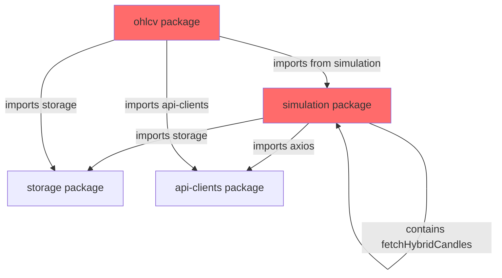
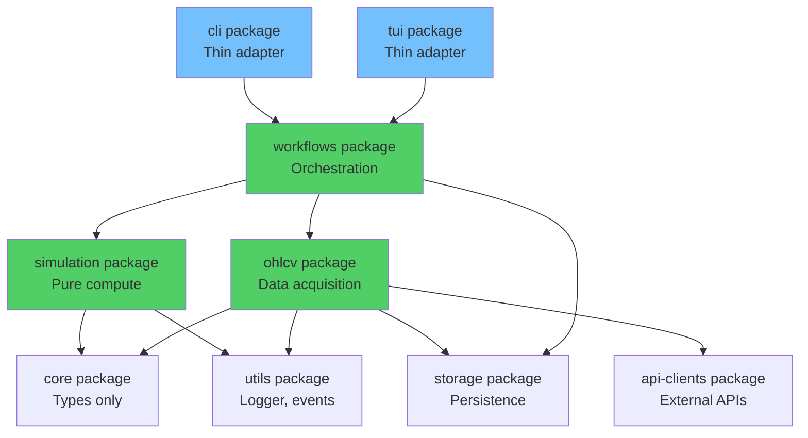

# Architectural Refactoring Plan v2 - Corrected

**Date:** 2025-01-XX  
**Status:** Ready for execution  
**Approach:** Minimal-diff first, gradual migration

## Executive Summary

**Problem:** Circular dependency between `@quantbot/ohlcv` and `@quantbot/simulation` prevents clean architecture. Simulation package contains I/O operations (network, database, filesystem, stdout) that violate separation of concerns.

**Solution:** 4-phase refactoring with minimal-diff approach. Phase 1 breaks cycle immediately with only 3-6 file changes. Remaining phases progressively purify simulation and establish clean orchestration layer.

**Critical Path:** Phase 1 (break cycle) → Phase 2 (pure simulation) → Phase 3 (workflows package) → Phase 4 (clean deps)

---

## Current Architecture (Problem State)



**Violations:**

- Circular: OHLCV → Simulation (fetchHybridCandles) - **ROOT CAUSE**
- Simulation imports: storage, axios, analytics
- Simulation contains: network calls, DB writes, filesystem writes, stdout
- 43 files import fetchHybridCandles from simulation (but Phase 1 doesn't touch them)

---

## Phase 1: Break Circular Dependency (CRITICAL PATH - Minimal Diff)

**Duration:** 1-2 days  
**Risk:** Low (only 3-6 files changed)  
**Dependencies:** None (must be first)

**Strategy:** Get architecture win first, migrate ecosystem gradually. OHLCV stops importing simulation immediately. Other 40+ files continue using deprecated shim temporarily.

### Objectives

1. Split `candles.ts` into pure math vs I/O operations
2. Move I/O operations to OHLCV
3. Update only OHLCV internals (3 files) to use local implementation
4. Remove `@quantbot/simulation` from OHLCV dependencies
5. Keep deprecated re-export shim in simulation (other 40+ files unchanged)

### Subtasks

#### 1.1: Analyze candles.ts and Identify Split Points

**File:** `packages/simulation/src/candles.ts` (1207 lines)

**I/O Operations (MOVE to OHLCV):**

- `fetchHybridCandles` (line 848) - main export
- `fetchBirdeyeCandles` (line 319) - API calls
- `fetchFreshCandles` (line 256) - API wrapper
- `mergeCandles` (line 277) - used by fetchHybridCandles
- CSV cache functions: `getCacheFilename`, `saveCandlesToCache`, `loadCandlesFromCache`
- ClickHouse queries (lines 872-904)
- `fetchTokenMetadata` (line 725) - API call

**Pure Math (KEEP in simulation or move to aggregator):**

- `aggregateCandles` (line 189) - **DUPLICATE** (already exists in `data/aggregator.ts` line 30)
- Can remove duplicate from candles.ts

**Types (ALREADY in @quantbot/core):**

- `Candle` type - verify in core
- `AggregationInterval` - verify in core

#### 1.2: Create OHLCV candles.ts with I/O Operations Only

**Source:** `packages/simulation/src/candles.ts`  
**Target:** `packages/ohlcv/src/candles.ts` (new file)

**Actions:**

- Copy I/O functions to new file
- Update imports:
  - Keep: `axios`, `fs`, `path`, `dotenv`, `DateTime` from luxon
  - Add: `@quantbot/storage` for ClickHouse
  - Add: `@quantbot/utils` for logger
  - Import `Candle` type from `@quantbot/core`
- Export: `fetchHybridCandles`, `TokenMetadata` interface
- Do NOT export: `aggregateCandles` (duplicate, use aggregator.ts)

**Files to create:**

- `packages/ohlcv/src/candles.ts` (new, ~600-800 lines of I/O code)

#### 1.3: Update OHLCV Internal Imports (3 files)

**Files to update:**

1. `packages/ohlcv/src/ohlcv-engine.ts` (line 13)
2. `packages/ohlcv/src/ohlcv-service.ts`
3. `packages/ohlcv/src/historical-candles.ts`

**Actions:**

- Change: `import { fetchHybridCandles } from '@quantbot/simulation'`
- To: `import { fetchHybridCandles } from './candles'` (relative import)

#### 1.4: Remove Simulation Dependency from OHLCV

**File:** `packages/ohlcv/package.json`

**Actions:**

- Remove: `"@quantbot/simulation": "workspace:*"` from dependencies
- Verify OHLCV can build independently

#### 1.5: Update OHLCV Exports

**File:** `packages/ohlcv/src/index.ts`

**Actions:**

- Export `fetchHybridCandles` from candles.ts
- Export `TokenMetadata` type if needed

#### 1.6: Split Simulation candles.ts (Keep Pure, Remove I/O)

**File:** `packages/simulation/src/candles.ts`

**Actions:**

- Remove I/O functions (moved to OHLCV)
- Remove duplicate `aggregateCandles` (use `data/aggregator.ts` instead)
- Keep `mergeCandles` temporarily if still needed, or move to aggregator
- Add deprecated re-export shim at end:

```typescript
/**
 * @deprecated Use @quantbot/ohlcv instead. This will be removed in v3.0.0
 * 
 * Migration:
 * - Old: import { fetchHybridCandles } from '@quantbot/simulation'
 * - New: import { fetchHybridCandles } from '@quantbot/ohlcv'
 */
export { fetchHybridCandles } from '@quantbot/ohlcv';
```

**Note:** File still contains some code initially, shim added at end. After Phase 2, can replace entire file with just shim.

#### 1.7: Verification Checkpoint

**Tests:**

- Run: `npm test -- packages/ohlcv/tests/`
- Run: `npm test -- packages/simulation/tests/`
- Run: `npm run lint` (check ESLint import firewall)
- Run: `npm test -- packages/simulation/tests/architectural/import-rules.test.ts`
- Verify: `packages/ohlcv/package.json` has no `@quantbot/simulation` dependency

**Success Criteria:**

- All OHLCV tests pass
- All simulation tests pass
- No circular dependency (TypeScript compilation succeeds)
- ESLint import firewall passes
- OHLCV builds independently

**Rollback:** Revert commits, restore original files

**Impact:** Only 3-6 files changed. 40+ other files continue working via shim.

---

## Phase 2: Make Simulation Pure (CRITICAL PATH)

**Duration:** 2-3 days  
**Risk:** Medium (engine refactor)  
**Dependencies:** Phase 1 complete

### Objectives

1. Remove `HybridCandleProvider` and `CandleDataProvider` interfaces
2. Update `simulateStrategy` to only accept `Candle[]` (no fetching)
3. Remove ALL I/O from simulation:
   - No network (axios, fetch, http)
   - No database (ClickHouse, Postgres)
   - No filesystem (CSV writes)
   - No stdout (console.log side-effects)
4. Simulation returns data only (SimulationResult object)
5. Orchestration layer handles all I/O (logging, persistence, display)

### Subtasks

#### 2.1: Remove CandleDataProvider from Engine

**File:** `packages/simulation/src/engine.ts`

**Actions:**

- Remove `CandleDataProvider` interface (lines 90-92)
- Remove `HybridCandleProvider` class (lines 94-107)
- Remove `dataProvider` from `SimulationEngine` class
- Update `SimulationEngine.runScenario()` to accept pre-fetched candles

**Breaking Change:**

```typescript
// Before
const engine = new SimulationEngine({ dataProvider: new HybridCandleProvider() });
await engine.runScenario({ targets: [...], scenario: {...} });

// After
const candles = await ohlcvEngine.fetch(...);
const result = await simulateStrategy(candles, strategy, ...);
```

#### 2.2: Remove All Sinks from Simulation

**Files:**

- `packages/simulation/src/sinks/console-sink.ts` - stdout side-effect
- `packages/simulation/src/sinks/csv-sink.ts` - filesystem write
- `packages/simulation/src/sinks/clickhouse-sink.ts` - database write
- `packages/simulation/src/sinks/json-sink.ts` - can keep if pure (in-memory)

**Actions:**

- Remove console-sink (stdout = I/O)
- Remove csv-sink (filesystem = I/O)
- Remove clickhouse-sink (database = I/O)
- Keep json-sink only if it's pure in-memory transformation
- Update `packages/simulation/src/sinks/index.ts` exports

**Principle:** Simulation returns `SimulationResult`. Orchestration decides what to do with it.

#### 2.3: Update Orchestrator Signature (Prepare for Phase 3 Move)

**File:** `packages/simulation/src/core/orchestrator.ts`

**Actions:**

- Remove `HybridCandleProvider` import (line 20)
- Remove `dataProvider` from `SimulationOrchestrator` class (line 190)
- Update `runSingleSimulation()` to accept `Candle[]` as parameter (not fetch)
- Update `runScenario()` signature to accept pre-fetched candles or remove entirely

**Note:** Orchestrator will move to `@quantbot/workflows` in Phase 3, but update signature now to be pure.

#### 2.4: Remove Network Imports

**Files to check:**

- `packages/simulation/src/candles.ts` (after Phase 1 split, should have minimal code)
- `packages/simulation/src/data/birdeye-provider.ts` (if exists)
- Any other files with axios/network imports

**Actions:**

- Remove axios imports
- Remove fetch/http/https imports
- Verify with: `npm test -- packages/simulation/tests/architectural/import-rules.test.ts`

#### 2.5: Remove Database Imports

**Files:**

- `packages/simulation/src/storage/*` (will move in Phase 3, but remove imports now)
- Any direct ClickHouse/Postgres imports

**Actions:**

- Remove `@quantbot/storage` imports from simulation source (not tests)
- Keep storage/ directory temporarily (moving in Phase 3)

#### 2.6: Update Simulation Package.json

**File:** `packages/simulation/package.json`

**Actions:**

- Verify `@quantbot/storage` is removed (already done per violations doc)
- Verify `axios` is removed
- Verify `@quantbot/analytics` status (handle in Phase 4)

#### 2.7: Update All Simulation Tests

**Files:** All test files using `HybridCandleProvider` or `CandleDataProvider`

**Actions:**

- Update tests to pass `Candle[]` directly to `simulateStrategy`
- Remove provider mocks
- Use golden fixtures where applicable
- Remove sink tests (sinks move to workflows in Phase 3)

#### 2.8: Replace candles.ts with Pure Shim

**File:** `packages/simulation/src/candles.ts`

**Actions:**

- After simulation no longer needs anything from candles.ts except types
- Replace entire file with minimal shim:

```typescript
/**
 * @deprecated Use @quantbot/ohlcv instead. This will be removed in v3.0.0
 */
export { fetchHybridCandles } from '@quantbot/ohlcv';
export type { Candle } from '@quantbot/core';
```

#### 2.9: Verification Checkpoint

**Tests:**

- Run full simulation test suite
- Run architectural import rules test
- Run ESLint import firewall
- Verify TypeScript compilation

**Success Criteria:**

- All simulation tests pass
- Zero network/DB/filesystem/stdout imports in simulation source
- `simulateStrategy` signature: `(candles: Candle[], ...) => Promise<SimulationResult>`
- Simulation returns data only (no side effects)

**Rollback:** Revert Phase 2 commits, restore provider interfaces

---

## Phase 3: Create @quantbot/workflows and Move Orchestration

**Duration:** 2-3 days  
**Risk:** Low (well-isolated)  
**Dependencies:** Phase 2 complete

### Objectives

1. Create `@quantbot/workflows` package (orchestration layer)
2. Move all sinks to workflows (all are I/O: console, CSV, ClickHouse, JSON)
3. Move orchestrator to workflows
4. Move storage helpers to workflows
5. Update CLI to use workflows (CLI becomes thin adapter)
6. Prepare for TUI to also use workflows (future)

### Subtasks

#### 3.1: Create @quantbot/workflows Package

**Directory:** `packages/workflows/` (already exists with tsconfig.json)

**Actions:**

- Create `packages/workflows/package.json`
- Create `packages/workflows/src/` directory
- Create `packages/workflows/src/index.ts`
- Add to root `package.json` workspaces if needed
- Set up TypeScript config

**Dependencies:**

- `@quantbot/ohlcv` - for candle fetching
- `@quantbot/simulation` - for simulation engine
- `@quantbot/storage` - for persistence
- `@quantbot/utils` - for logger
- `luxon` - for DateTime

#### 3.2: Move All Sinks to Workflows

**Source:** `packages/simulation/src/sinks/`  
**Target:** `packages/workflows/src/sinks/`

**Files to move:**

- `console-sink.ts` - stdout I/O
- `csv-sink.ts` - filesystem I/O
- `clickhouse-sink.ts` - database I/O
- `json-sink.ts` - can keep if pure, or move if used for persistence
- `base.ts` - base interface
- `index.ts` - exports

**Actions:**

- Move all sink files
- Update imports (remove simulation internal paths)
- Update to import from `@quantbot/simulation` (public API only)
- Update to import from `@quantbot/storage` for persistence

#### 3.3: Move Storage Helpers to Workflows

**Source:** `packages/simulation/src/storage/`  
**Target:** `packages/workflows/src/storage/`

**Files to move:**

- `storage-sink.ts`
- `result-cache.ts`
- `strategy-storage.ts`
- `orchestrator-helper.ts`
- `metrics-calculator.ts`
- `index.ts`

**Actions:**

- Move all storage files
- Update imports
- These are orchestration concerns, not simulation logic

#### 3.4: Move Orchestrator to Workflows

**Source:** `packages/simulation/src/core/orchestrator.ts`  
**Target:** `packages/workflows/src/orchestrator.ts`

**Actions:**

- Move file
- Update imports:
  - Use `@quantbot/ohlcv` for candle fetching
  - Use `@quantbot/simulation` for simulation engine
  - Use `@quantbot/storage` for persistence
- Update exports in `packages/workflows/src/index.ts`

#### 3.5: Update Simulation Exports

**File:** `packages/simulation/src/index.ts`

**Actions:**

- Remove orchestrator exports
- Remove all sink exports
- Remove storage exports
- Keep only pure simulation exports:
  - `simulateStrategy`
  - Strategy types
  - Indicator functions
  - Position/execution utilities

#### 3.6: Update CLI to Use Workflows

**Files:**

- `packages/cli/src/commands/*.ts` (commands using orchestrator)
- `scripts/workflows/run-simulation.ts`

**Actions:**

- Update imports: `import { SimulationOrchestrator } from '@quantbot/workflows'`
- CLI becomes thin adapter: parse args → call workflows → format output
- Remove any direct simulation/orchestrator imports

#### 3.7: Update Workflows Package Exports

**File:** `packages/workflows/src/index.ts`

**Actions:**

- Export orchestrator
- Export sinks
- Export storage helpers
- This becomes the orchestration API

#### 3.8: Verification Checkpoint

**Tests:**

- Run simulation tests (should still pass - pure compute)
- Create workflows tests
- Run CLI tests
- Run integration tests
- Verify no simulation → storage imports

**Success Criteria:**

- Simulation package has zero storage/sink imports
- Workflows package orchestrates: OHLCV → Simulation → Storage
- CLI uses workflows (thin adapter)
- Clean layering: CLI/TUI (interfaces) → Workflows (orchestration) → Simulation (compute)

**Rollback:** Revert Phase 3, restore files to simulation

---

## Phase 4: Clean Dependencies

**Duration:** 1 day  
**Risk:** Low  
**Dependencies:** Phase 3 complete (can start in parallel with Phase 3)

### Objectives

1. Remove `@quantbot/analytics` from simulation
2. Extract ATH/ATL math to simulation (if pure compute) or workflows (if orchestration)
3. Remove `@quantbot/simulation` from OHLCV (verify already removed in Phase 1)
4. Final dependency cleanup
5. Verify target architecture

### Subtasks

#### 4.1: Analyze Analytics Usage

**Files:**

- `packages/simulation/src/period-metrics/period-metrics.ts` (line 16, 41)
- `packages/simulation/src/types/results.ts`

**Actions:**

- Identify what's used from `@quantbot/analytics`
- Determine if it's pure math (keep in simulation) or orchestration (move to workflows)
- Check: `calculatePeriodAthAtlFromCandles` - is this pure computation or aggregation across runs?

#### 4.2: Extract Math Utilities (No New Package Unless Truly Shared)

**Decision:** Only create `@quantbot/math` if analytics AND simulation both need the same pure functions.

**If pure math (simulation compute):**

- Keep in `packages/simulation/src/period-metrics/` or move to `packages/simulation/src/math/ath-atl.ts`
- Update period-metrics to use local math
- Remove analytics dependency

**If orchestration (aggregation across runs):**

- Move to `packages/workflows/src/analytics/`
- Update period-metrics to be a thin adapter or remove

**Default:** Keep in simulation unless proven to be orchestration concern.

#### 4.3: Remove Analytics Dependency

**File:** `packages/simulation/package.json`

**Actions:**

- Remove `@quantbot/analytics` from dependencies
- Update imports in period-metrics to use local math

#### 4.4: Verify OHLCV Dependencies (Already Done in Phase 1)

**File:** `packages/ohlcv/package.json`

**Actions:**

- Verify `@quantbot/simulation` is removed (should be done in Phase 1.4)
- Verify OHLCV can build independently
- Dependencies should be: core, utils, storage, api-clients, luxon, lru-cache

#### 4.5: Final Dependency Verification

**File:** `packages/simulation/package.json`

**Target dependencies:**

```json
{
  "@quantbot/core": "workspace:*",
  "@quantbot/utils": "workspace:*",
  "luxon": "^3.7.2",
  "uuid": "^11.1.0",
  "zod": "^4.1.13"
}
```

**Actions:**

- Verify no forbidden deps
- Run ESLint import firewall
- Run architectural tests

#### 4.6: Add CI Circular Dependency Check

**File:** Create `scripts/ci/check-circular-deps.ts` or add to existing CI

**Actions:**

- Use `depcruise` or `madge` to detect circular dependencies
- Add to CI pipeline
- Fail build on circular deps

**Example:**

```bash
npm install --save-dev dependency-cruiser
npx depcruise --validate src
```

#### 4.7: Final Verification

**Tests:**

- Full test suite
- ESLint import firewall
- Architectural tests
- Circular dependency check
- TypeScript compilation
- Build all packages

**Success Criteria:**

- Target dependency graph achieved
- All tests pass
- Zero architectural violations
- Zero circular dependencies
- Clean separation: data acquisition → pure compute → orchestration

---

## Critical Path Analysis

```mermaid
gantt
    title Refactoring Critical Path
    dateFormat YYYY-MM-DD
    section Phase 1
    Analyze split points          :a1, 2025-01-XX, 0.5d
    Create OHLCV candles.ts       :a2, after a1, 1d
    Update OHLCV imports (3 files):a3, after a2, 0.5d
    Remove sim dep from OHLCV     :a4, after a3, 0.5d
    Split sim candles.ts          :a5, after a2, 1d
    Verify Phase 1                :a6, after a4, 0.5d
    section Phase 2
    Remove providers              :b1, after a6, 1d
    Remove all sinks              :b2, after b1, 0.5d
    Update orchestrator sig       :b3, after b1, 0.5d
    Remove network/DB imports     :b4, after b2, 0.5d
    Update tests                  :b5, after b4, 1d
    Replace candles.ts with shim  :b6, after b5, 0.5d
    Verify Phase 2                :b7, after b6, 0.5d
    section Phase 3
    Create workflows package      :c1, after b7, 0.5d
    Move sinks to workflows       :c2, after c1, 1d
    Move storage to workflows     :c3, after c1, 1d
    Move orchestrator             :c4, after c2, 0.5d
    Update CLI to use workflows   :c5, after c4, 1d
    Verify Phase 3                :c6, after c5, 0.5d
    section Phase 4
    Analyze analytics usage       :d1, after b7, 0.5d
    Extract math (if needed)      :d2, after d1, 0.5d
    Remove analytics dep          :d3, after d2, 0.5d
    Add CI circular deps check   :d4, after c6, 0.5d
    Final verify                  :d5, after d3, 0.5d
```

**Critical Path:** Phase 1 → Phase 2 → Phase 3 → Phase 4  
**Total Duration:** 6-8 days  
**Parallel Opportunities:**

- Phase 4.1-4.3 can start after Phase 2 (doesn't block Phase 3)
- Phase 4.4 (CI check) can be done in parallel with Phase 3

---

## Post-Refactoring Architecture



**Layers:**

1. **Data Acquisition:** OHLCV (fetches, caches, ingests)
2. **Pure Compute:** Simulation (strategy evaluation, PnL calculation) - returns data only
3. **Orchestration:** Workflows (coordinates acquisition → compute → persistence, handles I/O)
4. **Interfaces:** CLI/TUI (thin adapters, parse args/UI → call workflows → format output)

---

## Risk Mitigation

### Low Risk: Phase 1 (Only 3-6 files changed)

- **Mitigation:** Minimal diff approach - only OHLCV internals change, shim preserves backward compat
- **Rollback:** Revert 3-6 files, restore original
- **Testing:** OHLCV tests verify local implementation works

### Medium Risk: Phase 2 (Engine refactor, remove all I/O)

- **Mitigation:**
  - Keep old interfaces temporarily if needed
  - Golden fixtures catch regressions immediately
  - Staged approach: remove providers → remove sinks → remove imports
- **Rollback:** Revert engine changes
- **Testing:** Golden fixtures + architectural tests

### Low Risk: Phase 3 (Well-isolated, new package)

- **Mitigation:**
  - New package = clean slate, no legacy baggage
  - Move files, update imports, test incrementally
- **Rollback:** Git revert, delete workflows package
- **Testing:** Integration tests verify moved functionality

### Low Risk: Phase 4 (Dependency cleanup)

- **Mitigation:**
  - Analytics usage is isolated to period-metrics
  - Can extract math incrementally
- **Rollback:** Restore analytics dependency
- **Testing:** Period metrics tests verify functionality

---

## Success Metrics

**Architectural:**

- Zero circular dependencies (verified by CI)
- Simulation: zero network/DB/filesystem/stdout imports
- OHLCV: zero simulation imports
- Workflows: orchestrates all I/O
- Clean dependency graph (no cycles)

**Functional:**

- All tests pass
- All scripts work
- No breaking changes to public APIs (via shim in Phase 1-2)

**Code Quality:**

- ESLint import firewall passes
- Architectural tests pass
- Circular dependency CI check passes
- TypeScript compilation succeeds
- All packages build independently

---

## PR Sequencing (Clean, Incremental)

**PR1: Break the Cycle (Minimal Diff)**

- Phase 1 only
- OHLCV stops importing simulation
- Shim preserves backward compat
- ~3-6 files changed
- Architecture win immediately

**PR2: Purify Simulation**

- Phase 2 only
- Remove all I/O from simulation
- Simulation returns data only
- Update tests

**PR3: Introduce Workflows**

- Phase 3 only
- Create @quantbot/workflows
- Move orchestrator + sinks
- CLI becomes thin adapter

**PR4: Final Cleanup**

- Phase 4 only
- Remove analytics dependency
- Add CI circular deps check
- Final verification

---

## Key Principles

1. **Minimal Diff First:** Phase 1 changes only 3-6 files, gets architecture win immediately
2. **Gradual Migration:** Shim allows 40+ files to migrate gradually, not all at once
3. **Strict Purity:** Phase 2 removes ALL I/O (network, DB, filesystem, stdout)
4. **Clean Layering:** Workflows package separates orchestration from interfaces
5. **No Premature Abstraction:** Only create @quantbot/math if truly shared
6. **Enforcement:** ESLint + CI checks prevent regressions
