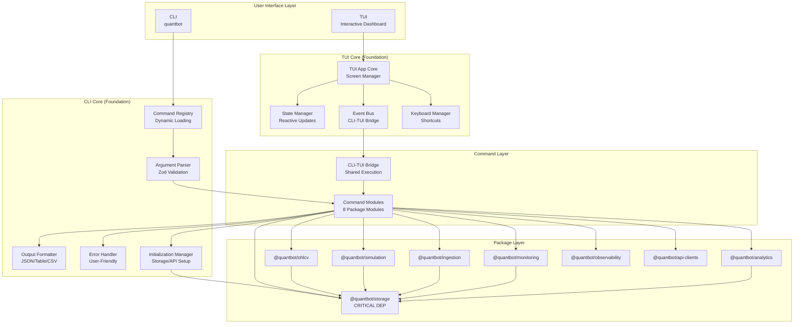

# CLI and TUI System - Architecture & Implementation Plan

## Executive Summary

This document provides a comprehensive, production-ready implementation plan for a unified CLI and TUI system for QuantBot. The plan follows software engineering best practices, Solana-specific security considerations, and project management principles with clear task decomposition, dependency management, and critical path analysis.

## Table of Contents

1. [Architecture Overview](#architecture-overview)
2. [Project Structure](#project-structure)
3. [Implementation Phases](#implementation-phases)
4. [Epic Breakdown](#epic-breakdown)
5. [Critical Path Analysis](#critical-path-analysis)
6. [Risk Management](#risk-management)
7. [Testing Strategy](#testing-strategy)
8. [Security Considerations](#security-considerations)
9. [Performance Requirements](#performance-requirements)
10. [Dependencies & Prerequisites](#dependencies--prerequisites)

---

## Architecture Overview

### System Architecture Diagram



### Design Principles

1. **Foundation First**: Core infrastructure must be stable before feature development
2. **Dependency Injection**: All services injected, no global state
3. **Type Safety**: Full TypeScript strict mode, Zod validation at boundaries
4. **Error Handling**: Graceful degradation, user-friendly messages, no secret leakage
5. **Testability**: Every component unit testable, integration tests for workflows
6. **Solana Security**: Mint address preservation, rate limiting, idempotency
7. **Incremental Delivery**: Each phase delivers working, testable functionality

---

## Project Structure

### Package Organization

```
packages/
├── cli/                          # CLI Package (NEW)
│   ├── src/
│   │   ├── index.ts              # Public API exports
│   │   ├── bin/
│   │   │   └── quantbot.ts       # Executable entry point
│   │   ├── core/                 # Foundation layer (CRITICAL PATH)
│   │   │   ├── command-registry.ts
│   │   │   ├── argument-parser.ts
│   │   │   ├── output-formatter.ts
│   │   │   ├── error-handler.ts
│   │   │   └── initialization-manager.ts
│   │   ├── commands/             # Command modules (8 modules)
│   │   │   ├── ohlcv.ts
│   │   │   ├── simulation.ts
│   │   │   ├── ingestion.ts
│   │   │   ├── monitoring.ts
│   │   │   ├── analytics.ts
│   │   │   ├── storage.ts
│   │   │   ├── observability.ts
│   │   │   └── api-clients.ts
│   │   ├── types/                # CLI-specific types
│   │   │   └── index.ts
│   │   └── utils/                # Shared utilities
│   │       ├── validators.ts
│   │       ├── formatters.ts
│   │       └── mint-address.ts   # Solana-specific
│   ├── tests/
│   │   ├── unit/
│   │   ├── integration/
│   │   └── properties/
│   ├── package.json
│   └── tsconfig.json
│
└── tui/                          # TUI Package (NEW)
    ├── src/
    │   ├── index.ts              # Public API exports
    │   ├── app.ts                # Main TUI application
    │   ├── core/                 # Foundation layer (CRITICAL PATH)
    │   │   ├── screen-manager.ts
    │   │   ├── state-manager.ts
    │   │   ├── event-bus.ts
    │   │   ├── keyboard-manager.ts
    │   │   └── cli-bridge.ts     # CLI-TUI integration
    │   ├── screens/              # Screen implementations
    │   │   ├── dashboard.ts
    │   │   ├── command-palette.ts
    │   │   ├── ohlcv-viewer.ts
    │   │   ├── simulation-runner.ts
    │   │   ├── monitoring-panel.ts
    │   │   └── analytics-viewer.ts
    │   ├── components/           # Reusable UI components
    │   │   ├── table.ts
    │   │   ├── chart.ts
    │   │   ├── form.ts
    │   │   ├── status-bar.ts
    │   │   └── panel.ts
    │   ├── types/                # TUI-specific types
    │   │   └── index.ts
    │   └── utils/                # Shared utilities
    │       ├── navigation.ts
    │       └── keyboard.ts
    ├── tests/
    │   ├── unit/
    │   ├── integration/
    │   └── e2e/
    ├── package.json
    └── tsconfig.json
```

---

## Implementation Phases

### Phase Overview

The implementation is divided into 4 phases, each building on the previous:

1. **Phase 0: Foundation** (Critical Path) - Core infrastructure, no features
2. **Phase 1: CLI MVP** - Basic CLI with 2-3 package commands
3. **Phase 2: CLI Complete** - All package commands implemented
4. **Phase 3: TUI Integration** - TUI with CLI integration

Each phase has:
- **Definition of Done**: Clear acceptance criteria
- **Dependencies**: Blocking tasks identified
- **Risks**: Known risks and mitigation
- **Testing**: Required test coverage

---

## Phase 0: Foundation (Critical Path)

**Duration**: 3-5 days  
**Priority**: P0 (Blocking)  
**Goal**: Establish core infrastructure that all other work depends on

### Epic 0.1: CLI Core Infrastructure

**Dependencies**: None (foundation)  
**Risk Level**: Medium (complexity of registry system)

#### Story 0.1.1: Project Setup

**Tasks**:
1. Create `packages/cli/package.json` with dependencies
2. Create `packages/cli/tsconfig.json` extending base config
3. Set up test infrastructure (vitest config)
4. Add package to `pnpm-workspace.yaml`
5. Create basic directory structure
6. Add build scripts to root `package.json`

**Acceptance Criteria**:
- Package builds successfully
- Tests can run (even if empty)
- TypeScript compilation passes
- Package is discoverable in workspace

**Testing**: Smoke test - verify package can be imported

#### Story 0.1.2: Command Registry

**Dependencies**: Story 0.1.1  
**Risk Level**: Medium

**Tasks**:
1. Design registry interface (types)
2. Implement `CommandRegistry` class
3. Support command registration by namespace
4. Support subcommand registration
5. Implement command discovery
6. Generate help text automatically
7. Validate command structure

**Acceptance Criteria**:
- Can register commands dynamically
- Can discover all registered commands
- Help text generated correctly
- Invalid commands rejected with clear errors

**Testing**:
- Unit tests: Registry operations
- Property tests: Command structure validation

#### Story 0.1.3: Argument Parser with Zod

**Dependencies**: Story 0.1.1  
**Risk Level**: Low (Zod is well-established)

**Tasks**:
1. Design parser interface
2. Implement Zod schema integration
3. Support `--flag value` and `--flag=value` formats
4. Parse Commander.js options to Zod
5. Validate inputs before execution
6. Generate user-friendly error messages
7. Support nested/optional arguments

**Acceptance Criteria**:
- Parses all argument formats correctly
- Validates against Zod schemas
- Clear error messages for invalid inputs
- Type-safe argument passing

**Testing**:
- Unit tests: Parsing logic
- Property tests: Input validation (fuzzing)
- Integration tests: End-to-end parsing

#### Story 0.1.4: Output Formatter

**Dependencies**: Story 0.1.1  
**Risk Level**: Low

**Tasks**:
1. Design formatter interface
2. Implement JSON formatter (for programmatic use)
3. Implement table formatter (Rich tables)
4. Implement CSV formatter
5. Support progress indicators
6. Handle large datasets (streaming/pagination)

**Acceptance Criteria**:
- All formats produce valid output
- Tables are readable and formatted
- CSV is valid and parseable
- Progress indicators work for long operations

**Testing**:
- Unit tests: Each formatter
- Integration tests: Format round-trip

#### Story 0.1.5: Error Handler

**Dependencies**: Story 0.1.1  
**Risk Level**: Medium (Solana security)

**Tasks**:
1. Design error hierarchy
2. Implement user-friendly error messages
3. **CRITICAL**: Never leak secrets in errors
4. Log errors with context (for debugging)
5. Handle Solana-specific errors (mint address, API failures)
6. Support error recovery suggestions

**Acceptance Criteria**:
- Errors are user-friendly
- No secrets in error messages
- Errors logged with full context
- Solana errors handled appropriately

**Testing**:
- Unit tests: Error formatting
- Security tests: No secret leakage

#### Story 0.1.6: Initialization Manager

**Dependencies**: Story 0.1.1, `@quantbot/storage`  
**Risk Level**: High (database connections)

**Tasks**:
1. Design initialization interface
2. Implement storage initialization (ClickHouse, Postgres)
3. Handle connection failures gracefully
4. Support lazy initialization
5. Implement health checks
6. Support connection pooling
7. Handle reconnection logic

**Acceptance Criteria**:
- Storage initialized before commands run
- Connection failures handled gracefully
- Health checks work correctly
- No connection leaks

**Testing**:
- Unit tests: Initialization logic
- Integration tests: Database connections
- Failure tests: Connection failures

#### Story 0.1.7: CLI Entry Point

**Dependencies**: Stories 0.1.2, 0.1.3, 0.1.4, 0.1.5, 0.1.6  
**Risk Level**: Low

**Tasks**:
1. Create `bin/quantbot.ts` executable
2. Integrate Commander.js
3. Register core commands (help, version)
4. Integrate command registry
5. Set up error handling
6. Add shebang for direct execution

**Acceptance Criteria**:
- CLI executable works
- Help command works
- Version command works
- Errors handled gracefully

**Testing**:
- E2E test: CLI execution
- Integration test: Command registration

### Epic 0.2: TUI Core Infrastructure

**Dependencies**: Epic 0.1 (CLI Core)  
**Risk Level**: Medium (TUI complexity)

#### Story 0.2.1: TUI Project Setup

**Dependencies**: None  
**Tasks**: Similar to Story 0.1.1 for TUI package

#### Story 0.2.2: Screen Manager

**Dependencies**: Story 0.2.1  
**Risk Level**: Medium

**Tasks**:
1. Design screen interface
2. Implement screen stack
3. Support screen navigation
4. Handle screen lifecycle (mount/unmount)
5. Support screen transitions

**Acceptance Criteria**:
- Can navigate between screens
- Screen lifecycle managed correctly
- No memory leaks

**Testing**:
- Unit tests: Screen management
- Integration tests: Navigation

#### Story 0.2.3: State Manager

**Dependencies**: Story 0.2.1  
**Risk Level**: Low

**Tasks**:
1. Design state interface
2. Implement reactive state updates
3. Support state subscriptions
4. Handle state persistence (optional)

**Acceptance Criteria**:
- State updates trigger UI updates
- No state leaks
- State is type-safe

**Testing**:
- Unit tests: State management
- Integration tests: State updates

#### Story 0.2.4: CLI-TUI Bridge

**Dependencies**: Epic 0.1, Story 0.2.1  
**Risk Level**: Medium (integration complexity)

**Tasks**:
1. Design bridge interface
2. Implement CLI command execution from TUI
3. Support progress updates
4. Handle command results
5. Support cancellation

**Acceptance Criteria**:
- TUI can execute CLI commands
- Progress updates work
- Results displayed correctly
- Cancellation works

**Testing**:
- Integration tests: CLI-TUI integration
- E2E tests: Command execution from TUI

#### Story 0.2.5: Keyboard Manager

**Dependencies**: Story 0.2.1  
**Risk Level**: Low

**Tasks**:
1. Design keyboard interface
2. Implement shortcut registration
3. Handle key combinations
4. Support context-sensitive shortcuts
5. Prevent conflicts

**Acceptance Criteria**:
- Shortcuts work correctly
- No conflicts
- Context-sensitive shortcuts work

**Testing**:
- Unit tests: Keyboard handling
- Integration tests: Shortcuts

### Phase 0 Definition of Done

- [ ] CLI package builds and tests pass
- [ ] TUI package builds and tests pass
- [ ] Command registry works
- [ ] Argument parser validates correctly
- [ ] Output formatters work
- [ ] Error handler doesn't leak secrets
- [ ] Storage initialization works
- [ ] CLI entry point executable
- [ ] TUI core components functional
- [ ] CLI-TUI bridge works
- [ ] 80%+ test coverage on core components

---

## Phase 1: CLI MVP

**Duration**: 5-7 days  
**Priority**: P1 (High)  
**Goal**: Working CLI with 2-3 package commands to validate architecture

### Epic 1.1: Observability Commands (Simplest)

**Dependencies**: Phase 0  
**Risk Level**: Low (read-only operations)

**Rationale**: Start with simplest commands (health checks, no data mutation)

#### Story 1.1.1: Health Command

**Tasks**:
1. Create `commands/observability.ts`
2. Implement `health` command
3. Check storage connections
4. Check API client status
5. Format health output
6. Add tests

**Acceptance Criteria**:
- `quantbot observability health` works
- Shows system status
- Handles failures gracefully

#### Story 1.1.2: Quotas Command

**Tasks**:
1. Implement `quotas` command
2. Query API quota repositories
3. Format quota information
4. Support service filtering
5. Add tests

**Acceptance Criteria**:
- `quantbot observability quotas` works
- Shows quota information
- Service filtering works

### Epic 1.2: Storage Commands

**Dependencies**: Phase 0  
**Risk Level**: Medium (database queries)

#### Story 1.2.1: Query Command

**Tasks**:
1. Create `commands/storage.ts`
2. Implement `query` command
3. Support table selection
4. Support WHERE clauses (safe)
5. Support LIMIT
6. Format results
7. Add tests

**Acceptance Criteria**:
- `quantbot storage query` works
- SQL injection prevented
- Results formatted correctly

### Epic 1.3: OHLCV Commands (Core Feature)

**Dependencies**: Phase 0  
**Risk Level**: Medium (Solana mint addresses)

#### Story 1.3.1: Query Command

**Tasks**:
1. Create `commands/ohlcv.ts`
2. Implement `query` command
3. **CRITICAL**: Validate mint addresses (32-44 chars, preserve case)
4. Parse date ranges
5. Query OHLCV repository
6. Format candle output
7. Support intervals (1m, 5m, 15m, 1h)
8. Add tests

**Acceptance Criteria**:
- `quantbot ohlcv query` works
- Mint addresses validated correctly
- Case preserved
- Date ranges parsed correctly
- Output formatted

**Testing**:
- Property tests: Mint address validation
- Integration tests: OHLCV queries

### Phase 1 Definition of Done

- [ ] 3 package commands working
- [ ] All commands have tests
- [ ] Mint address handling correct
- [ ] Documentation updated
- [ ] Example usage documented

---

## Phase 2: CLI Complete

**Duration**: 10-14 days  
**Priority**: P1 (High)  
**Goal**: All package commands implemented

### Epic 2.1: Remaining Observability Commands

**Dependencies**: Phase 1  
**Risk Level**: Low

#### Story 2.1.1: Errors Command

**Tasks**: Implement error statistics command

### Epic 2.2: API Clients Commands

**Dependencies**: Phase 0  
**Risk Level**: Medium (external API calls)

#### Story 2.2.1: Test Command

**Tasks**:
1. Create `commands/api-clients.ts`
2. Implement `test` command
3. Test API connections
4. Handle rate limiting
5. Format results

#### Story 2.2.2: Status & Credits Commands

**Tasks**: Implement status and credits commands

### Epic 2.3: Ingestion Commands

**Dependencies**: Phase 0  
**Risk Level**: Medium (data mutation)

#### Story 2.3.1: Telegram Ingestion

**Tasks**:
1. Create `commands/ingestion.ts`
2. Implement `telegram` command
3. Validate file paths
4. Handle parsing errors
5. Show progress
6. Format results

#### Story 2.3.2: OHLCV Ingestion

**Tasks**: Implement OHLCV ingestion command

### Epic 2.4: Simulation Commands

**Dependencies**: Phase 0  
**Risk Level**: High (complex logic)

#### Story 2.4.1: Run Command

**Tasks**:
1. Create `commands/simulation.ts`
2. Implement `run` command
3. Validate strategy configs
4. Handle long-running operations
5. Show progress
6. Format results

#### Story 2.4.2: List & Compare Commands

**Tasks**: Implement list-runs and compare commands

### Epic 2.5: Monitoring Commands

**Dependencies**: Phase 0  
**Risk Level**: High (long-running processes)

#### Story 2.5.1: Start/Stop Commands

**Tasks**:
1. Create `commands/monitoring.ts`
2. Implement `start` command
3. Implement `stop` command
4. Handle process management
5. Support background execution

#### Story 2.5.2: Status & Logs Commands

**Tasks**: Implement status and logs commands

### Epic 2.6: Analytics Commands

**Dependencies**: Phase 0  
**Risk Level**: Medium

#### Story 2.6.1: Analyze Command

**Tasks**:
1. Create `commands/analytics.ts`
2. Implement `analyze` command
3. Calculate metrics
4. Format results

#### Story 2.6.2: Metrics & Report Commands

**Tasks**: Implement metrics and report commands

### Epic 2.7: OHLCV Commands (Complete)

**Dependencies**: Phase 1  
**Risk Level**: Medium

#### Story 2.7.1: Backfill Command

**Tasks**: Implement backfill command

#### Story 2.7.2: Coverage Command

**Tasks**: Implement coverage check command

### Phase 2 Definition of Done

- [ ] All 8 package commands implemented
- [ ] All commands tested
- [ ] Documentation complete
- [ ] Migration guide for scripts
- [ ] Performance benchmarks

---

## Phase 3: TUI Integration

**Duration**: 10-14 days  
**Priority**: P2 (Medium)  
**Goal**: Full TUI with CLI integration

### Epic 3.1: Dashboard Screen

**Dependencies**: Phase 0, Phase 1  
**Risk Level**: Medium

#### Story 3.1.1: Dashboard Layout

**Tasks**:
1. Create `screens/dashboard.ts`
2. Implement layout with Rich
3. Add status panels
4. Add quick actions
5. Support real-time updates

#### Story 3.1.2: Metrics Integration

**Tasks**: Integrate with observability commands

### Epic 3.2: Command Palette

**Dependencies**: Phase 0, Phase 2  
**Risk Level**: Medium

#### Story 3.2.1: Palette Implementation

**Tasks**:
1. Create `screens/command-palette.ts`
2. Implement fuzzy search
3. Support command execution
4. Handle keyboard navigation

### Epic 3.3: Specialized Screens

**Dependencies**: Phase 0, Phase 2  
**Risk Level**: Medium

#### Story 3.3.1: OHLCV Viewer

**Tasks**:
1. Create `screens/ohlcv-viewer.ts`
2. Implement candle charts
3. Add table view
4. Support filtering

#### Story 3.3.2: Simulation Runner

**Tasks**: Create interactive simulation runner

#### Story 3.3.3: Monitoring Panel

**Tasks**: Create monitoring panel with live updates

#### Story 3.3.4: Analytics Viewer

**Tasks**: Create analytics viewer

### Epic 3.4: UI Components

**Dependencies**: Phase 0  
**Risk Level**: Low

#### Story 3.4.1: Table Component

**Tasks**: Create reusable table component

#### Story 3.4.2: Chart Component

**Tasks**: Create chart component

#### Story 3.4.3: Form Component

**Tasks**: Create form component

### Phase 3 Definition of Done

- [ ] Dashboard functional
- [ ] Command palette works
- [ ] All specialized screens implemented
- [ ] UI components reusable
- [ ] Keyboard shortcuts work
- [ ] Documentation complete

---

## Critical Path Analysis

### Critical Path Tasks (Must Complete in Order)

1. **Phase 0.1.1**: Project Setup (CLI) - **BLOCKER**
2. **Phase 0.1.2**: Command Registry - **BLOCKER**
3. **Phase 0.1.3**: Argument Parser - **BLOCKER**
4. **Phase 0.1.6**: Initialization Manager - **BLOCKER** (storage dependency)
5. **Phase 0.1.7**: CLI Entry Point - **BLOCKER**
6. **Phase 1.3.1**: OHLCV Query (validates architecture) - **VALIDATION**
7. **Phase 2**: All CLI commands - **FEATURE COMPLETE**
8. **Phase 3**: TUI integration - **POLISH**

### Dependency Graph

```
Phase 0 (Foundation)
  ├─> CLI Core (0.1.1 - 0.1.7) [CRITICAL PATH]
  │     └─> All Phase 1-3 work
  └─> TUI Core (0.2.1 - 0.2.5) [PARALLEL]
        └─> Phase 3 work

Phase 1 (CLI MVP)
  ├─> Observability (1.1) [SIMPLEST]
  ├─> Storage (1.2) [MEDIUM]
  └─> OHLCV (1.3) [VALIDATION]

Phase 2 (CLI Complete)
  └─> All remaining commands [PARALLEL]

Phase 3 (TUI)
  └─> All TUI work [DEPENDS ON Phase 0, 1, 2]
```

### Parallelization Opportunities

- **Phase 0**: CLI Core and TUI Core can be developed in parallel
- **Phase 2**: All command modules can be developed in parallel
- **Phase 3**: Screens can be developed in parallel

---

## Risk Management

### High-Risk Items

1. **Storage Initialization** (Phase 0.1.6)
   - **Risk**: Database connection failures
   - **Mitigation**: Graceful error handling, health checks, retry logic
   - **Contingency**: Fallback to connection pooling, lazy initialization

2. **Mint Address Handling** (All phases)
   - **Risk**: Address truncation/case changes
   - **Mitigation**: Property tests, validation at boundaries
   - **Contingency**: Strict validation, error on invalid addresses

3. **CLI-TUI Bridge** (Phase 0.2.4)
   - **Risk**: Integration complexity
   - **Mitigation**: Clear interface, comprehensive tests
   - **Contingency**: Simplify interface, defer advanced features

4. **Long-Running Operations** (Phase 2.4, 2.5)
   - **Risk**: Process management, cancellation
   - **Mitigation**: Progress indicators, cancellation support
   - **Contingency**: Background jobs, status polling

### Medium-Risk Items

1. **Command Registry Complexity** (Phase 0.1.2)
2. **TUI Screen Management** (Phase 0.2.2)
3. **External API Calls** (Phase 2.2)

### Risk Mitigation Strategies

- **Incremental Development**: Each story delivers working code
- **Test Coverage**: High coverage on critical paths
- **Property Tests**: Fuzzing for validation logic
- **Integration Tests**: End-to-end validation
- **Code Reviews**: All code reviewed before merge
- **Documentation**: Clear documentation for complex logic

---

## Testing Strategy

### Test Pyramid

```
        /\
       /E2E\          (5%) - Full workflows
      /------\
     /Integration\    (25%) - Component integration
    /------------\
   /   Unit Tests  \  (70%) - Individual components
  /----------------\
```

### Testing by Phase

#### Phase 0: Foundation

- **Unit Tests**: 90%+ coverage on core components
- **Property Tests**: Argument parsing, validation
- **Integration Tests**: Command registry, initialization
- **Security Tests**: Error message leakage

#### Phase 1: CLI MVP

- **Unit Tests**: Command handlers
- **Property Tests**: Mint address validation
- **Integration Tests**: End-to-end command execution
- **E2E Tests**: Full workflows

#### Phase 2: CLI Complete

- **Unit Tests**: All command handlers
- **Integration Tests**: All commands
- **Performance Tests**: Long-running operations
- **E2E Tests**: Complex workflows

#### Phase 3: TUI

- **Unit Tests**: Components, screens
- **Integration Tests**: Screen navigation, CLI integration
- **E2E Tests**: Full TUI workflows
- **Accessibility Tests**: Keyboard navigation

### Test Requirements

- **Critical Path**: 90%+ coverage
- **All Commands**: Integration tests
- **Solana Logic**: Property tests (mint addresses)
- **Error Handling**: Security tests
- **Performance**: Benchmarks for long operations

---

## Security Considerations

### Solana-Specific Security

1. **Mint Address Handling**
   - Never truncate addresses
   - Preserve exact case
   - Validate length (32-44 chars)
   - Property tests for validation

2. **API Key Management**
   - Never log API keys
   - Never expose in errors
   - Use environment variables
   - Support key rotation

3. **Rate Limiting**
   - Respect API rate limits
   - Implement backoff strategies
   - Monitor quota usage

4. **Input Validation**
   - Validate all inputs with Zod
   - Sanitize user input
   - Prevent SQL injection
   - Prevent command injection

### General Security

1. **Error Messages**
   - No secret leakage
   - User-friendly messages
   - Full context in logs

2. **Dependencies**
   - Regular security audits
   - Pin dependency versions
   - Monitor vulnerabilities

3. **Access Control**
   - Validate permissions
   - Audit sensitive operations
   - Log security events

---

## Performance Requirements

### CLI Performance

- **Command Startup**: < 500ms
- **Simple Queries**: < 1s
- **Complex Queries**: < 5s
- **Long Operations**: Progress indicators

### TUI Performance

- **Screen Rendering**: < 100ms
- **State Updates**: < 50ms
- **Real-time Updates**: 1s refresh rate
- **Memory Usage**: < 500MB

### Optimization Strategies

- **Lazy Loading**: Load commands on demand
- **Caching**: Cache frequently accessed data
- **Streaming**: Stream large datasets
- **Pagination**: Paginate large results

---

## Dependencies & Prerequisites

### External Dependencies

- **commander**: ^12.0.0 (CLI framework)
- **zod**: ^4.1.13 (validation)
- **rich**: ^13.7.0 (TUI formatting)
- **prompts**: ^2.4.2 (interactive prompts)

### Internal Dependencies

- **@quantbot/core**: Core types
- **@quantbot/utils**: Utilities, logger
- **@quantbot/storage**: **CRITICAL** - Storage initialization
- **@quantbot/ohlcv**: OHLCV operations
- **@quantbot/simulation**: Simulation engine
- **@quantbot/ingestion**: Ingestion services
- **@quantbot/monitoring**: Monitoring services
- **@quantbot/analytics**: Analytics engine
- **@quantbot/observability**: Observability services
- **@quantbot/api-clients**: API clients

### Prerequisites

- **Node.js**: 18+
- **TypeScript**: 5.9+
- **PostgreSQL**: Running and accessible
- **ClickHouse**: Running and accessible (optional)
- **Environment Variables**: Configured in `.env`

---

## Success Metrics

### Phase 0 Success

- Core infrastructure stable
- 90%+ test coverage
- No critical bugs
- Documentation complete

### Phase 1 Success

- 3 commands working
- Architecture validated
- Performance acceptable
- User feedback positive

### Phase 2 Success

- All commands implemented
- Migration path clear
- Performance benchmarks met
- Documentation complete

### Phase 3 Success

- TUI fully functional
- User experience polished
- Keyboard shortcuts work
- Real-time updates work

---

## Appendix: Task Estimation

### Story Point Estimates (Fibonacci)

- **Phase 0**: 34 points (foundation)
- **Phase 1**: 13 points (MVP)
- **Phase 2**: 34 points (complete)
- **Phase 3**: 21 points (TUI)

**Total**: ~102 story points

### Time Estimates

- **Phase 0**: 3-5 days (1 developer)
- **Phase 1**: 5-7 days (1 developer)
- **Phase 2**: 10-14 days (2 developers parallel)
- **Phase 3**: 10-14 days (1-2 developers)

**Total**: 28-40 days (1-2 developers)

---

## Appendix: Command Reference

### Command Structure

```bash
quantbot <package> <command> [options]

# Examples:
quantbot observability health
quantbot ohlcv query --mint <address> --from <date> --to <date>
quantbot simulation run --strategy <name> --caller <name>
```

### Package Commands

- **observability**: health, quotas, errors
- **storage**: query, export, stats
- **ohlcv**: query, backfill, coverage
- **simulation**: run, list-runs, compare
- **ingestion**: telegram, ohlcv
- **monitoring**: start, stop, status, logs
- **analytics**: analyze, metrics, report
- **api-clients**: test, status, credits

---

## Revision History

- **v1.0**: Initial architecture plan
- **v1.1**: Added critical path analysis
- **v1.2**: Added risk management
- **v1.3**: Added testing strategy
- **v1.4**: Added security considerations

