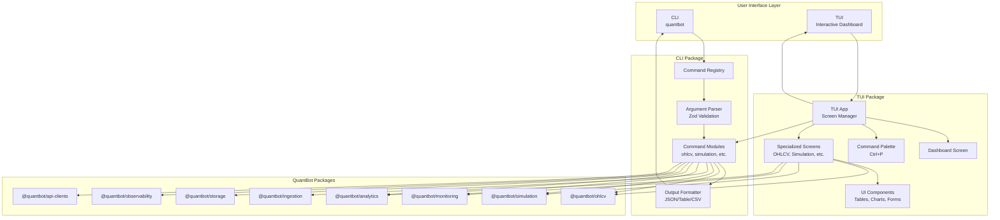

# CLI and TUI System Implementation Plan

## Overview

This plan creates two complementary systems:

1. **Package-level CLI**: Namespaced commands for each package's functionality
2. **Central TUI**: Interactive hybrid interface (dashboard + command palette) integrating all packages

Both systems support interactive and non-interactive (programmatic) modes.

## System Architecture



## Architecture

### Command Structure

Commands use namespaced structure:

```bash
quantbot <package> <command> [options]

# Examples:
quantbot ohlcv query --mint <address> --from <date> --to <date>
quantbot simulation run --strategy <name> --caller <name>
quantbot ingestion telegram --file <path> --caller-name <name>
quantbot monitoring start --caller Brook
quantbot analytics analyze --caller Brook --from <date> --to <date>
quantbot storage query --table <name> --limit 100
quantbot observability health
quantbot api-clients test --service birdeye
```

### Package Structure

```
packages/
├── cli/                          # CLI package
│   ├── src/
│   │   ├── index.ts              # Main CLI entry point
│   │   ├── bin/
│   │   │   └── quantbot.ts       # Executable entry point
│   │   ├── commands/              # Command modules
│   │   │   ├── ohlcv.ts
│   │   │   ├── simulation.ts
│   │   │   ├── ingestion.ts
│   │   │   ├── monitoring.ts
│   │   │   ├── analytics.ts
│   │   │   ├── storage.ts
│   │   │   ├── observability.ts
│   │   │   └── api-clients.ts
│   │   ├── core/
│   │   │   ├── command-registry.ts
│   │   │   ├── argument-parser.ts
│   │   │   ├── output-formatter.ts
│   │   │   └── error-handler.ts
│   │   └── utils/
│   │       ├── validators.ts
│   │       └── formatters.ts
│   ├── package.json
│   └── tsconfig.json
│
└── tui/                          # TUI package
    ├── src/
    │   ├── index.ts               # TUI entry point
    │   ├── app.ts                 # Main TUI application
    │   ├── screens/
    │   │   ├── dashboard.ts        # Dashboard screen
    │   │   ├── command-palette.ts # Command palette (Ctrl+P)
    │   │   ├── ohlcv-viewer.ts
    │   │   ├── simulation-runner.ts
    │   │   ├── monitoring-panel.ts
    │   │   └── analytics-viewer.ts
    │   ├── components/
    │   │   ├── table.ts          # Rich tables
    │   │   ├── chart.ts          # ASCII/Unicode charts
    │   │   ├── form.ts           # Input forms
    │   │   ├── status-bar.ts
    │   │   └── panel.ts
    │   ├── commands/
    │   │   └── tui-commands.ts   # TUI-specific commands
    │   └── utils/
    │       ├── navigation.ts
    │       └── keyboard.ts
    ├── package.json
    └── tsconfig.json
```

## Phase 1: CLI Package Implementation

### Step 1.1: Create CLI Package Structure

**Files to create:**

- `packages/cli/package.json`
- `packages/cli/tsconfig.json`
- `packages/cli/src/index.ts`
- `packages/cli/src/bin/quantbot.ts`

**Key features:**

- Commander.js for argument parsing
- Zod for validation
- Command registry for dynamic command loading
- Output formatters (JSON, table, CSV)
- Error handling with user-friendly messages

### Step 1.2: Core CLI Infrastructure

**Command Registry (`packages/cli/src/core/command-registry.ts`):**

- Register commands by package namespace
- Support subcommands
- Generate help text automatically
- Command discovery and validation

**Argument Parser (`packages/cli/src/core/argument-parser.ts`):**

- Parse arguments using Zod schemas
- Validate inputs before execution
- Provide helpful error messages
- Support both `--flag value` and `--flag=value` formats

**Output Formatter (`packages/cli/src/core/output-formatter.ts`):**

- JSON output (for programmatic use)
- Table output (for human-readable)
- CSV output (for data export)
- Progress indicators for long operations

### Step 1.3: Package Command Modules

Each package gets a command module with:

- Command definitions
- Zod schemas for validation
- Handler functions
- Help text

**OHLCV Commands (`packages/cli/src/commands/ohlcv.ts`):**

```typescript
- query: Query candles for a token
  Options: --mint, --from, --to, --interval, --format
- backfill: Backfill OHLCV data
  Options: --mint, --from, --to, --interval
- coverage: Check data coverage
  Options: --mint, --interval
```

**Simulation Commands (`packages/cli/src/commands/simulation.ts`):**

```typescript
- run: Run simulation on calls
  Options: --strategy, --caller, --from, --to, --format
- list-runs: List simulation runs
  Options: --caller, --from, --to, --limit
- compare: Compare multiple strategies
  Options: --strategies, --caller, --from, --to
```

**Ingestion Commands (`packages/cli/src/commands/ingestion.ts`):**

```typescript
- telegram: Ingest Telegram export
  Options: --file, --caller-name, --chain, --chat-id
- ohlcv: Fetch OHLCV for calls
  Options: --from, --to, --pre-window, --post-window, --interval
```

**Monitoring Commands (`packages/cli/src/commands/monitoring.ts`):**

```typescript
- start: Start monitoring service
  Options: --caller, --config
- stop: Stop monitoring service
  Options: --caller
- status: Check monitoring status
- logs: View monitoring logs
  Options: --caller, --limit, --follow
```

**Analytics Commands (`packages/cli/src/commands/analytics.ts`):**

```typescript
- analyze: Analyze calls with metrics
  Options: --caller, --from, --to, --format
- metrics: Calculate period metrics
  Options: --caller, --from, --to
- report: Generate analytics report
  Options: --caller, --from, --to, --format
```

**Storage Commands (`packages/cli/src/commands/storage.ts`):**

```typescript
- query: Query database tables
  Options: --table, --where, --limit, --format
- export: Export data to file
  Options: --table, --where, --format, --output
- stats: Show database statistics
```

**Observability Commands (`packages/cli/src/commands/observability.ts`):**

```typescript
- health: Check system health
- quotas: Check API quotas
  Options: --service
- errors: View error statistics
  Options: --from, --to, --limit
```

**API Clients Commands (`packages/cli/src/commands/api-clients.ts`):**

```typescript
- test: Test API connection
  Options: --service
- status: Check API status
  Options: --service
- credits: Check API credits
  Options: --service
```

## Phase 2: TUI Package Implementation

### Step 2.1: Create TUI Package Structure

**Files to create:**

- `packages/tui/package.json`
- `packages/tui/tsconfig.json`
- `packages/tui/src/index.ts`
- `packages/tui/src/app.ts`

**Dependencies:**

- `rich`: Terminal formatting, tables, panels, progress
- `prompts`: Interactive prompts
- `blessed` or `ink`: Full TUI framework (optional)

### Step 2.2: TUI Application Core

**Main App (`packages/tui/src/app.ts`):**

- Screen management
- Navigation system
- Keyboard shortcuts
- Event handling
- State management

**Features:**

- Dashboard as default screen
- Command palette (Ctrl+P) for quick actions
- Screen stack for navigation
- Keyboard shortcuts for common actions

### Step 2.3: Dashboard Screen

**Dashboard (`packages/tui/src/screens/dashboard.ts`):**

- Live metrics panels:
  - System health
  - API quotas
  - Recent calls
  - Active monitoring
  - Simulation stats
- Quick action buttons
- Status indicators
- Real-time updates

**Layout:**

```
┌─────────────────────────────────────────┐
│  QuantBot Dashboard          [Ctrl+P]   │
├─────────────────────────────────────────┤
│  Health    │  Quotas   │  Monitoring   │
│  ✅ All OK │  🟢 Good  │  🟢 Active    │
├─────────────────────────────────────────┤
│  Recent Calls                           │
│  • Token ABC (Brook) - 2.5x            │
│  • Token XYZ (LSY) - 1.8x               │
├─────────────────────────────────────────┤
│  Quick Actions                          │
│  [1] Run Simulation  [2] View OHLCV     │
│  [3] Start Monitor   [4] Analytics     │
└─────────────────────────────────────────┘
```

### Step 2.4: Command Palette

**Command Palette (`packages/tui/src/screens/command-palette.ts`):**

- Fuzzy search for commands
- Command categories
- Recent commands
- Keyboard navigation
- Execute commands directly

**Features:**

- Type to filter commands
- Arrow keys to navigate
- Enter to execute
- Tab to autocomplete
- Esc to close

### Step 2.5: Specialized Screens

**OHLCV Viewer (`packages/tui/src/screens/ohlcv-viewer.ts`):**

- Candle chart (ASCII/Unicode)
- Table view with sorting
- Filter by date range
- Export functionality

**Simulation Runner (`packages/tui/src/screens/simulation-runner.ts`):**

- Interactive form for parameters
- Live progress indicator
- Results display
- Comparison view

**Monitoring Panel (`packages/tui/src/screens/monitoring-panel.ts`):**

- Live token monitoring
- Alert feed
- Status indicators
- Control buttons (start/stop)

**Analytics Viewer (`packages/tui/src/screens/analytics-viewer.ts`):**

- Metrics tables
- Charts and graphs
- Filtering options
- Export functionality

### Step 2.6: Reusable Components

**Table Component (`packages/tui/src/components/table.ts`):**

- Rich tables with sorting
- Pagination
- Column resizing
- Search/filter

**Chart Component (`packages/tui/src/components/chart.ts`):**

- ASCII/Unicode candle charts
- Line charts
- Bar charts
- Real-time updates

**Form Component (`packages/tui/src/components/form.ts`):**

- Input fields
- Dropdowns
- Date pickers
- Validation feedback

**Status Bar (`packages/tui/src/components/status-bar.ts`):**

- System status
- Connection status
- Last update time
- Keyboard shortcuts hint

## Phase 3: Integration

### Step 3.1: CLI-TUI Integration

**Programmatic Mode:**

- TUI can execute CLI commands in background
- CLI output can be piped to TUI for visualization
- Shared command definitions

**Interactive Mode:**

- TUI uses CLI command handlers
- Real-time updates from CLI operations
- Progress indicators for long operations

### Step 3.2: Package Integration

**Command Discovery:**

- Each package can export CLI command definitions
- CLI/TUI imports from packages, not scripts
- Commands use package APIs directly

**Example:**

```typescript
// packages/ohlcv/src/cli.ts
export const ohlcvCommands = {
  query: {
    schema: z.object({ /* ... */ }),
    handler: async (args) => {
      // Use @quantbot/ohlcv package
    },
  },
};
```

## Implementation Details

### CLI Entry Point

**`packages/cli/src/bin/quantbot.ts`:**

```typescript
#!/usr/bin/env node
import { program } from 'commander';
import { registerCommands } from '../index';

program
  .name('quantbot')
  .description('QuantBot CLI - Unified interface for all packages')
  .version('1.0.0');

registerCommands(program);
program.parse();
```

### Command Registration Pattern

```typescript
// packages/cli/src/commands/ohlcv.ts
import { Command } from 'commander';
import { z } from 'zod';
import { OhlcvService } from '@quantbot/ohlcv';

export function registerOhlcvCommands(program: Command) {
  const ohlcvCmd = program
    .command('ohlcv')
    .description('OHLCV data operations');

  ohlcvCmd
    .command('query')
    .description('Query OHLCV candles')
    .requiredOption('--mint <address>', 'Token mint address')
    .requiredOption('--from <date>', 'Start date (ISO 8601)')
    .requiredOption('--to <date>', 'End date (ISO 8601)')
    .option('--interval <interval>', 'Candle interval', '5m')
    .option('--format <format>', 'Output format', 'table')
    .action(async (options) => {
      const schema = z.object({
        mint: z.string(),
        from: z.string().datetime(),
        to: z.string().datetime(),
        interval: z.enum(['1m', '5m', '15m', '1h']),
        format: z.enum(['json', 'table', 'csv']),
      });

      const args = schema.parse(options);
      const service = new OhlcvService();
      const candles = await service.queryCandles(args);
      
      // Format output based on --format flag
      formatOutput(candles, args.format);
    });
}
```

### TUI Command Execution

```typescript
// packages/tui/src/commands/tui-commands.ts
import { execCLICommand } from '@quantbot/cli';

export async function executeCommand(
  command: string,
  args: Record<string, unknown>
) {
  // Execute CLI command programmatically
  const result = await execCLICommand(command, args);
  
  // Update TUI state
  updateUI(result);
  
  return result;
}
```

## Testing Strategy

### CLI Tests

- Unit tests for argument parsing
- Unit tests for command handlers
- Integration tests for full command execution
- Property tests for validation

### TUI Tests

- Component tests for UI elements
- Integration tests for screen navigation
- E2E tests for workflows
- Keyboard shortcut tests

## Migration Path

1. **Phase 1**: Create CLI package, migrate existing scripts gradually
2. **Phase 2**: Create TUI package, integrate with CLI
3. **Phase 3**: Deprecate old scripts, update documentation
4. **Phase 4**: Add advanced TUI features, polish UX

## Dependencies

### CLI Package

```json
{
  "dependencies": {
    "commander": "^12.0.0",
    "zod": "^4.1.13",
    "@quantbot/core": "workspace:*",
    "@quantbot/utils": "workspace:*",
    "@quantbot/storage": "workspace:*",
    "@quantbot/ohlcv": "workspace:*",
    "@quantbot/simulation": "workspace:*",
    "@quantbot/ingestion": "workspace:*",
    "@quantbot/monitoring": "workspace:*",
    "@quantbot/analytics": "workspace:*",
    "@quantbot/observability": "workspace:*",
    "@quantbot/api-clients": "workspace:*"
  }
}
```

### TUI Package

```json
{
  "dependencies": {
    "rich": "^13.7.0",
    "prompts": "^2.4.2",
    "@quantbot/cli": "workspace:*",
    "@quantbot/core": "workspace:*",
    "@quantbot/utils": "workspace:*"
  }
}
```

## Usage Examples

### CLI Usage (Non-Interactive)

```bash
# Query OHLCV data
quantbot ohlcv query --mint So111... --from 2024-01-01T00:00:00Z --to 2024-01-02T00:00:00Z --format json

# Run simulation
quantbot simulation run --strategy PT2_SL25 --caller Brook --from 2024-01-01 --to 2024-02-01

# Ingest Telegram export
quantbot ingestion telegram --file data/messages.html --caller-name Brook

# Check system health
quantbot observability health
```

### TUI Usage (Interactive)

```bash
# Start TUI
quantbot tui

# Or use alias
quantbot interactive
```

**TUI Navigation:**

- `Ctrl+P`: Open command palette
- `Ctrl+D`: Open dashboard
- `Ctrl+Q`: Quit
- `Tab`: Navigate between panels
- `Enter`: Execute command
- `Esc`: Go back

### Programmatic Usage

```typescript
import { execCLICommand } from '@quantbot/cli';

// Execute command programmatically
const result = await execCLICommand('ohlcv', 'query', {
  mint: 'So111...',
  from: '2024-01-01T00:00:00Z',
  to: '2024-01-02T00:00:00Z',
  format: 'json',
});
```

## File Structure Summary

### New Files to Create

**CLI Package:**

- `packages/cli/package.json`
- `packages/cli/tsconfig.json`
- `packages/cli/src/index.ts`
- `packages/cli/src/bin/quantbot.ts`
- `packages/cli/src/core/command-registry.ts`
- `packages/cli/src/core/argument-parser.ts`
- `packages/cli/src/core/output-formatter.ts`
- `packages/cli/src/core/error-handler.ts`
- `packages/cli/src/commands/ohlcv.ts`
- `packages/cli/src/commands/simulation.ts`
- `packages/cli/src/commands/ingestion.ts`
- `packages/cli/src/commands/monitoring.ts`
- `packages/cli/src/commands/analytics.ts`
- `packages/cli/src/commands/storage.ts`
- `packages/cli/src/commands/observability.ts`
- `packages/cli/src/commands/api-clients.ts`
- `packages/cli/src/utils/validators.ts`
- `packages/cli/src/utils/formatters.ts`

**TUI Package:**

- `packages/tui/package.json`
- `packages/tui/tsconfig.json`
- `packages/tui/src/index.ts`
- `packages/tui/src/app.ts`
- `packages/tui/src/screens/dashboard.ts`
- `packages/tui/src/screens/command-palette.ts`
- `packages/tui/src/screens/ohlcv-viewer.ts`
- `packages/tui/src/screens/simulation-runner.ts`
- `packages/tui/src/screens/monitoring-panel.ts`
- `packages/tui/src/screens/analytics-viewer.ts`
- `packages/tui/src/components/table.ts`
- `packages/tui/src/components/chart.ts`
- `packages/tui/src/components/form.ts`
- `packages/tui/src/components/status-bar.ts`
- `packages/tui/src/components/panel.ts`
- `packages/tui/src/commands/tui-commands.ts`
- `packages/tui/src/utils/navigation.ts`
- `packages/tui/src/utils/keyboard.ts`

### Files to Modify

- `package.json`: Add CLI/TUI scripts
- `pnpm-workspace.yaml`: Add new packages
- `README.md`: Update with CLI/TUI documentation

## Next Steps

1. Create CLI package structure
2. Implement core CLI infrastructure
3. Add package command modules
4. Create TUI package structure
5. Implement TUI screens and components
6. Integrate CLI and TUI
7. Add tests
8. Update documentation
