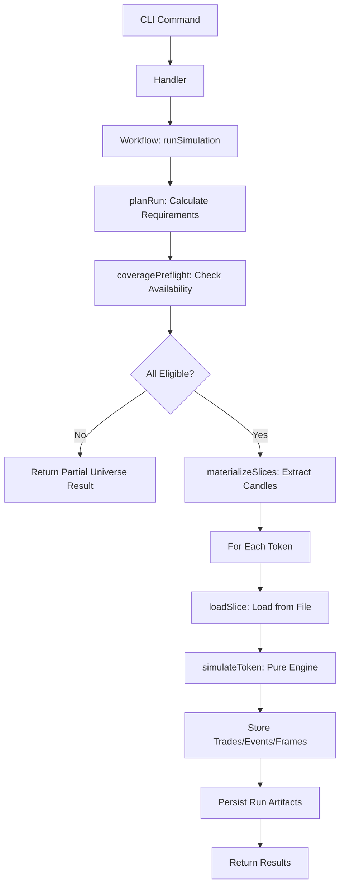

# Simulator Engine Architecture

## Overview

The simulator engine integration adds a pure, deterministic simulation core to QuantBot while preserving all existing workflows and CLI commands. The integration follows the established handler → service → workflow pattern.

## Architecture Layers

```
┌─────────────────────────────────────────────────────────┐
│ CLI Commands (unchanged)                                 │
│ quantbot simulation run ...                              │
└──────────────────┬──────────────────────────────────────┘
                   │
┌──────────────────▼──────────────────────────────────────┐
│ Workflow Layer (packages/workflows/src/simulation/)     │
│                                                          │
│ 1. planRun() - Calculate requirements                   │
│ 2. coveragePreflight() - Validate availability         │
│ 3. materializeSlices() - Extract candles                │
│ 4. runSimulation() - Orchestrate execution              │
└──────────────────┬──────────────────────────────────────┘
                   │
┌──────────────────▼──────────────────────────────────────┐
│ Pure Simulator Engine (packages/simulation/src/engine/) │
│                                                          │
│ simulateToken(strategy, candles) →                      │
│   { summary, trades, events, frames }                    │
│                                                          │
│ - No I/O, no DB, no network                             │
│ - Deterministic                                          │
│ - JSON-serializable outputs                              │
└──────────────────────────────────────────────────────────┘
```

## Integration Points

### 1. Pure Simulator Core

**Location**: `packages/simulation/src/engine/`

**Files**:
- `sim_types.ts` - Type definitions
- `indicators.ts` - RSI, EMA implementations
- `strategy_validate.ts` - Zod validation schemas
- `sim_engine.ts` - Core `simulateToken()` function

**Contract**:
```typescript
function simulateToken(
  token: string,
  candles: Candle[],
  strategy: StrategyConfig
): SimulationResult
```

**Rules**:
- ✅ No I/O, no DB, no network
- ✅ Deterministic (same inputs → same outputs)
- ✅ JSON-serializable outputs only
- ✅ No dependencies on CLI/workflow/storage packages

### 2. Run Planning Service

**Location**: `packages/workflows/src/simulation/planRun.ts`

**Purpose**: Calculate candle requirements before simulation

**Output**:
- `requiredWarmupCandles` - Max indicator period
- `requiredLookback` - Delay + max holding
- `requiredFromTs`, `requiredToTs` - Time range per token
- `requiredCandleCount` - Minimum candles needed

### 3. Coverage Preflight Service

**Location**: `packages/workflows/src/simulation/coveragePreflight.ts`

**Purpose**: Validate candle availability before simulation

**Output**:
- `eligibleTokens` - Tokens with sufficient candles
- `excludedTokens` - Tokens excluded with reasons
- `coverageSummary` - Statistics

**Integration**: Uses existing `getCoverage()` from `@quantbot/ohlcv`

### 4. Slice Materialization Service

**Location**: `packages/workflows/src/simulation/materializeSlices.ts`

**Purpose**: Extract required candles to fast local format

**Output**:
- `slicePaths` - Map of token → slice file path
- `sliceMetadata` - Per-slice metadata

**Storage**: JSON files in `artifacts/{runId}/slices/`

### 5. Workflow Integration

**Location**: `packages/workflows/src/simulation/runSimulation.ts`

**Flow**:
1. Validate strategy config
2. Fetch calls
3. Plan run (calculate requirements)
4. Coverage preflight (validate availability)
5. Materialize slices (extract candles)
6. Simulate (pure engine on slices)
7. Store artifacts (events/frames)

## Data Flow



## Strategy Configuration

The simulator accepts strategy JSON in this format:

```typescript
{
  entry: {
    mode: 'immediate' | 'signal',
    signal?: { type: 'rsi_below' | 'ema_cross', ... },
    delay?: { mode: 'none' | 'candles', n?: number }
  },
  exits: {
    targets?: Array<{ size_pct: number, profit_pct: number }>,
    trailing?: { enabled: boolean, trail_pct: number, ... },
    time_exit?: { enabled: boolean, max_candles_in_trade: number }
  },
  stops: {
    stop_loss_pct: number,
    break_even_after_first_target?: boolean
  },
  execution: {
    fill_model: 'open' | 'close',
    fee_bps: number,
    slippage_bps: number
  }
}
```

## Output Structure

### Summary
```typescript
{
  token: string;
  trades: number;
  win_rate: number;
  avg_pnl_pct: number;
}
```

### Trades
```typescript
{
  trade_id: string;
  token: string;
  entry_ts: string;
  exit_ts: string;
  entry_price: number;
  exit_price: number;
  pnl_pct: number;
  exit_reason: 'stop' | 'targets_done' | 'time_exit' | 'end_of_data';
}
```

### Events
Events track all simulation state changes:
- `ENTRY_SIGNAL_TRUE`, `ENTRY_FILLED`
- `STOP_SET`, `STOP_MOVED`, `STOP_HIT`
- `TARGET_HIT`, `PARTIAL_EXIT`, `EXIT_FULL`

### Replay Frames
Per-candle state for replay:
```typescript
{
  seq: number;
  candle: Candle;
  events: Event[];
  position: {
    is_open: boolean;
    size_pct: number;
    avg_price: number | null;
    stop_price: number | null;
    unrealized_pnl_pct: number | null;
  }
}
```

## Non-Negotiables

1. **Existing CLI commands unchanged** - All current simulation commands work as before
2. **Coverage analysis authoritative** - Uses existing `getCoverage()` function
3. **Slices mandatory** - Simulator never queries ClickHouse directly
4. **Simulator pure** - No I/O, no DB, no network dependencies
5. **UI is compiler** - Wizard emits strategy JSON, doesn't execute strategies
6. **Workflow orchestration** - All I/O happens in workflow layer, not simulator

## Testing

### Unit Tests
- `sim_engine.test.ts` - Pure simulator tests
- `planRun.test.ts` - Requirement calculation tests
- `coveragePreflight.test.ts` - Eligibility classification tests
- `materializeSlices.test.ts` - Slice extraction tests

### Golden Tests
- `sim_engine_golden.test.ts` - Python/TypeScript parity tests
- Ensures identical outputs for known inputs

### Integration Tests
- `runSimulation.test.ts` - Full workflow tests
- Tests plan → preflight → slice → simulate → persist flow

## Strategy Builder UI

**Location**: `strategy-ui/app/templates/strategy_wizard.html`

**Features**:
- 5-step wizard (Entry → Risk → Profit → Time → Execution)
- Live validation
- Plain-English summary
- JSON preview with advanced edit

**Output**: Valid strategy JSON compatible with simulator

See [Strategy Builder Wizard Guide](../guides/strategy-builder-wizard.md) for details.

## Migration Notes

The integration is **additive** - no existing code was replaced:

- ✅ Existing simulation commands continue to work
- ✅ Existing workflows preserved
- ✅ Existing storage/artifact systems unchanged
- ✅ New pure simulator is drop-in module

The workflow now uses the pure simulator, but the old simulation path remains available for backward compatibility.

## Future Enhancements

- Parquet/Arrow slice format (currently JSON)
- Slice caching across runs
- Block-based advanced mode for strategy builder
- Strategy templates/presets
- Parameter sweeps

