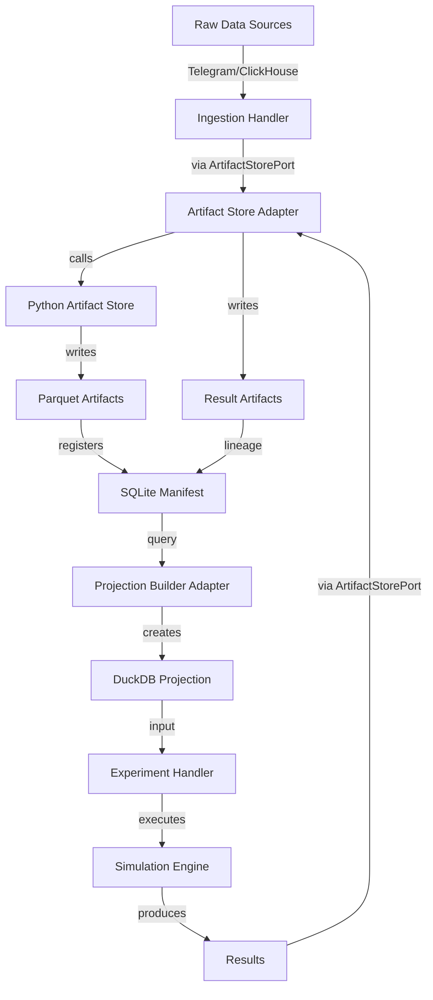
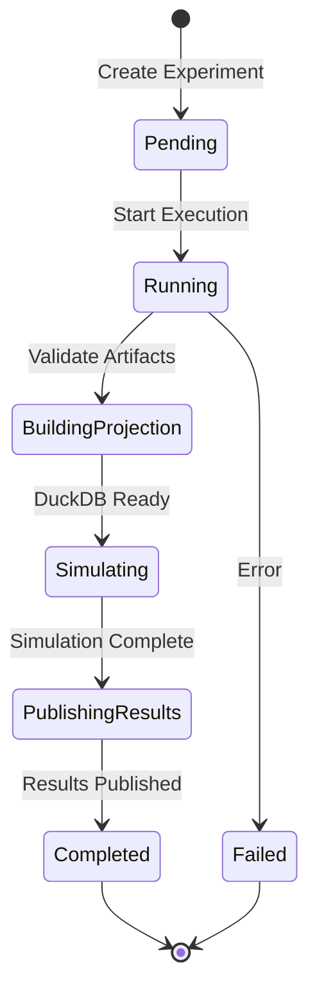

# Research Package Architecture

## Overview

The Research Package implements a Parquet-first, DuckDB-as-projection architecture for reproducible research using the ports/adapters/handlers pattern.

---

## Core Architecture

### Layered Architecture

```
┌─────────────────────────────────────────────────────────────┐
│                     CLI Layer                                │
│  (Command registration, argument parsing, output formatting) │
│  packages/cli/src/commands/                                  │
└────────────────────┬────────────────────────────────────────┘
                     │ calls
┌────────────────────▼────────────────────────────────────────┐
│                  Handler Layer                               │
│  (Pure orchestration, business logic, no I/O)               │
│  packages/*/src/handlers/                                    │
│  - Depends on ports only                                     │
│  - No subprocess calls                                       │
│  - No database access                                        │
│  - No file I/O                                              │
└────────────────────┬────────────────────────────────────────┘
                     │ depends on
┌────────────────────▼────────────────────────────────────────┐
│                   Port Layer                                 │
│  (Type-only interfaces, zero dependencies)                  │
│  packages/core/src/ports/                                    │
│  - ArtifactStorePort                                        │
│  - ProjectionBuilderPort                                    │
│  - ExperimentTrackerPort                                    │
└────────────────────▲────────────────────────────────────────┘
                     │ implemented by
┌────────────────────┴────────────────────────────────────────┐
│                  Adapter Layer                               │
│  (I/O implementations, external system integration)         │
│  packages/storage/src/adapters/                             │
│  - ArtifactStoreAdapter (uses PythonEngine)                 │
│  - ProjectionBuilderAdapter (uses DuckDB)                   │
│  - ExperimentTrackerAdapter (uses DuckDB)                   │
└────────────────────┬────────────────────────────────────────┘
                     │ calls
┌────────────────────▼────────────────────────────────────────┐
│              External Systems Layer                          │
│  - Python Artifact Store (packages/artifact_store)          │
│  - Data Lake (/home/memez/opn)                              │
│  - DuckDB (cache projections)                               │
│  - ClickHouse (OHLCV source)                                │
└─────────────────────────────────────────────────────────────┘
```

---

## Data Flow

### Ingestion → Artifact → Projection → Experiment → Results



### Experiment Lifecycle



---

## Ports/Adapters Pattern

### Port Interface (Type-Only)

**Location**: `packages/core/src/ports/artifact-store-port.ts`

```typescript
export interface ArtifactStorePort {
  getArtifact(artifactId: string): Promise<Artifact>;
  listArtifacts(filter: ArtifactFilter): Promise<Artifact[]>;
  publishArtifact(request: PublishArtifactRequest): Promise<PublishArtifactResult>;
  getLineage(artifactId: string): Promise<ArtifactLineage>;
  isAvailable(): Promise<boolean>;
}
```

**Properties:**
- Zero dependencies (types only)
- No implementation details
- Handlers depend on this

### Adapter Implementation (I/O)

**Location**: `packages/storage/src/adapters/artifact-store-adapter.ts`

```typescript
export class ArtifactStoreAdapter implements ArtifactStorePort {
  constructor(
    manifestDb: string,
    artifactsRoot: string,
    pythonEngine?: PythonEngine
  ) { /* ... */ }
  
  async getArtifact(artifactId: string): Promise<Artifact> {
    // Uses PythonEngine to call artifact_store_ops.py
    return await this.pythonEngine.runScriptWithStdin(/* ... */);
  }
}
```

**Properties:**
- Implements port interface
- Uses `PythonEngine` for Python calls
- Handles I/O and errors
- Wired in composition root

### Handler (Pure Orchestration)

**Location**: `packages/workflows/src/experiments/handlers/execute-experiment.ts`

```typescript
export async function executeExperiment(
  definition: ExperimentDefinition,
  ports: {
    artifactStore: ArtifactStorePort;
    projectionBuilder: ProjectionBuilderPort;
    experimentTracker: ExperimentTrackerPort;
  }
): Promise<Experiment> {
  // Pure orchestration - no I/O
  // Depends on ports only
  // Testable with mocks
}
```

**Properties:**
- Pure orchestration
- No I/O operations
- Depends on ports (not adapters)
- Testable with mocks

### Composition Root (Wiring)

**Location**: `packages/cli/src/core/command-context.ts`

```typescript
export class CommandContext {
  artifactStore(): ArtifactStorePort {
    if (!this._artifactStore) {
      this._artifactStore = new ArtifactStoreAdapter(
        manifestDb,
        artifactsRoot,
        this.pythonEngine()
      );
    }
    return this._artifactStore;
  }
}
```

**Properties:**
- Wires adapters to ports
- Lazy initialization
- Configuration from environment

---

## Data Lake Structure

### Directory Layout

```
/home/memez/opn/
├── artifacts/                      # Immutable Parquet truth
│   ├── alerts_v1/v1/              # 750 alert artifacts
│   │   ├── alerts_v1__v1__day=2025-05-01_chain=solana__ch=ace42dc3.parquet
│   │   └── alerts_v1__v1__day=2025-05-01_chain=solana__ch=ace42dc3.json
│   ├── ohlcv_slice_v2/v2/         # 3,641 OHLCV slice artifacts
│   │   ├── ohlcv_slice_v2__v2__token=ABC...__ch=12345678.parquet
│   │   └── ohlcv_slice_v2__v2__token=ABC...__ch=12345678.json
│   ├── alerts_event_v1/v1/        # 508 alert event artifacts
│   └── _quarantine/               # Invalid/rejected artifacts
├── cache/                          # Disposable DuckDB projections
│   ├── ohlcv_cache.duckdb         # Rebuildable from artifacts
│   └── ohlcv_v2_dataset/          # Bucketed partitions (64 buckets × 8 months)
├── coverage/                       # Coverage analysis artifacts
│   └── ohlcv_v2/
│       ├── alert_forward_coverage.parquet
│       ├── coverage_gaps.parquet
│       └── coverage_summary.parquet
├── manifest/                       # Artifact registry (SQLite)
│   └── manifest.sqlite            # 4,899 artifacts registered
├── staging/                        # Temporary ingestion staging
│   └── alerts_v1_shards/          # Pre-publish alert shards
└── verify/                         # Verification & rebuild scripts
    ├── rebuild_cache_duckdb.py    # Rebuild DuckDB from Parquet
    ├── audit_artifacts.py         # Audit artifact integrity
    └── build_alert_forward_coverage.py
```

### Artifact Naming Convention

**Pattern**: `{type}__v{version}__{logical_key}__ch={content_hash_short}.parquet`

**Examples:**
- `alerts_v1__v1__day=2025-05-01_chain=solana__ch=ace42dc3.parquet`
- `ohlcv_slice_v2__v2__token=ABC..._res=1m_from=2025-05-01_to=2025-05-02__ch=12345678.parquet`

**Properties:**
- Content-addressable (hash in filename)
- Self-describing (type, version, logical key)
- Deterministic (same content → same hash)

### Sidecar Metadata

**Pattern**: `{artifact}.json` (same name as Parquet, `.json` extension)

**Contents:**
```json
{
  "artifact_id": "uuid",
  "artifact_type": "alerts_v1",
  "schema_version": 1,
  "logical_key": "day=2025-05-01/chain=solana",
  "status": "active",
  "identity": {
    "file_hash": "sha256:...",
    "content_hash": "sha256:...",
    "row_count": 40,
    "canonical_cols": ["alert_ts_utc", "chain", "mint", ...],
    "sort_keys": ["alert_ts_utc", "chain", "mint", ...]
  },
  "provenance": {
    "writer": {"name": "alerts_publisher", "version": "1.0.0"},
    "git": {"commit": "deadbeef", "dirty": false},
    "params": {"source": "telegram"},
    "inputs": []
  },
  "paths": {
    "parquet": "/home/memez/opn/artifacts/...",
    "sidecar": "/home/memez/opn/artifacts/..."
  }
}
```

---

## Manifest Schema (SQLite)

### Tables

```sql
-- Artifact registry
CREATE TABLE artifacts (
  artifact_id TEXT PRIMARY KEY,
  artifact_type TEXT NOT NULL,
  schema_version INTEGER NOT NULL,
  logical_key TEXT NOT NULL,
  status TEXT NOT NULL,  -- active | superseded | tombstoned
  path_parquet TEXT NOT NULL,
  path_sidecar TEXT NOT NULL,
  file_hash TEXT NOT NULL UNIQUE,
  content_hash TEXT NOT NULL,
  row_count INTEGER NOT NULL,
  min_ts TEXT,
  max_ts TEXT,
  created_at TEXT NOT NULL
);

-- Lineage tracking
CREATE TABLE artifact_lineage (
  artifact_id TEXT NOT NULL,
  input_artifact_id TEXT NOT NULL,
  PRIMARY KEY (artifact_id, input_artifact_id),
  FOREIGN KEY (artifact_id) REFERENCES artifacts(artifact_id),
  FOREIGN KEY (input_artifact_id) REFERENCES artifacts(artifact_id)
);

-- Tag-based metadata
CREATE TABLE artifact_tags (
  artifact_id TEXT NOT NULL,
  k TEXT NOT NULL,
  v TEXT NOT NULL,
  PRIMARY KEY (artifact_id, k, v),
  FOREIGN KEY (artifact_id) REFERENCES artifacts(artifact_id)
);

-- Supersession tracking
CREATE TABLE artifact_supersedes (
  artifact_id TEXT NOT NULL PRIMARY KEY,
  supersedes_artifact_id TEXT NOT NULL,
  FOREIGN KEY (artifact_id) REFERENCES artifacts(artifact_id),
  FOREIGN KEY (supersedes_artifact_id) REFERENCES artifacts(artifact_id)
);
```

### Indexes

```sql
CREATE INDEX idx_artifacts_type_key ON artifacts(artifact_type, logical_key);
CREATE INDEX idx_artifacts_content_hash ON artifacts(content_hash);
CREATE INDEX idx_artifacts_type_key_content ON artifacts(artifact_type, logical_key, content_hash);
```

---

## Deduplication Strategy

### File-Level Deduplication

**Mechanism**: SHA256 of Parquet bytes

**Use Case**: Exact duplicate detection (same file uploaded twice)

**Result**: Return existing artifact ID, discard new file

### Semantic Deduplication

**Mechanism**: SHA256 of canonical columns in deterministic order

**Use Case**: Logical duplicate detection (same data, different file)

**Process:**
1. Read Parquet with deterministic column selection
2. Apply type casts for normalization (timestamps → ISO8601 UTC)
3. Sort by sort_keys
4. Hash delimited row stream
5. Compare content_hash

**Result**: Return existing artifact ID if content matches

---

## Reproducibility Guarantees

### Experiment Reproducibility

**Given:**
- Experiment ID
- Input artifact IDs (frozen)
- Configuration (strategy, params)
- Random seed
- Git commit

**Guarantee:**
- Same inputs + same seed → byte-identical outputs (within tolerance)

**Mechanism:**
1. Artifact IDs frozen at experiment creation
2. Artifacts are immutable (never change)
3. Deterministic RNG (seeded)
4. Versioned simulation contract
5. Lineage tracked in manifest

### Data Reproducibility

**Given:**
- Artifact ID

**Guarantee:**
- Can retrieve exact Parquet file that produced results

**Mechanism:**
1. Manifest stores path to Parquet
2. File hash verifies integrity
3. Content hash verifies semantic identity
4. Lineage shows input artifacts

---

## Example Workflows

### Workflow 1: Ingest Alerts

```typescript
// Handler (pure)
async function ingestTelegramAlertsHandler(
  args: IngestTelegramAlertsArgs,
  ctx: CommandContext
) {
  const artifactStore = ctx.services.artifactStore();
  
  // 1. Load and normalize
  const alerts = await loadTelegramExport(args.exportPath);
  const normalized = await normalizeAlerts(alerts, args.chain);
  
  // 2. Validate
  const { valid, invalid } = await validateAlerts(normalized);
  
  // 3. Quarantine invalid
  if (invalid.length > 0) {
    await quarantineAlerts(invalid, artifactStore);
  }
  
  // 4. Write temp Parquet
  const tempPath = await writeTempParquet(valid);
  
  // 5. Publish via port
  const result = await artifactStore.publishArtifact({
    artifactType: 'alerts_v1',
    schemaVersion: 1,
    logicalKey: `day=${args.date}/chain=${args.chain}`,
    dataPath: tempPath,
    tags: { source: 'telegram', chain: args.chain },
    inputArtifactIds: [],
    writerName: 'telegram-ingestion',
    writerVersion: '1.0.0',
    gitCommit: await getGitCommit(),
    gitDirty: await isGitDirty(),
    params: { exportPath: args.exportPath },
  });
  
  return result;
}

// Adapter (I/O)
class ArtifactStoreAdapter implements ArtifactStorePort {
  async publishArtifact(request: PublishArtifactRequest): Promise<PublishArtifactResult> {
    // Call Python artifact store via PythonEngine
    return await this.pythonEngine.runScriptWithStdin(
      this.scriptPath,
      { operation: 'publish_artifact', ...request },
      PublishArtifactResultSchema
    );
  }
}

// Python wrapper
# tools/storage/artifact_store_ops.py
def publish_artifact_op(manifest_db, artifacts_root, request):
    df = pd.read_parquet(request['data_path'])
    result = publish_dataframe(
        manifest_db=Path(manifest_db),
        artifacts_root=Path(artifacts_root),
        artifact_type=request['artifact_type'],
        # ... other params
    )
    return result

# Python artifact store
# packages/artifact_store/artifact_store/publisher.py
def publish_dataframe(...):
    # 1. Write temp Parquet
    # 2. Compute file hash
    # 3. Compute content hash
    # 4. Check deduplication
    # 5. Register in manifest
    # 6. Return result
```

### Workflow 2: Execute Experiment

```typescript
// Handler (pure)
async function executeExperimentHandler(
  args: ExecuteExperimentArgs,
  ctx: CommandContext
) {
  const artifactStore = ctx.services.artifactStore();
  const projectionBuilder = ctx.services.projectionBuilder();
  const experimentTracker = ctx.services.experimentTracker();
  
  // 1. Get experiment definition
  const experiment = await experimentTracker.getExperiment(args.experimentId);
  
  // 2. Validate artifacts
  await validateArtifacts(experiment.inputs, artifactStore);
  
  // 3. Build projection
  const projection = await projectionBuilder.buildProjection({
    projectionId: `exp-${args.experimentId}`,
    artifacts: experiment.inputs,
    tables: { alerts: 'alerts', ohlcv: 'ohlcv' },
  });
  
  // 4. Execute simulation
  const results = await executeSimulation(projection.duckdbPath, experiment.config);
  
  // 5. Publish results
  const outputArtifacts = await publishResults(
    args.experimentId,
    results,
    experiment.inputs,
    artifactStore
  );
  
  // 6. Store results
  await experimentTracker.storeResults(args.experimentId, outputArtifacts);
  
  // 7. Cleanup
  await projectionBuilder.disposeProjection(`exp-${args.experimentId}`);
  
  return experiment;
}

// Projection builder adapter
class ProjectionBuilderAdapter implements ProjectionBuilderPort {
  async buildProjection(request: ProjectionRequest): Promise<ProjectionResult> {
    // 1. Get artifact metadata from manifest
    const artifacts = await this.getArtifacts(request.artifacts);
    
    // 2. Create DuckDB file
    const duckdb = new DuckDBClient(duckdbPath);
    
    // 3. Create tables from Parquet files
    await duckdb.execute(`
      CREATE TABLE alerts AS
      SELECT * FROM read_parquet([${alertPaths}])
    `);
    
    await duckdb.execute(`
      CREATE TABLE ohlcv AS
      SELECT * FROM read_parquet([${ohlcvPaths}])
    `);
    
    // 4. Create indexes
    await duckdb.execute(`CREATE INDEX idx_alerts ON alerts(alert_ts_utc, mint)`);
    
    return { projectionId, duckdbPath, tables, ... };
  }
}
```

### Workflow 3: Query Lineage

```typescript
// Handler (pure)
async function getArtifactLineageHandler(
  args: GetArtifactLineageArgs,
  ctx: CommandContext
) {
  const artifactStore = ctx.services.artifactStore();
  
  // Get lineage
  const lineage = await artifactStore.getLineage(args.artifactId);
  
  return lineage;
}

// Adapter (I/O)
class ArtifactStoreAdapter implements ArtifactStorePort {
  async getLineage(artifactId: string): Promise<ArtifactLineage> {
    return await this.pythonEngine.runScriptWithStdin(
      this.scriptPath,
      { operation: 'get_lineage', artifact_id: artifactId },
      ArtifactLineageSchema
    );
  }
}

// Python wrapper
def get_lineage(manifest_db, artifact_id):
    con = connect_manifest(Path(manifest_db))
    rows = con.execute("""
        SELECT a.* FROM artifacts a
        JOIN artifact_lineage l ON a.artifact_id = l.input_artifact_id
        WHERE l.artifact_id = ?
    """, (artifact_id,)).fetchall()
    return {'artifactId': artifact_id, 'inputs': [row_to_dict(r) for r in rows]}
```

---

## Architectural Invariants

### Invariant 1: Parquet is Truth

**Rule**: All authoritative data exists as immutable Parquet artifacts.

**Enforcement**:
- No direct writes to DuckDB tables
- All data mutations go through `ArtifactStorePort`
- Architecture tests verify no direct DuckDB writes

**Verification**:
```typescript
// Architecture test
it('should not write directly to DuckDB', () => {
  const handlers = findAllHandlers();
  for (const handler of handlers) {
    expect(handler).not.toContain('INSERT INTO');
    expect(handler).not.toContain('UPDATE ');
    expect(handler).not.toContain('DELETE FROM');
  }
});
```

### Invariant 2: DuckDB is Disposable

**Rule**: DuckDB files can be deleted without data loss.

**Enforcement**:
- DuckDB projections built from Parquet on-demand
- Rebuild mechanism available (`rebuild_cache_duckdb.py`)
- No authoritative state in DuckDB

**Verification**:
```typescript
// Integration test
it('should rebuild DuckDB from Parquet', async () => {
  // 1. Build projection
  const projection = await projectionBuilder.buildProjection(request);
  
  // 2. Query data
  const before = await query(projection.duckdbPath, 'SELECT COUNT(*) FROM alerts');
  
  // 3. Delete DuckDB
  await projectionBuilder.disposeProjection(request.projectionId);
  
  // 4. Rebuild
  const rebuilt = await projectionBuilder.buildProjection(request);
  
  // 5. Verify same data
  const after = await query(rebuilt.duckdbPath, 'SELECT COUNT(*) FROM alerts');
  expect(after).toEqual(before);
});
```

### Invariant 3: Idempotency Everywhere

**Rule**: Every pipeline step is safe to re-run.

**Enforcement**:
- Content hashing prevents duplicate artifacts
- Semantic deduplication at artifact level
- Deterministic artifact IDs

**Verification**:
```typescript
// Integration test
it('should be idempotent', async () => {
  // Run pipeline twice
  const result1 = await ingestAlerts(args);
  const result2 = await ingestAlerts(args);
  
  // Second run should dedupe
  expect(result2.deduped).toBe(true);
  expect(result2.existingArtifactId).toBe(result1.artifactId);
});
```

### Invariant 4: Lineage is Complete

**Rule**: Every artifact declares its inputs.

**Enforcement**:
- Artifact store requires `input_artifact_ids`
- Manifest tracks lineage
- Experiments declare input artifacts

**Verification**:
```typescript
// Integration test
it('should track lineage', async () => {
  // 1. Publish input artifacts
  const input1 = await publishArtifact({ type: 'alerts_v1', ... });
  const input2 = await publishArtifact({ type: 'ohlcv_slice_v2', ... });
  
  // 2. Publish output artifact with lineage
  const output = await publishArtifact({
    type: 'experiment_trades',
    inputArtifactIds: [input1.artifactId, input2.artifactId],
    ...
  });
  
  // 3. Query lineage
  const lineage = await artifactStore.getLineage(output.artifactId);
  
  // 4. Verify inputs
  expect(lineage.inputs).toHaveLength(2);
  expect(lineage.inputs.map(a => a.artifactId)).toContain(input1.artifactId);
  expect(lineage.inputs.map(a => a.artifactId)).toContain(input2.artifactId);
});
```

---

## Testing Strategy

### Unit Tests (Handlers)

**Pattern**: Mock ports, test orchestration

```typescript
describe('executeExperimentHandler', () => {
  it('should execute experiment with frozen artifacts', async () => {
    // Mock ports
    const mockArtifactStore = createMockArtifactStore();
    const mockProjectionBuilder = createMockProjectionBuilder();
    const mockExperimentTracker = createMockExperimentTracker();
    
    // Execute handler
    const result = await executeExperiment(definition, {
      artifactStore: mockArtifactStore,
      projectionBuilder: mockProjectionBuilder,
      experimentTracker: mockExperimentTracker,
    });
    
    // Verify calls
    expect(mockArtifactStore.getArtifact).toHaveBeenCalledWith('artifact-1');
    expect(mockProjectionBuilder.buildProjection).toHaveBeenCalled();
    expect(mockExperimentTracker.storeResults).toHaveBeenCalled();
  });
});
```

### Integration Tests (Adapters)

**Pattern**: Test with real Python scripts, verify I/O

```typescript
describe('ArtifactStoreAdapter', () => {
  it('should publish artifact via Python', async () => {
    const adapter = new ArtifactStoreAdapter(manifestDb, artifactsRoot);
    
    const result = await adapter.publishArtifact({
      artifactType: 'test_artifact',
      schemaVersion: 1,
      logicalKey: 'test/key',
      dataPath: '/tmp/test.csv',
      // ... other params
    });
    
    expect(result.success).toBe(true);
    expect(result.artifactId).toBeDefined();
    
    // Verify artifact exists in manifest
    const artifact = await adapter.getArtifact(result.artifactId);
    expect(artifact.logicalKey).toBe('test/key');
  });
});
```

### End-to-End Tests

**Pattern**: Full workflow from ingestion to results

```typescript
describe('End-to-End: Experiment Execution', () => {
  it('should execute experiment with artifact lineage', async () => {
    // 1. Ingest alerts
    const alertsResult = await ingestAlerts({ ... });
    
    // 2. Export OHLCV slice
    const ohlcvResult = await exportOhlcvSlice({ ... });
    
    // 3. Create experiment
    const experiment = await createExperiment({
      inputs: {
        alerts: [alertsResult.artifactId],
        ohlcv: [ohlcvResult.artifactId],
      },
      config: { ... },
    });
    
    // 4. Execute experiment
    const result = await executeExperiment(experiment.experimentId);
    
    // 5. Verify results
    expect(result.status).toBe('completed');
    expect(result.outputs.tradesArtifactId).toBeDefined();
    
    // 6. Verify lineage
    const lineage = await getLineage(result.outputs.tradesArtifactId);
    expect(lineage.inputs).toContainEqual(
      expect.objectContaining({ artifactId: alertsResult.artifactId })
    );
  });
});
```

---

## Performance Considerations

### Projection Building

**Optimization**: Use DuckDB's parallel read_parquet

```sql
-- DuckDB reads multiple Parquet files in parallel
CREATE TABLE ohlcv AS
SELECT * FROM read_parquet([
  '/home/memez/opn/artifacts/ohlcv_slice_v2/v2/file1.parquet',
  '/home/memez/opn/artifacts/ohlcv_slice_v2/v2/file2.parquet',
  -- ... 3,641 files
])
```

**Benchmark**: 3,641 OHLCV artifacts → DuckDB table in ~30 seconds

### Content Hashing

**Optimization**: Stream-based hashing (no full load)

```python
# Hash rows in batches
while True:
    rows = cur.fetchmany(10_000)
    if not rows:
        break
    for r in rows:
        h.update((delim.join(parts) + "\n").encode("utf-8"))
```

**Benchmark**: 1M rows → content hash in ~5 seconds

### Deduplication

**Optimization**: Two-level deduplication (file hash → content hash)

```python
# 1. Check file hash (fast, exact match)
existing = artifact_exists_by_file_hash(con, file_hash)
if existing:
    return {'deduped': True, 'mode': 'file_hash', 'existingArtifactId': existing}

# 2. Check content hash (slower, semantic match)
existing = artifact_exists_by_semantic_key(con, artifact_type, logical_key, content_hash)
if existing:
    return {'deduped': True, 'mode': 'content_hash', 'existingArtifactId': existing}
```

---

## Monitoring & Observability

### Metrics to Track

1. **Artifact Metrics**:
   - Artifacts published per day
   - Deduplication rate (file vs semantic)
   - Artifact size distribution
   - Quarantine rate

2. **Projection Metrics**:
   - Projection build time
   - Projection size
   - Cache hit rate
   - Rebuild frequency

3. **Experiment Metrics**:
   - Experiments per day
   - Success rate
   - Execution time distribution
   - Artifact reuse rate

### Logging

**Structured logging** with context:

```typescript
logger.info('Publishing artifact', {
  artifactType: request.artifactType,
  logicalKey: request.logicalKey,
  dataPath: request.dataPath,
  inputArtifactCount: request.inputArtifactIds?.length || 0,
});

logger.info('Artifact published', {
  artifactId: result.artifactId,
  deduped: result.deduped,
  mode: result.mode,
  pathParquet: result.pathParquet,
});
```

---

## Troubleshooting

### Issue: Artifact not found

**Symptom**: `NotFoundError: Artifact not found: abc-123`

**Cause**: Artifact ID doesn't exist in manifest

**Solution**:
```bash
# Check manifest
sqlite3 /home/memez/opn/manifest/manifest.sqlite \
  "SELECT * FROM artifacts WHERE artifact_id = 'abc-123'"

# List available artifacts
quantbot artifacts list --type alerts_v1 --limit 10
```

### Issue: Projection build fails

**Symptom**: `Error: Failed to create table from Parquet`

**Cause**: Parquet file missing or corrupted

**Solution**:
```bash
# Verify artifact integrity
python3 /home/memez/opn/verify/audit_artifacts.py \
  --manifest-db /home/memez/opn/manifest/manifest.sqlite

# Check Parquet file
duckdb -c "SELECT COUNT(*) FROM read_parquet('/path/to/artifact.parquet')"
```

### Issue: Deduplication not working

**Symptom**: Same data published as multiple artifacts

**Cause**: Content hash mismatch (column order, type casts)

**Solution**:
```bash
# Check artifact spec
python3 -c "from artifact_store.spec import get_spec; print(get_spec('alerts_v1'))"

# Verify canonical columns and sort keys match
```

---

## Future Enhancements

### Phase VIII: Optimization Engine

- Grid search optimizer
- Random search optimizer
- Bayesian optimization (optional)
- Pruning heuristics
- Multi-objective optimization

### Phase IX: Strategy DSL

- Strategy templates
- Parameter sweeps
- Strategy mutation
- Strategy comparison

### Phase X: Execution Bridge

- Paper trading adapter
- Live execution stub
- Telemetry collection
- Slippage/latency feedback

---

## References

- **Consolidated PRD**: `tasks/prd-research-package-consolidated.md`
- **Roadmap PRD**: `tasks/prd-research-lab-roadmap.md`
- **Correction Document**: `tasks/prd-research-package-integration-CORRECTION.md`
- **Architecture Rules**: `.cursor/rules/10-architecture-ports-adapters.mdc`
- **Existing Adapters**: `packages/storage/src/adapters/`
- **PythonEngine**: `packages/utils/src/python/python-engine.ts`
- **Artifact Store**: `packages/artifact_store/`
- **Data Lake**: `/home/memez/opn/`

