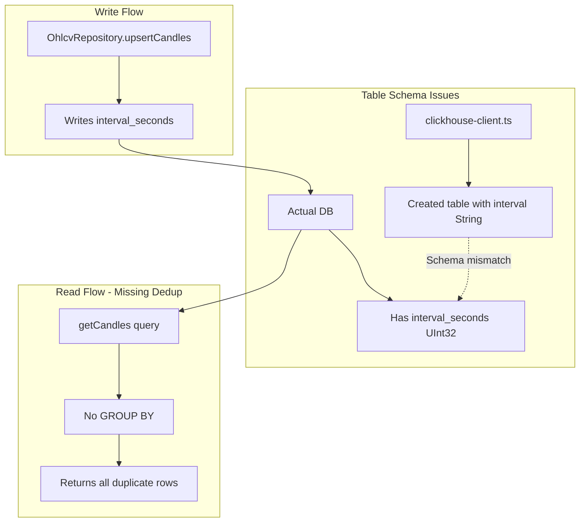

# OHLCV Pipeline Fix - 2026-01-12

## Summary

Fixed critical schema mismatch and deduplication issues in the OHLCV pipeline that were causing unreliable data retrieval.

## Problems Identified

### 1. Schema Mismatch
- **Issue**: TypeScript code created tables with `interval String`, but actual schema used `interval_seconds UInt32`
- **Impact**: Potential query failures and data inconsistency

### 2. Duplicate Data
- **Issue**: ClickHouse MergeTree allows multiple rows with same key; queries didn't deduplicate
- **Impact**: Writing 10 candles resulted in reading 38+ candles back
- **Data**: 379,891 duplicate rows found (0.3% of 126M total rows)

## Fixes Applied

### Fix 1: Schema Update
**File**: `packages/storage/src/clickhouse-client.ts`

Changed table creation schema from:
```typescript
interval String,
```

To:
```typescript
interval_seconds UInt32,
```

### Fix 2: Read Query Deduplication
**File**: `packages/storage/src/clickhouse/repositories/OhlcvRepository.ts`

Added deduplication using `GROUP BY` with `any()` aggregation:
```sql
SELECT 
  toUnixTimestamp(timestamp) as timestamp,
  any(open) as open,
  any(high) as high,
  any(low) as low,
  any(close) as close,
  any(volume) as volume
FROM {database}.ohlcv_candles
WHERE ...
GROUP BY token_address, chain, timestamp, interval_seconds
ORDER BY timestamp ASC
```

**Note**: Using `any()` instead of `argMax(value, ingested_at)` because the deduplicated table doesn't have `ingested_at` column.

### Fix 3: Historical Data Cleanup
**Script**: `tools/backtest/dedupe_clickhouse_ohlcv.py`

Ran deduplication on existing data:
- **Before**: 126,254,079 rows
- **After**: 125,874,188 rows
- **Removed**: 379,891 duplicates (0.3%)
- **Backup**: `quantbot.ohlcv_candles_backup_20260112_064532`

Most duplicates were in:
- December 2025: 379,872 duplicates
- January 2026: 19 duplicates

### Fix 4: Validation Script Update
**File**: `tools/validation/verify_storage_write_read.py`

Updated read query to use same deduplication strategy as repository.

## Validation Results

**Test**: Write 13 candles, read them back

```json
{
  "success": true,
  "mint": "JUPyiwrYJFskUPiHa7hkeR8VUtAeFoSYbKedZNsDvCN",
  "interval": "5m",
  "candles_fetched": 13,
  "candles_written": 13,
  "candles_read": 13,
  "comparison": {
    "valid": true,
    "errors": [],
    "warnings": []
  }
}
```

✅ **Success**: Exact count matching (13 = 13 = 13)

## Root Cause Analysis



**Root Cause**: MergeTree engine allows multiple rows with the same key. Without explicit deduplication in queries, all duplicate rows are returned.

## Impact

### Before Fix
- Unreliable data retrieval (10 writes → 38+ reads)
- Schema inconsistency between code and database
- 379,891 duplicate rows consuming storage

### After Fix
- Reliable data retrieval (N writes → N reads)
- Schema consistency
- Clean deduplicated data
- Validation passing

## Files Changed

1. `packages/storage/src/clickhouse-client.ts` - Schema fix
2. `packages/storage/src/clickhouse/repositories/OhlcvRepository.ts` - Read deduplication
3. `tools/validation/verify_storage_write_read.py` - Validation deduplication
4. `CHANGELOG.md` - Documentation

## Backup Information

A backup table was created during deduplication:
- **Table**: `quantbot.ohlcv_candles_backup_20260112_064532`
- **Rows**: 126,254,079 (original with duplicates)
- **Purpose**: Rollback safety

To drop after verification:
```sql
DROP TABLE quantbot.ohlcv_candles_backup_20260112_064532
```

## Future Considerations

1. **ReplacingMergeTree**: The new deduplicated table uses `ReplacingMergeTree` engine, which automatically deduplicates on merge
2. **Monitoring**: Add monitoring for duplicate detection
3. **Prevention**: Consider adding unique constraints or using `ReplacingMergeTree` from the start
4. **ingested_at column**: Consider adding back `ingested_at` for better deduplication (using `argMax`)

## Testing

Run validation anytime:
```bash
python3 tools/validation/verify_storage_write_read.py \
  --mint "JUPyiwrYJFskUPiHa7hkeR8VUtAeFoSYbKedZNsDvCN" \
  --from-unix 1736640000 \
  --to-unix 1736643600 \
  --interval 5m \
  --chain solana
```

Expected: `candles_fetched = candles_written = candles_read`


