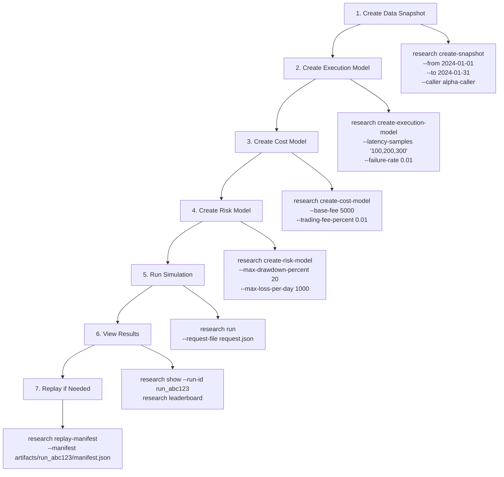
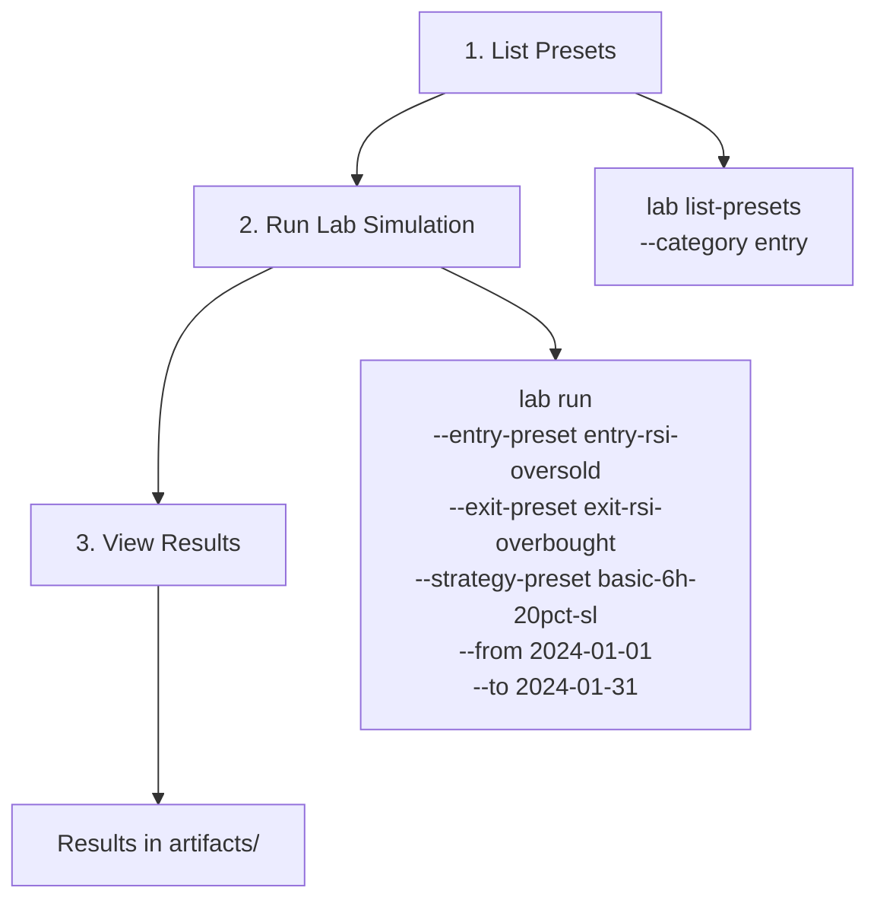
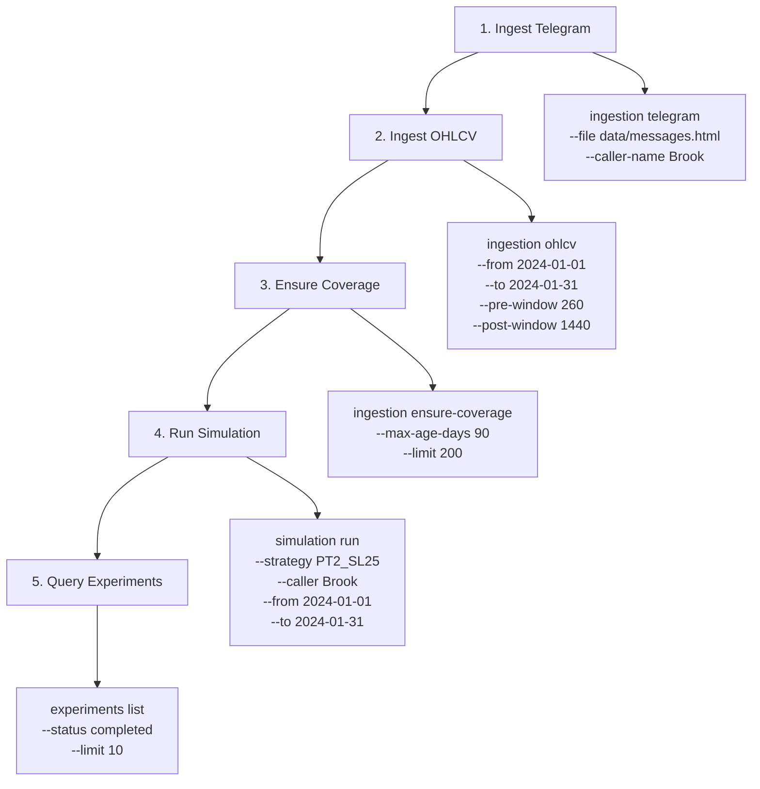

# QuantBot CLI Commands Overview & E2E Workflows

## Command Categories Summary

### 1. **Research** (`@quantbot/cli` → `packages/cli/src/commands/research.ts`)
**Purpose**: Research OS experiment management - full simulation lifecycle with snapshots, models, and reproducibility.

**Key Commands**:
- `research run` - Run single simulation from JSON request file
- `research batch` - Run batch simulations from batch JSON file
- `research sweep` - Run parameter sweeps from sweep JSON file
- `research replay` - Replay simulation by run ID
- `research replay-manifest` - Replay from manifest.json (first-class re-run)
- `research list` - List all simulation runs
- `research show` - Show details of specific run
- `research leaderboard` - Show leaderboard ranked by metrics
- `research create-snapshot` - Create data snapshots for reproducibility
- `research create-execution-model` - Create execution models (latency, slippage, failures)
- `research create-cost-model` - Create cost models (fees, priority fees)
- `research create-risk-model` - Create risk models (drawdown, position limits)

**Package**: `@quantbot/cli` (handlers in `packages/cli/src/handlers/research/`)

**Workflow**: Research OS pattern - full experiment tracking with snapshots, models, and replayability

---

### 2. **Experiments** (`@quantbot/cli` → `packages/cli/src/commands/experiments.ts`)
**Purpose**: Query and manage experiment records stored in database.

**Key Commands**:
- `experiments list` - List experiments with filters (experiment-id, strategy-id, parameter-hash, git-commit, status, dates)
- `experiments get <experimentId>` - Get experiment by ID
- `experiments find` - Find experiments by parameter hash

**Package**: `@quantbot/cli` (handlers in `packages/cli/src/handlers/experiments/`)

**Workflow**: Database query layer - read-only operations on stored experiment records

**Difference from Research**: 
- **Research** = Run/create/manage experiments (write operations)
- **Experiments** = Query existing experiments (read operations)

---

### 3. **Lab** (`@quantbot/cli` → `packages/cli/src/commands/lab.ts`)
**Purpose**: Quick lab simulations with preset indicator signals (RSI, MACD, etc.) on existing candles.

**Key Commands**:
- `lab run` - Run lab simulation with preset entry/exit signals
- `lab list-presets` - List available signal and strategy presets

**Package**: `@quantbot/cli` (handlers in `packages/cli/src/handlers/lab/`)

**Workflow**: Quick testing with preset signals - no full experiment tracking

**Difference from Research**:
- **Lab** = Quick testing with preset signals, minimal configuration
- **Research** = Full experiment tracking with snapshots, models, replayability
- **Lab** = Uses existing candles, preset signals (RSI oversold, MACD cross, etc.)
- **Research** = Full simulation with custom strategies, execution models, cost models

---

### 4. **Calls** (`@quantbot/cli` → `packages/cli/src/commands/calls.ts`)
**Purpose**: Call evaluation and backtesting operations - evaluate call signals with overlay-based backtesting.

**Key Commands**:
- `calls evaluate` - Evaluate calls with overlay-based backtesting (take-profit, stop-loss)
- `calls sweep` - Run parameter sweeps across intervals, lags, and overlay sets
- `calls export` - Export calls from DuckDB to CallSignal JSON format
- `calls export-simulation` - Export calls with simulation results to CSV

**Package**: `@quantbot/cli` (handlers in `packages/cli/src/handlers/calls/`)

**Workflow**: Overlay-based backtesting - simpler than full simulation, focuses on exit strategies

**Difference from Research/Lab**:
- **Calls** = Overlay-based backtesting (exit strategies: take-profit, stop-loss)
- **Research** = Full simulation with entry/exit strategies, execution models, cost models
- **Lab** = Quick testing with preset signals
- **Calls** = Focus on evaluating call signals with different exit overlays
- **Research** = Full experiment tracking with reproducibility

---

### 5. **Simulation** (`@quantbot/cli` → `packages/cli/src/commands/simulation.ts`)
**Purpose**: Trading strategy simulation operations - lower-level simulation commands.

**Key Commands**:
- `simulation run` - Run simulation on calls (uses workflows)
- `simulation list-runs` - List simulation runs
- `simulation run-duckdb` - Run simulation using DuckDB Python engine
- `simulation store-strategy` - Store strategy in DuckDB
- `simulation store-run` - Store simulation run in DuckDB
- `simulation generate-report` - Generate reports from DuckDB
- `simulation list-strategies` - List all available strategies
- `simulation create-strategy` - Interactive strategy creation
- `simulation clickhouse-query` - Query ClickHouse using Python engine

**Package**: `@quantbot/cli` (handlers in `packages/cli/src/handlers/simulation/`)

**Workflow**: Lower-level simulation operations - direct DuckDB/ClickHouse access

**Difference from Research**:
- **Simulation** = Lower-level operations, direct DuckDB/ClickHouse access
- **Research** = Higher-level experiment management with snapshots and models
- **Simulation** = Individual run operations
- **Research** = Full experiment lifecycle with tracking and replayability

---

### 6. **Ingestion** (`@quantbot/cli` → `packages/cli/src/commands/ingestion.ts`)
**Purpose**: Data ingestion operations - fetch and store data.

**Key Commands**:
- `ingestion telegram` - Ingest Telegram export file (extracts callers automatically)
- `ingestion ohlcv` - Fetch OHLCV data for calls
- `ingestion telegram-python` - Process Telegram export using Python DuckDB pipeline
- `ingestion validate-addresses` - Validate addresses and fetch metadata
- `ingestion surgical-fetch` - Surgical OHLCV fetching based on coverage analysis
- `ingestion ensure-coverage` - Ensure OHLCV coverage for tokens <3 months old

**Package**: `@quantbot/cli` (handlers in `packages/cli/src/handlers/ingestion/`)

**Workflow**: Data acquisition and storage - prerequisite for all simulation workflows

---

## Complete E2E Workflows

### Workflow 1: Research OS Experiment (Full Lifecycle)



**Steps**:
1. **Create Snapshot**: `quantbot research create-snapshot --from 2024-01-01T00:00:00Z --to 2024-01-31T23:59:59Z --caller alpha-caller`
2. **Create Models**: Create execution, cost, and risk models
3. **Run Simulation**: `quantbot research run --request-file request.json` (contains snapshot ref, strategy, models)
4. **View Results**: `quantbot research show --run-id run_abc123` or `quantbot research leaderboard`
5. **Replay**: `quantbot research replay-manifest --manifest artifacts/run_abc123/manifest.json`

**Package Flow**:
- CLI → Handler → Workflow → Services → Storage/Simulation

---

### Workflow 2: Lab Quick Testing (Preset Signals)



**Steps**:
1. **List Presets**: `quantbot lab list-presets --category entry`
2. **Run Lab**: `quantbot lab run --entry-preset entry-rsi-oversold --exit-preset exit-rsi-overbought --strategy-preset basic-6h-20pct-sl --from 2024-01-01T00:00:00Z --to 2024-01-31T23:59:59Z`
3. **View Results**: Results saved to artifacts directory

**Package Flow**:
- CLI → Handler → Lab Service → Simulation Engine → Results

---

### Workflow 3: Calls Evaluation (Overlay Backtesting)

```mermaid
graph TD
    A[1. Export Calls] --> B[2. Evaluate Calls]
    B --> C[3. Sweep Parameters]
    C --> D[4. Export Results]
    
    A --> A1[calls export<br/>--duckdb data/tele.duckdb<br/>--from-iso 2024-01-01<br/>--to-iso 2024-01-31<br/>--out calls.json]
    B --> B1[calls evaluate<br/>--calls-file calls.json<br/>--overlays '[{"kind":"take_profit","takePct":100}]'<br/>--lag-ms 10000]
    C --> C1[calls sweep<br/>--calls-file calls.json<br/>--intervals '["1m","5m"]'<br/>--lags-ms '[0,10000,30000]'<br/>--overlays-file overlays.json]
    D --> D1[calls export-simulation<br/>--duckdb data/tele.duckdb<br/>--from-iso 2024-01-01<br/>--to-iso 2024-01-31<br/>--out results.csv]
```

**Steps**:
1. **Export Calls**: `quantbot calls export --duckdb data/tele.duckdb --from-iso 2024-01-01T00:00:00Z --to-iso 2024-01-31T23:59:59Z --out calls.json`
2. **Evaluate**: `quantbot calls evaluate --calls-file calls.json --overlays '[{"kind":"take_profit","takePct":100}]' --lag-ms 10000`
3. **Sweep**: `quantbot calls sweep --calls-file calls.json --intervals '["1m","5m"]' --lags-ms '[0,10000,30000]' --overlays-file overlays.json`
4. **Export Results**: `quantbot calls export-simulation --duckdb data/tele.duckdb --from-iso 2024-01-01T00:00:00Z --to-iso 2024-01-31T23:59:59Z --out results.csv`

**Package Flow**:
- CLI → Handler → Calls Service → Overlay Engine → Results

---

### Workflow 4: Full Data Pipeline (Ingestion → Simulation)



**Steps**:
1. **Ingest Telegram**: `quantbot ingestion telegram --file data/messages.html --caller-name Brook`
2. **Ingest OHLCV**: `quantbot ingestion ohlcv --from 2024-01-01T00:00:00Z --to 2024-01-31T23:59:59Z --pre-window 260 --post-window 1440`
3. **Ensure Coverage**: `quantbot ingestion ensure-coverage --max-age-days 90 --limit 200`
4. **Run Simulation**: `quantbot simulation run --strategy PT2_SL25 --caller Brook --from 2024-01-01T00:00:00Z --to 2024-01-31T23:59:59Z`
5. **Query Experiments**: `quantbot experiments list --status completed --limit 10`

**Package Flow**:
- Ingestion → Storage → Simulation → Workflows → Storage → Experiments Query

---

## Command Comparison Matrix

| Command | Purpose | Tracking | Models | Replay | Package |
|---------|---------|----------|--------|--------|---------|
| **research** | Full experiment lifecycle | ✅ Full tracking | ✅ Execution/Cost/Risk | ✅ Manifest replay | `@quantbot/cli` |
| **experiments** | Query stored experiments | ✅ Read-only | ❌ | ❌ | `@quantbot/cli` |
| **lab** | Quick preset testing | ❌ Minimal | ❌ | ❌ | `@quantbot/cli` |
| **calls** | Overlay backtesting | ❌ | ❌ | ❌ | `@quantbot/cli` |
| **simulation** | Lower-level simulation | ⚠️ Basic | ❌ | ❌ | `@quantbot/cli` |
| **ingestion** | Data acquisition | ❌ | ❌ | ❌ | `@quantbot/cli` |

---

## Architecture Layers

All commands follow the same architecture pattern:

```
CLI Command Definition (commands/*.ts)
    ↓
Command Executor (core/execute.ts)
    ↓
Handler (handlers/{package}/{command}.ts)
    ↓
Service/Workflow Layer
    ↓
Domain Services (packages/{package}/src/)
    ↓
Storage/External APIs
```

**Key Principles**:
- **Commands** = Metadata only (schema, description, examples)
- **Handlers** = Pure use-case functions (no CLI concerns)
- **Executor** = Side effects (validation, formatting, error handling)
- **Services** = Business logic and I/O
- **Workflows** = Orchestration (coordinate multiple services)

---

## When to Use Which Command

### Use **Research** when:
- You need full experiment tracking and reproducibility
- You want to create snapshots for consistent data
- You need execution/cost/risk models
- You want to replay experiments from manifests
- You're running parameter sweeps or batch experiments

### Use **Experiments** when:
- You want to query existing experiment records
- You need to find experiments by parameter hash
- You're analyzing historical experiment data

### Use **Lab** when:
- You want quick testing with preset signals
- You're experimenting with indicator combinations
- You don't need full experiment tracking
- You want to test entry/exit signal presets

### Use **Calls** when:
- You want to evaluate call signals with exit overlays
- You're testing different take-profit/stop-loss strategies
- You want to sweep parameters (intervals, lags, overlays)
- You need to export calls with simulation results

### Use **Simulation** when:
- You need lower-level simulation operations
- You're working directly with DuckDB/ClickHouse
- You want to store strategies/runs manually
- You're generating reports from DuckDB

### Use **Ingestion** when:
- You need to fetch and store data
- You're setting up the data pipeline
- You need to ensure OHLCV coverage
- You're processing Telegram exports

---

## Package Dependencies

All commands are in `@quantbot/cli` but depend on:

- **Research**: `@quantbot/workflows`, `@quantbot/simulation`, `@quantbot/storage`, `@quantbot/data-observatory`
- **Experiments**: `@quantbot/storage`
- **Lab**: `@quantbot/simulation`, `@quantbot/storage`
- **Calls**: `@quantbot/simulation`, `@quantbot/storage`
- **Simulation**: `@quantbot/workflows`, `@quantbot/simulation`, `@quantbot/storage`
- **Ingestion**: `@quantbot/ingestion`, `@quantbot/ohlcv`, `@quantbot/storage`, `@quantbot/api-clients`

---

## Complete E2E Example: Research Experiment

```bash
# 1. Create data snapshot
quantbot research create-snapshot \
  --from 2024-01-01T00:00:00Z \
  --to 2024-01-31T23:59:59Z \
  --caller alpha-caller \
  --min-volume 1000

# 2. Create execution model
quantbot research create-execution-model \
  --latency-samples "100,200,300" \
  --failure-rate 0.01 \
  --partial-fill-rate 0.05

# 3. Create cost model
quantbot research create-cost-model \
  --base-fee 5000 \
  --priority-fee-min 1000 \
  --priority-fee-max 10000 \
  --trading-fee-percent 0.01

# 4. Create risk model
quantbot research create-risk-model \
  --max-drawdown-percent 20 \
  --max-loss-per-day 1000 \
  --max-consecutive-losses 5

# 5. Create request.json with snapshot ref, strategy, and models
cat > request.json << EOF
{
  "snapshotRef": {
    "snapshotId": "snapshot_abc123",
    "dataHash": "hash_xyz789"
  },
  "strategyConfig": {
    "entry": { "type": "immediate" },
    "exit": {
      "targets": [{"target": 2.0, "percent": 0.5}],
      "stopLoss": {"stopPct": 0.25}
    }
  },
  "executionModel": {...},
  "costModel": {...},
  "riskModel": {...}
}
EOF

# 6. Run simulation
quantbot research run --request-file request.json

# 7. View results
quantbot research show --run-id run_abc123
quantbot research leaderboard --criteria return --limit 10

# 8. Replay from manifest
quantbot research replay-manifest --manifest artifacts/run_abc123/manifest.json
```

---

## Summary

- **Research** = Full experiment lifecycle with tracking, snapshots, models, replayability
- **Experiments** = Query existing experiment records (read-only)
- **Lab** = Quick testing with preset signals (minimal tracking)
- **Calls** = Overlay-based backtesting (exit strategies)
- **Simulation** = Lower-level simulation operations (DuckDB/ClickHouse)
- **Ingestion** = Data acquisition and storage (prerequisite for all)

All commands follow the same architecture: Command → Executor → Handler → Service/Workflow → Domain → Storage/APIs.

